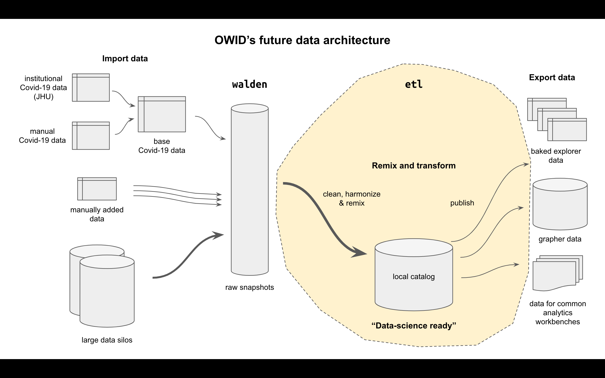

 

# etl

_A compute graph for loading and transforming data for OWID._

**Status: work in progress**

## Overview

This project is the spiritual successor to [importers](https://github.com/owid/importers), meant to eventually replace it. Its job is to assemble and republish OWID's _data science catalog_, the richest and easiest to use version of the datasets we can create. The catalog it creates is also meant to eventually replace Grapher's database as our source of truth for all data.

## Getting started

You need Python 3.9+, `poetry` and `make` installed.

Then you can run all checks with:

`make test`

You can build all known data tables into the `data/` folder with:

`make etl`

## Reporting problems

Please file any bugs or issues at https://github.com/owid/etl/issues. We are not currently seeking external contributions, but any member of the public should be able to run this codebase and recreate our catalog.

## Architecture

The `etl` project is the heart of OWID's future data architecture, containing all data transformations and publishing rules to take data from the raw snapshots kept in [walden](https://github.com/owid/walden) to the MySQL copy kept by [grapher](https://github.com/owid/grapher) for publishing the OWID charts and site.



The ETL is the place where several key steps can be done:

- **Syntactic harmonization**: get data from institutional formats into a common OWID format with as few changes as possible
- **Semantic harmonization**: harmonize dimension fields like country, region, gender, and others to create OWID's reference data set
- **Remixing**: generating combined datasets and indicators, e.g. taking population from one dataset and using it to  transforming another indicator into a per-capita version
- **Republishing** (OWID only): export OWID's reference data set for a variety of consumers

## Design principles

- **Dependencies listed**: all transformation steps and their dependencies are collected in a single file `dag.yml`
- **URI style steps**: all steps have a URI style format, e.g. `data://garden/who/2021-07-01/gho`
- **Filenames by convention**: We use convention to reduce the amount of config required
    - `walden://<path>` steps match data snapshots in the [walden](https://github.com/owid/walden) index at `<path>`, and download the snapshots locally when executed
    - `data://<path>` steps are defined by a Python or Jupyter notebook script in `etl/steps/data/<path>.{py,ipynb}`, and generate a new dataset in the `data/<path>` folder when executed
- **Data stored outside Git**: unlike the importers repo, only tiny reference datasets and metadata is kept in git; all actual datasets are not stored and are instead regenerated on demand from the raw data in Walden

## Data formats

The core formats used are the `Dataset` and `Table` formats from [owid-catalog-py](https://github.com/owid/owid-catalog-py).

- Dataset: a folder full of data files (e.g. `my_dataset/`), with overall metadata in `index.json` (e.g. `my_dataset/index.json`)
- Table: a CSV or Feather file (e.g. `my_table.feather`) with table and variable metadata in a `.meta.json` file (e.g. `my_table.meta.json`)

Visit the `owid-catalog-py` project for more details on these formats or their Python API.

## Step types

### Walden (`walden://...`)

[Walden](https://github.com/owid/walden) is OWID's data store for bulk data snapshots. It consists of a data index stored in git, with the snapshots themselves stored in S3 and available over HTTPS.

Walden steps, when executed, find the matching data snapshot in Walden's index and ensure its files are downloaded, by calling `ensure_downloaded()` on it. Walden stores such locally cached files in `~/.owid/walden`.

### Data (`data://...`)

Each data step is defined by its output, it must create a new folder in `data/` containing a dataset at the matching path. The name also indicates where the script to run for this step lives.

For example, suppose we have a step `data://a/b/c`. Then:

- The step must create when run a dataset at `data/a/b/c`
- It must have a Python script at `etl/steps/data/a/b/c.py`, a module at `etl/steps/data/a/b/c/__init__.py`, or a Jupyter notebook at `etl/steps/data/a/b/c.ipynb`

Data steps can have any dependencies you like. The ETL system will make sure all dependencies are run before the script starts, but the script itself is responsible for finding and consuming those dependencies.

### Github (`github://...`)

An empty step used only to mark a dependency on a Github repo, and trigger a rebuild of later steps whenever that repo changes. This is useful since Github is a good store for data that updates too frequently to be snapshotted into Walden, e.g. OWID's [covid-19-data](https://github.com/owid/covid-19-data).

Example: `github://owid/covid-19-data/master`

The most recent commit hash of the given branch will be used to determine whether the data has been updated. This way, the ETL will be triggered to rebuild any downstream steps each time the data is changed.

NOTE: Github rate-limits unauthorized API requests to 60 per hour, so we should be sparing with the use of this step as it is implemented today.

### ETag (`etag://...`)

A step used to mark dependencies on HTTPS resources. The path is interpreted as an HTTPS url, and a HEAD request is made against the URL and checked for its `ETag`. This can be used to trigger a rebuild each time the resource changes.

Example: `etag://raw.githubusercontent.com/owid/covid-19-data/master/public/data/owid-covid-data.csv`

## Writing a new ETL step

Firstly, edit `dag.yml` and add a new step under the `steps` section. Your step name should look like `data://<path>`, meaning it will generate a dataset in a folder at `data/<path>`. You should list as dependencies any ingredients your dataset will need to build.

### Python step

To define a Python data step, create a new python module at `etl/steps/data/<path>.py`. Your module must define a `run()` method, here is the minimal one:

```python
from owid.catalog import Dataset

def run(dest_dir: str) -> None:
    ds = Dataset.create_empty(dest_dir)
    ds.metadata.short_name = 'my_dataset'
    ds.save()
```

You can use `make etl` to rebuild everything, including your new table. Or you can run:

`.venv/bin/etl data://<path>`

just to run your step alone.

### Jupyter notebook step

A Jupyter notebook step is nearly identical to the Python step above, but instead of a Python module you create a new notebook at `etl/steps/data/<path>.ipynb`.

Run `make lab` to start the Juypter Lab environment, then navigate to the folder you want, start a new notebook and rename it to match name in `<path>`.

Your notebook must contain a cell of parameters, containing `dest_dir`, like this:

```python
dest_dir = '/tmp/my_dataset'
```

If we tag this cell correctly, at runtime `dest_dir` will get filled in by the ETL system. To tag the cell, click on the cell, then the cog on the top right of the Jupyter interface. Add the tag `parameters` to the cell.

Add a second cell containing the minimal code to create a dataset:

```
from owid.catalog import Dataset

ds = Dataset.create_empty(dest_dir)
ds.metadata.short_name = 'my_dataset'
ds.save()
```

Then run `make etl` to check that it's working correctly before fleshing out your ETL step.
