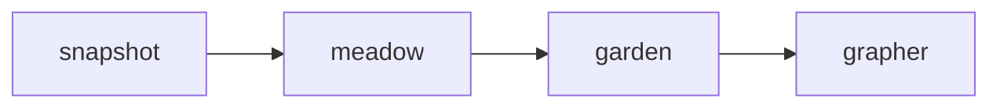

# Using the interactive walkthrough

_This article is meant for OWID staff members._

The walkthrough is an interactive web UI for setting up ETL steps.

## Get set up

Before you begin, make sure you've set up the ETL as described in [Getting Started](../getting-started/index.md).

## Decide on names

The ETL uses a naming convention to identify datasets. To add a dataset, you will need to choose a short name for the data provider (e.g. `un`, `who`), which will serve as the namespace to add it to.

You will also need to choose a short name for the dataset itself (e.g. `population`), which will be used to identify the dataset in the ETL.

!!! tip "What's a short name?"

    Short names must be unique within a namespace. They must be in lowercase and separated only with underscores. They must not contain any special characters, and should not be too long.

    - ✓ `population`
    - ✓ `electricity_demand`
    - ✗ `Electricity Demand`
    - ✗ `electricity-demand`
    - ✗ `really_long_elaborate_description_of_the_variable_in_question`

## Start the walkthrough

```bash
source .venv/bin/activate
```

Then, for each stage of data processing you need to do, run the walkthrough for that stage:



Begin with `walkthrough snapshot`, and open your browser to the page that it prints out.