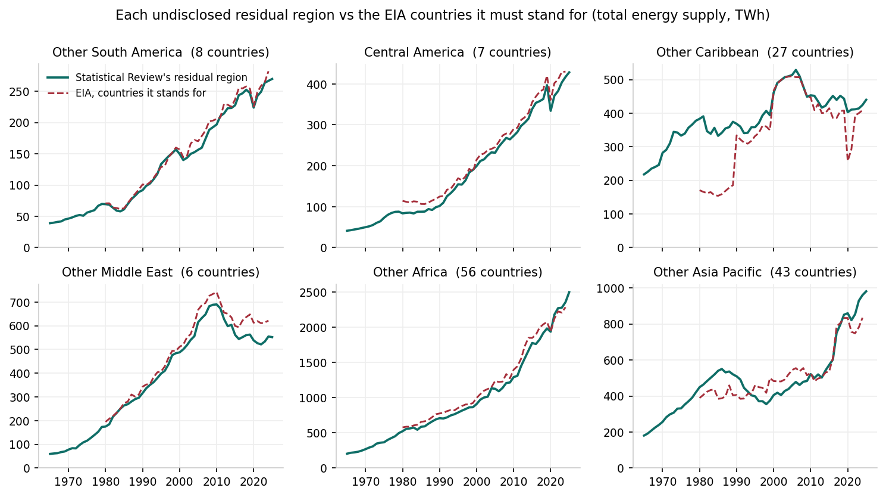
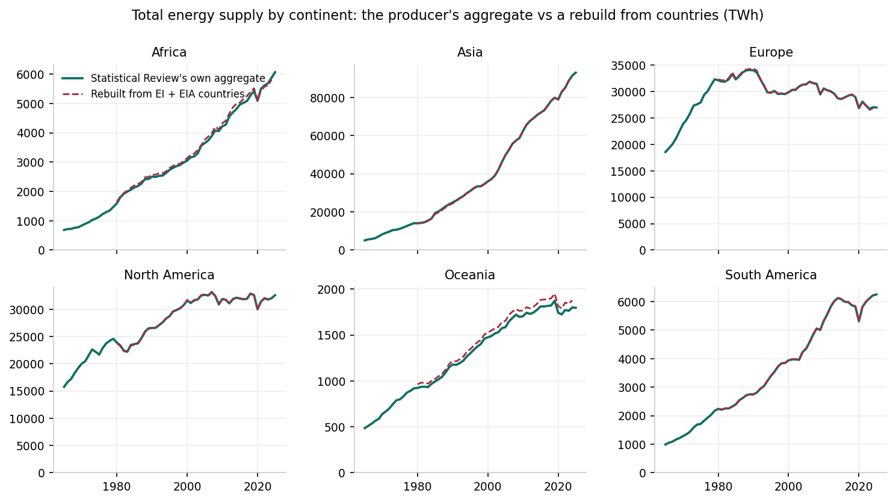
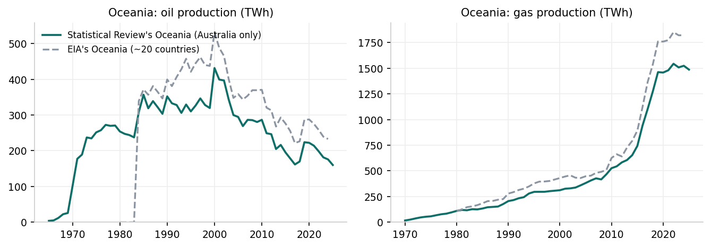
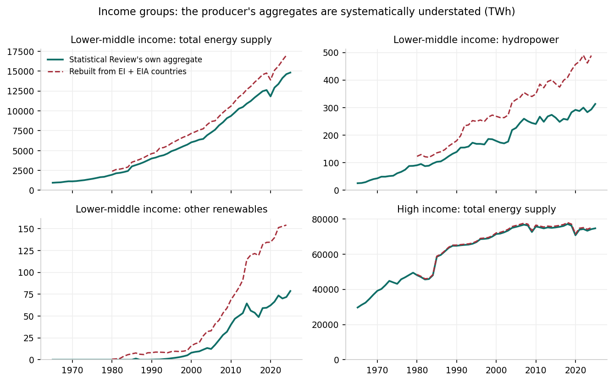
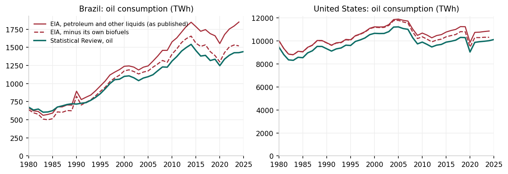
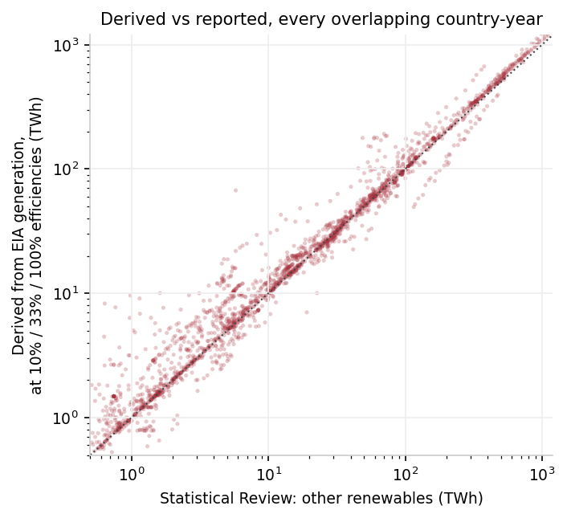

# How we build regional aggregates in our energy data

Our energy datasets combine three producers: the Energy Institute's Statistical Review of World Energy, the U.S. Energy Information Administration's international energy data, and Ember's electricity data.
This page documents how our regional aggregates (continents and income groups) are constructed from them, the problems each choice responds to, and the evidence behind those choices.
It covers the Energy mix, Fossil fuels, and Electricity mix datasets, which feed our energy charts.

## The Statistical Review's residual regions

The Statistical Review itemizes around 80 countries.
Everything else is reported in residual regions such as "Other Africa" or "Other Caribbean": one number per indicator for all the remaining countries of an area, without saying which countries it covers or how much each contributes.
Two properties make these regions hard to use:

- **Their membership is undisclosed and varies by indicator.** "Other South America" covers whichever South American countries are not itemized for that particular indicator, so the same entity name would quietly mean a different set of countries on different charts.
- **Some straddle our region definitions.** "Other C.I.S." contains countries we assign to Europe (Moldova) and to Asia (Georgia, Armenia, Kyrgyzstan, Tajikistan); "Other Asia Pacific" mixes Asian and Oceanian countries.

For this reason, we do not publish the residual regions as selectable entities.
But they must be counted inside regional aggregates, since otherwise those aggregates would miss every non-itemized country.
We assign each residual region to the region that contains most of its energy:

| Residual region | Assigned to | Notes |
| --- | --- | --- |
| Other Africa (and its Northern/Southern subdivisions) | Africa | Our Africa aggregate is the producer's own, since both define Africa identically. |
| Other Europe | Europe | |
| Other C.I.S. | Asia | Moldova is the only European member; the region never exceeds 5% of Europe or 7% of Asia. |
| Other Middle East | Asia | All of the producer's Middle East is in our Asia. |
| Other Asia Pacific | Asia | Priced with EIA data, it is 93% Asian and 7% Oceanian, in 2000 and 2023 alike. |
| Other South America | South America | |
| Other Caribbean, Central America, Other North America | North America | Our North America includes Central America and the Caribbean. |

The Statistical Review also publishes a wider rollup, "Other South and Central America".
For most indicators it is exactly the sum of the three finer residual regions above, which are already assigned, so it is redundant and ignored.
For the indicators where the finer regions are absent (reserves) or fall short of it (electricity generation by fuel, biodiesel), the difference is genuinely unassignable; there, the affected aggregate is removed rather than published understated.

How much can we trust these residual regions?
Each one stands for a specific set of countries, and the EIA reports most of those countries individually, so the two can be compared directly:

On total energy supply, the residual regions agree with the sum of the EIA countries they stand for to within 3-14% (median over the overlapping years), which is the same order as the two producers' definitional differences for countries both report.
The Caribbean panel's early divergence reflects the EIA's incomplete coverage of small islands before 1990, not a disagreement.

## Continents come from the producer

With every residual region assigned, the Statistical Review's continental aggregates cover the whole globe: the six continents sum to exactly its own World total, on every energy indicator.
We therefore publish the producer's continental aggregates directly, which preserves their full history (1965 onward).

The alternative, rebuilding each continent by summing Statistical Review countries plus EIA countries, was measured before being rejected:

The two constructions differ by less than 2% in a typical year for every continent, and the rebuild can only start in 1980, when EIA coverage begins.
Rebuilding would have traded fifteen years of history for nothing.

## Oceania is the exception

Oceania is the one continent with no residual region of its own: "Other Asia Pacific" is folded into Asia, so Oceania's aggregate contains only the countries the Statistical Review names, and it names at most two (Australia and New Zealand).
Summed with EIA data, those two cover about 96% of the region's energy consumption; the remainder is mostly Papua New Guinea, New Caledonia, and Fiji, whose energy is counted inside Asia.

For production the situation is worse: the Statistical Review reports no oil or gas production for New Zealand, so its Oceania production aggregates were Australia alone, sitting 7-18% below the region's true level, with the gap growing after Papua New Guinea's gas fields came online:

We now require at least two reporting countries for an Oceania aggregate.
This keeps every consumption indicator (where New Zealand is reported) and withholds the production indicators, which would otherwise publish Australia's figures under Oceania's name.

## Income groups are rebuilt from countries

The Statistical Review assigns its residual regions to continents but to no income group, and no assignment is possible even in principle: the countries behind "Other South America" alone span three income groups.
Its income-group aggregates therefore cover only the itemized countries, reaching 91-99% of its own World total depending on the indicator, with the shortfall concentrated where it hurts: the low-income group is missing entirely, and the lower-middle-income group is understated by around 15% overall and far more for individual sources.

We therefore rebuild the four income groups by summing country-level data, combining the Statistical Review with the EIA for the countries it does not itemize.
Ember's electricity data, an independent third producer, confirms the defect: its lower-middle-income electricity generation exceeds the Statistical Review's by 14-16% in every year from 2000 to 2024.
Because most of the countries in these aggregates come from the EIA, whose coverage starts in 1980, the income groups are published from 1980 onward.

## Extending country coverage with EIA data

The Statistical Review's ~80 itemized countries leave most of the world without an energy breakdown.
Combining it with the EIA raises the number of countries with a full nine-source mix from 80 to 230.
The Statistical Review is prioritized wherever both report a value, so no country's series mixes the two producers within a year.

Two methodological differences matter when combining them:

- **Different accounting bases.** Both report total energy supply on the physical energy content basis, but the EIA's own total nets out electricity trade and counts renewable electricity as generated rather than as heat input, so it is not comparable with its own by-source columns; our totals are always the sum of the nine sources.
- **The EIA counts biofuels as oil.** Its "petroleum and other liquids" consumption explicitly includes fuel ethanol and biodiesel blended into gasoline and diesel, while the Statistical Review's oil excludes them.
  We subtract the EIA's own biofuels figures from its oil consumption, so oil is a fossil fuel on both sides and biofuels are counted once, as a source of their own.
  Its oil production behaves differently and needs no correction: the EIA books biofuel output as renewable primary energy.

After the correction, the residual difference between the producers' oil figures for countries both report is about 5%, which is their ordinary definitional offset (natural gas liquids, refinery gain, bunker fuels).

## Deriving "other renewables" from EIA data

The Statistical Review reports "other renewables" (geothermal, biomass power, tide, and wave) as an input-equivalent primary energy figure, which the EIA does not publish.
We derive it from the EIA's generation data using the efficiency factors the Statistical Review itself documents in its methodology: geothermal electricity is converted at 10% thermal efficiency, biomass electricity at 33%, and tide and wave enter at 100%, like hydropower.

Validated against every country-year both producers report, the derived figure matches the Statistical Review's with a median difference of 9% across 2,178 country-years:

## Stacked charts get dedicated indicators

A stacked area chart assembles several indicators, and if one of them is missing for an entity-year while others are present, the chart shows part of a mix as though it were the whole.
Before this work, Oceania's 1985-1999 electricity stack covered about a fifth of its own reported total, and 128 countries had the same defect somewhere in their history.

Each individual indicator is accurate on its own, so the fix is not to delete data.
Instead, the stacked charts read dedicated chart-specific indicators, built from the standalone ones under three rules:

1. A gap that the entity's reported total leaves no room for is a zero confirmed by the producer, and is filled (Sri Lanka reports no nuclear at all, but its other sources add up to its total).
2. Any other row missing a source is blanked entirely.
3. A row reporting every source whose sum still deviates from the reported total by more than 5% is blanked too (the United Kingdom's sources before 1985 reach as little as 77% of its own total).

Both resulting invariants (whole mix or nothing, and the mix adds up to the total) are asserted at build time, so a future data release that breaks them fails our pipeline instead of publishing a spurious stack.
The standalone indicators are untouched, so single-source charts keep every accurate value.

## Known limitations

- Oceania's oil and gas production are not published: no source provides them for the full region without double counting, since New Zealand's and Papua New Guinea's production sits inside a residual region assigned to Asia.
- Oceania's consumption aggregates are understated by roughly 4-5%, the share of the region's energy inside "Other Asia Pacific".
- The income groups start in 1980 and the low-income group depends almost entirely on EIA data.
- The membership the Statistical Review assumes for "Other Europe" and "Other C.I.S." is not published and cannot be verified against the EIA.
- Electricity generation by fuel has no source for income groups before 2000, so those aggregates start where Ember's data does.
