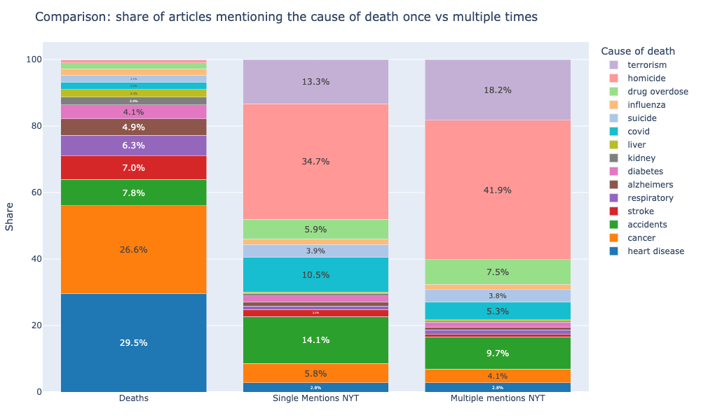

# Does the news reflect what we die from?

!!! info "This is the methodology for the data analysis used in our article [:material-file-document: Does the news reflect what we die from?](https://ourworldindata.org/does-the-news-reflect-what-we-die-from)"

    **Resources**: Browse the [code for the analysis](media_deaths_analysis.html) or download a stand-alone package including methodology, code and intermediate and final data files [here](https://catalog.owid.io/analyses/media-deaths-analysis-data.zip) (direct download).

    **Contact**: [tuna.acisu@ourworldindata.org](mailto:tuna.acisu@ourworldindata.org?subject=Media%20Mentions%20of%20Causes%20of%20Death).

Our team ran an analysis and published an article ("Does the news reflect what we die from?") comparing what Americans die from, and the relative coverage that these causes of death get in media coverage.

We wanted to understand how “representative” what people read in the news is of reality. To be clear, our expectation was not that these should exactly match, but we wanted to understand the media bias towards more exceptional — rather than common — events and make readers aware that this disconnect exists.

In this document, we detail the methodology we used to do this analysis and highlight some additional checks that we ran to understand how sensitive the results were to our choices of media outlets and mentions.

## Sources

### Causes of death in the United States

The first step was to compile data on what Americans die from.

-   We used deaths data from the CDC Wonder database: “[:octicons-link-external-16:  Underlying cause of death](https://wonder.cdc.gov/deaths-by-underlying-cause.html)”.
-   In this database, every death in the U.S. is assigned one main cause, classified in the [:octicons-link-external-16:  International Classification of Diseases](https://www.who.int/standards/classifications/classification-of-diseases) (ICD). Each cause of death has a unique “ICD-10” code.
-   We used the “15 leading causes of death”, given by the CDC. Of those we selected the twelve most common causes and additionally included the categories "drug overdoses" and "homicides", as these are commonly covered in the media.
-   The specific CDC category, ICD-10 code, and name we use in the article is shown in the table below.

| **Cause of death (CDC category)**                                      | **ICD-10 codes**           | **Category name in the article**   |
| ---------------------------------------------------------------------- | -------------------------- | ---------------------------------- |
| Diseases of heart                                                      | I00-I09, I11, I13, I20-I51 | Heart disease                      |
| Malignant neoplasms                                                    | C00-C97                    | Cancer                             |
| Accidents (unintentional injuries) (\*excluding drug overdoses)        | V01-X59 (excl. X42), Y85-Y86| Accidents                          |
| Cerebrovascular diseases                                               | I60-I69                    | Stroke                             |
| Chronic lower respiratory diseases                                     | J40-J47                    | Chronic lower respiratory diseases |
| Alzheimer's disease                                                    | G30                        | Alzheimer’s                        |
| Diabetes mellitus                                                      | E10-E14                    | Diabetes                           |
| Nephritis, nephrotic syndrome and nephrosis                            | N00-N07, N17-N19, N25-N27  | Kidney disease                     |
| Chronic liver disease and cirrhosis                                    | K70, K73-K74               | Liver failure                      |
| COVID-19                                                               | U07.1                      | COVID-19                           |
| Intentional self-harm                                                  | \*U03, X60-X84, Y87.0      | Suicide                            |
| Influenza and pneumonia                                                | J09, J18                   | Influenza and pneumonia            |
| Accidental poisoning by and exposure to narcotics and psychodysleptics | X42                        | Drug overdose                      |
| Assault                                                                | X85-Y09                    | Homicide                           |

-   Since terrorism is often covered in the media, we also included this category in the analysis. The CDC does not have data specifically on terrorism deaths, so we used the [:octicons-link-external-16:  Global Terrorism Index](https://www.visionofhumanity.org/maps/global-terrorism-index/#/) (US Terrorism deaths for 2023).
-   We used 2023 data, as this is the latest year for which complete data from the CDC was available.
-   During the COVID-19 pandemic, especially 2020-2022, COVID-19 was a major cause of death in the United States. In 2023 it still ranks under the 10 most common causes, but there are less deaths attributed to the disease than in 2020-2022.

### Media coverage from Media Cloud

-   Our media coverage data comes from [:octicons-link-external-16:  Media Cloud](https://www.mediacloud.org/). Media cloud is an open source platform for media analysis, which provides a queryable database of newspaper articles from many outlets around the world. Their database includes all articles published online under the domain of the newspaper.
-   We queried the newspaper articles from three outlets. We selected these for several reasons. First, they are large and well-read across the US, so it’s likely that a large share of the population get their news from them. Second, they are popular outlets that span the political spectrum, so our results are not limited to just left- or right-leaning media:

    - [:octicons-link-external-16: The New York Times](https://www.nytimes.com) ([:octicons-link-external-16:  Source ID 1](https://search.mediacloud.org/sources/1))
    - [:octicons-link-external-16: The Washington Post](https://www.washingtonpost.com/) ([:octicons-link-external-16:  Source ID 2](https://search.mediacloud.org/sources/2))
    - [:octicons-link-external-16:  Fox News](https://www.foxnews.com/) ([:octicons-link-external-16:  Source ID 1092](https://search.mediacloud.org/sources/1092)).

-   We restrict our data to articles published in 2023, so it matches the death data.
-   We only count articles where the cause of death is mentioned several times. This filters out passing mentions (like in obituaries or celebrity stories). Some false positives still appear, but at similar rates across all causes, so they don’t change the overall results. Later in [this section](#differences-between-single-and-multiple-mentions), we provide a comparison of how the results would change if we did include single mentions (the answer is, not that much).

This analysis will never give a perfect result that only captures the relevant mentions, but we think that the results are still solid and representative of overall coverage. Here are some caveats or limitations to keep in mind about this data:

-   Articles can include links to other news stories. If these include our keywords the article was also counted.
-   Some articles have multiple URLs (often in “Briefing” or “News of the Week” formats), which can lead to double counting.
-   We didn’t just include articles about deaths, but also those discussing underlying causes or prevention, if they mentioned our keywords. For example: insulin prices (diabetes), air quality (respiratory disease), or terrorism in conflicts. We count these because they still raise awareness about the cause of death and ways to prevent it.
-   Some false positives remain. After testing and iterating we arrived at this balance between being sensitive enough to capture most relevant coverage while keeping irrelevant articles to a minimum.

## Queries for each cause of death

This is how we build our queries:

- We picked relevant keywords and synonyms for each cause of death.
- The first part of our query is an “OR” list of all those key words (e.g. “heart disease” OR “heart attack” OR “high blood pressure”...). Articles need to include at least one of these terms exactly to be included in the result.
- The second part of our query makes sure the keywords appear more than once. For that we used a “proximity search” query: The query (“heart disease cardiac arrest”~1000) returns all articles where the words heart, disease, cardiac and arrest appear within 1000 words of each other. We use one proximity search for each combination of terms.
- We repeated this a few times and adjusted the queries where needed. Sometimes we excluded specific terms if they returned many false positives (e.g. excluding “golf” for the “stroke” query). Sometimes we added new synonyms we found in related articles.

Below you can find the actual keywords we used for each cause of death and the full query for reproducibility.

??? quote "Heart Disease"

    - Keywords: Heart disease, heart attack, cardiac arrest, infarct, arrhythmia, coronary artery disease, heart failure, pericarditis, endocarditis, cardiomyopathy, high blood pressure, hypertension, heart infection, cardiology, cardiologist
    - Query used: `("hease heart"~1000 OR "heart attack heart"~1000 OR "heart cardiac"~1000 OR "cardiac cardiac"~1000 OR "heart infarct artery"~1000 OR "heart coronary artery"~1000 OR "cardiac coronary artery"~1000 OR "heart arrhythmia"~1000 OR "arrhythmia cardiac"~1000 OR "heart failure heart"~1000 OR "heart failure cardiac"~1000 OR "heart pericarditis"~1000 OR "heart endocarditis"~1000 OR "heart cardiomyopathy"~1000 OR "heart hypotension"~1000 OR "cardiac hypertension"~1000 OR "heart infection heart"~1000 OR "heart cardiology"~1000 OR "heart cardiologist"~1000 OR "heart disease blood pressure"~1000 OR "heart attack blood pressure"~1000) AND ("heart disease" OR "heart attack" OR "cardiac arrest" OR "infarct" OR "coronary artery disease" OR "arrhythmia" OR "heart failure" OR "pericarditis" OR "endocarditis" OR "cardiomyopathy" OR "high blood pressure" OR "hypertension" OR "heart infection" OR "cardiology" OR "cardiologist")`

??? quote "Cancer"

    - Keywords: Cancer, tumor, tumour, carcinoma, sarcoma, leukemia, lymphoma, melanoma, oncology, oncologist, chemotherapy, radiation therapy, immunotherapy, targeted therapy, biopsy, oncogene, carcinogenesis, metastasis, remission, carcinogenic, carcinogen
    - Query used: `("cancer cancer"~1000 OR "cancer tumor"~1000 OR "cancer tumour"~1000 OR "cancer carcinoma"~1000 OR "cancer sarcoma"~1000 OR "cancer leukemia"~1000 OR "cancer lymphoma"~1000 OR "cancer melanoma"~1000 OR "cancer oncology"~1000 OR "cancer chemotherapy"~1000 OR "cancer radiation therapy"~1000 OR "cancer immunotherapy"~1000 OR "cancer targeted therapy"~1000 OR "cancer biopsy"~1000 OR "cancer remission"~1000 OR "cancer carcinogen"~1000) AND ("cancer" OR "tumor" OR "tumour" OR "carcinoma" OR "sarcoma" OR "leukemia" OR "lymphoma" OR "melanoma" OR "oncology" OR "oncology" OR "chemotherapy" OR "radiation therapy" OR "immunotherapy" OR "targeted therapy" OR "biopsy" OR "oncogene" OR "carcinogenesis" OR "metastasis" OR "remission" OR "carcinogenic" OR "carcinogen")`

??? quote "Accidents"

    - Keywords: Road accident, car crash, vehicle accident, traffic collision, car accident, motorcycle accident, hit and run, plane crash, train accident, boat accident, plane accident, industrial accident, workplace accident, electrocution, burn injury, drowning, drowned, house fire, blaze, burns, burning, burned
    - Query used: `("accident accident "~1000 OR "crash accident "~1000 OR "crash crash"~1000 OR "crash collision"~1000 OR "collision collision"~1000 OR "car accident car"~1000 OR "motorcycle accident motorcycle"~1000 OR "hit and run accident"~1000 OR "plane crash plane"~1000 OR "plane accident plane"~1000 OR "train accident train"~1000 OR "boat accident boat"~1000 OR "electrocution electric"~1000 OR "burn burn"~1000 OR "drowning drown"~1000 OR "fire fire died"~1000 OR "fire fire dead"~1000 OR "fire fire killed"~1000 OR "fire fire burn injury"~1000) AND ("road accident" OR "car crash" OR "vehicle accident" OR "traffic collision" OR "car accident" OR "motorcycle accident" OR "hit and run" OR "plane crash" OR "train accident" OR "boat accident" OR "plane accident" OR "industrial accident" OR "workplace accident" OR "electrocution" OR "burn injury" OR "drowning" OR "drowned" OR "house fire" OR "blaze" OR "burns" OR "burning" OR "burned")`

??? quote "Stroke"

    - Keywords: Stroke, brain attack, transient ischemic attack, brain hemorrhage, embolism, ischemia, brain injury, neurology
    - Excluded terms: golf, golfing
    - Query used: `('("stroke stroke"~1000 OR "stroke cerebrovascular"~1000 OR "stroke brain attack"~1000 OR "stroke transient ischemic attack"~1000 OR "stroke cerebral"~1000 OR "stroke hemorrhage"~1000 OR "stroke neurology"~1000 OR "stroke neurologist"~1000 OR "thrombosis brain"~1000 OR "thrombosis stroke"~1000 OR "embolism brain"~1000 OR "embolism stroke"~1000 OR "brain ischemia"~1000 OR "stroke ischemia"~1000) AND ("stroke" OR "brain attack" OR "transient ischemic attack" OR "brain hemorrhage" OR "embolism" OR "ischemia" OR "brain injury" OR "neurology") NOT ("golf" OR "golfing")')`

??? quote "Lower respiratory diseases"

    - Keywords: chronic obstructive pulmonary disease, COPD, C.O.P.D., chronic bronchitis, emphysema, asthma, respiratory failure, lung disease, pulmonary disease, respiratory illness, respiratory disease, respiratory tract infection
    - Query used: `("COPD COPD"~1000 OR "COPD lung"~1000 OR "COPD respiratory"~1000 OR "COPD pulmonary"~1000 OR "COPD chronic bronchitis"~1000 OR "COPD emphysema"~1000 OR "COPD asthma"~1000 OR "C.O.P.D. C.O.P.D."~1000 OR "C.O.P.D. lung"~1000 OR "C.O.P.D. respiratory"~1000 OR "C.O.P.D. pulmonary"~1000 OR "C.O.P.D. chronic bronchitis"~1000 OR "C.O.P.D. emphysema"~1000 OR "C.O.P.D. asthma"~1000 OR "chronic bronchitis bronchitis"~1000 OR "chronic bronchitis lung"~1000 OR "chronic bronchitis respiratory"~1000 OR "chronic bronchitis pulmonary"~1000 OR "chronic bronchitis emphysema"~1000 OR "chronic bronchitis asthma"~1000 OR "emphysema emphysema"~1000 OR "emphysema lung"~1000 OR "emphysema respiratory"~1000 OR "emphysema pulmonary"~1000 OR "emphysema asthma"~1000 OR "asthma asthma"~1000 OR "asthma lung"~1000 OR "asthma respiratory"~1000 OR "asthma pulmonary"~1000 OR "respiratory respiratory"~1000 OR "respiratory lung"~1000 OR "respiratory pulmonary"~1000 OR "pulmonary pulmonary"~1000 OR "pulmonary lung"~1000 OR "lung lung"~1000) AND ("chronic obstructive pulmonary disease" OR "COPD" OR "C.O.P.D." OR "chronic bronchitis" OR "emphysema" OR "asthma" OR "respiratory failure" OR "lung disease" OR "pulmonary disease" OR "respiratory illness" OR "respiratory disease" OR "respiratory tract infection")`

??? quote "Alzheimer’s disease"

    - Keywords: Alzheimer’s disease, dementia
    - Query used: `("Alzheimer Alzheimer"~1000 OR "Alzheimer’s Alzheimer’s"~1000 OR "Alzheimer\'s Alzheimer\'s"~1000 OR "Alzheimers Alzheimers"~1000 OR "Alzheimers dementia"~1000 OR "Alzheimer’s dementia"~1000 OR "Alzheimer\'s dementia"~1000 OR "dementia dementia"~1000 OR "Alzheimer dementia"~1000) AND ("Alzheimer" OR "Alzheimers" OR "Alzheimer’s" OR "Alzheimer\'s" OR "dementia")`

??? quote "Diabetes"

    - Keywords: Diabetes, insulin, hyperglycemia, diabetic
    - Query used: `("diabetes diabetes"~1000 OR "hyperglycemia hyperglycemia"~1000 OR "diabetic diabetic"~1000 OR "diabetes insulin"~1000 OR "diabetes diabetic"~1000 OR "insulin diabetic"~1000) AND ("diabetes" OR "insulin" OR "hyperglycemia" OR "diabetic")`

??? quote "Kidney disease"

    - Keywords: Kidney disease, renal disease, renal failure, kidney failure, dialysis, nephropathy, nephrology, nephrologist
    - Query used: `("kidney disease kidney"~1000 OR "kidney renal failure"~1000 OR "renal renal"~1000 OR "kidney chronic kidney disease"~1000 OR "kidney dialysis"~1000 OR "renal dialysis"~1000 OR "kidney nephrology"~1000 OR "kidney nephrologist"~1000) AND ("kidney disease" OR "renal disease" OR "renal failure" OR "kidney failure" OR "dialysis" OR "nephropathy" OR "nephrology" OR "nephrologist")`

??? quote "Liver failure"

    -  Keywords: Liver disease, cirrhosis, chronic liver disease, hepatitis, liver failure, fatty liver, steatohepatitis, hepatology, hepatologist, liver transplant
    - Query used: `("liver disease liver"~1000 OR "liver cirrhosis"~1000 OR "liver chronic liver disease"~1000 OR "liver hepatitis"~1000 OR "liver liver failure"~1000 OR "liver fatty liver"~1000 OR "liver steatohepatitis"~1000 OR "liver hepatology"~1000 OR "liver hepatologist"~1000 OR "liver transplant"~1000 OR "hepatitis hepatitis"~1000) AND ("liver disease" OR "cirrhosis" OR "chronic liver disease" OR "hepatitis" OR "liver failure" OR "fatty liver" OR "steatohepatitis" OR "hepatology" OR "hepatologist" OR "liver transplant")`

??? quote "COVID-19"

    - Keywords: COVID-19, coronavirus, SARS-CoV-2
    - Query used: `("COVID-19 COVID-19"~1000 OR "coronavirus coronavirus"~1000 OR "SARS-CoV-2 SARS-CoV-2"~1000 OR "COVID-19 coronavirus"~1000 OR "COVID-19 SARS-CoV-2"~1000 OR "coronavirus SARS-CoV-2"~1000) AND ("COVID-19" OR "coronavirus" OR "SARS-CoV-2")`

??? quote "Suicide"

    - Keywords: Suicide, self-harm, self-inflicted injury, suicidal
    - Query used: `("suicide suicide"~1000 OR "suicide self-harm"~1000 OR "suicide kill"~1000 OR "suicide suicidal"~1000 OR "suicide self-inflicted"~1000 OR "self-harm kill"~1000 OR "self-harm suicidal"~1000 OR "self-harm injury"~1000 OR "suicidal suicidal"~1000 OR "suicide depression"~1000 OR "suicide depressed"~1000 OR "depressed suicidal"~1000) AND ("suicide" OR "self-harm" OR "self-inflicted injury" OR "suicidal")`

??? quote "Influenza and pneumonia"

    - Keywords: Influenza, flu, respiratory infection, pneumonia, lung infection, bronchopneumonia
    - Query used: `("influenza flu"~1000 OR "influenza lung"~1000 OR "influenza influenza"~1000 OR "influenza respiratory"~1000 OR "influenza pneumonia"~1000 OR "flu flu"~1000 OR "flu lung"~1000 OR "flu respiratory"~1000 OR "flu pneumonia"~1000 OR "respiratory infection respiratory"~1000 OR "respiratory infection pneumonia"~1000 OR "respiratory infection lung"~1000 OR "pneumonia pneumonia"~1000 OR "pneumonia lung"~1000) AND ("influenza" OR "flu" OR "respiratory infection" OR "pneumonia" OR "lung infection" OR "bronchopneumonia")`

??? quote "Drug use / Overdose"

    - Keywords: Drug use, overdose, drug-related, substance use disorder, substance abuse, addiction, opioid, heroin, fentanyl, morphine, cocaine, drug abuse, illicit drug
    - Query used: `("drug overdose"~1000 OR "drug substance"~1000 OR "drug addiction"~1000 OR "drug opioid"~1000 OR "drug heroin"~1000 OR "drug fentanyl"~1000 OR "drug morphine"~1000 OR "drug cocaine"~1000 OR "drug drug use"~1000 OR "drug drug illicit"~1000 OR "overdose overdose"~1000 OR "overdose substance"~1000 OR "overdose addiction"~1000 OR "overdose opioid"~1000 OR "overdose heroin"~1000 OR "overdose fentanyl"~1000 OR "overdose morphine"~1000 OR "overdose cocaine"~1000 OR "substance addiction"~1000 OR "substance opioid"~1000 OR "substance heroin"~1000 OR "substance fentanyl"~1000 OR "substance morphine"~1000 OR "substance cocaine"~1000 OR "addiction addiction"~1000 OR "addiction opioid"~1000 OR "addiction heroin"~1000 OR "addiction fentanyl"~1000 OR "addiction morphine"~1000 OR "addiction cocaine"~1000 OR "opioid opioid"~1000 OR "opioid heroin"~1000 OR "opioid fentanyl"~1000 OR "opioid morphine"~1000 OR "opioid cocaine"~1000 OR "heroin heroin"~1000 OR "heroin fentanyl"~1000 OR "heroin morphine"~1000 OR "heroin cocaine"~1000 OR "fentanyl fentanyl"~1000 OR "fentanyl morphine"~1000 OR "fentanyl cocaine"~1000 OR "morphine morphine"~1000 OR "morphine cocaine"~1000 OR "cocaine cocaine"~1000) AND ("drug use" OR "overdose" OR "drug-related" OR "substance use disorder" OR "substance abuse" OR "addiction" OR "opioid" OR "heroin" OR "fentanyl" OR "morphine" OR "cocaine" OR "drug abuse" OR "illicit drug")`

??? quote "Homicide"

    - Keywords: Homicide, assault, shooting, murder, manslaughter, violent crime, domestic violence, gang violence, knife attack, stabbing, lynching, execution, killer, killing
    - Query used: `("homicide homicide"~1000 OR "homicide assault"~1000 OR "homicide shooting"~1000 OR "homicide murder"~1000 OR "homicide manslaughter"~1000 OR "homicide crime"~1000 OR "homicide violent"~1000 OR "homicide violence"~1000 OR "homicide knife attack"~1000 OR "homicide stabbing"~1000 OR "homicide kill"~1000 OR "assault shooting"~1000 OR "assault murder"~1000 OR "assault manslaughter"~1000 OR "assault crime"~1000 OR "assault violent"~1000 OR "assault violence"~1000 OR "assault knife attack"~1000 OR "assault stabbing"~1000 OR "assault lynching"~1000 OR "assault execution"~1000 OR "assault kill"~1000 OR "shooting shooting"~1000 OR "shooting murder"~1000 OR "shooting manslaughter"~1000 OR "shooting crime"~1000 OR "shooting violence"~1000 OR "shooting violent"~1000 OR "shooting knife attack"~1000 OR "shooting stabbing"~1000 OR "shooting kill"~1000 OR "murder murder"~1000 OR "murder manslaughter"~1000 OR "murder crime"~1000 OR "murder violence"~1000 OR "murder violent"~1000 OR "murder knife attack"~1000 OR "murder stabbing"~1000 OR "murder lynching"~1000 OR "murder execution"~1000 OR "murder kill"~1000 OR "crime crime"~1000 OR "crime violence"~1000 OR "crime violent"~1000 OR "crime knife attack"~1000 OR "crime stabbing"~1000 OR "crime kill"~1000 OR "violence knife attack"~1000 OR "violence stabbing"~1000 OR "violence kill"~1000 OR "stabbing stabbing"~1000 OR "stabbing knife attack"~1000 OR "kill killer"~1000 OR "kill killing"~1000) AND ("homicide" OR "assault" OR "shooting" OR "murder" OR "manslaughter" OR "violent crime" OR "domestic violence" OR "gang violence" OR "knife attack" OR "stabbing" OR "lynching" OR "execution" OR "killer" OR "killing")`

??? quote "Terrorism"

    - Keywords: Terrorism, terrorist, extremism, radicalization, suicide bomb, car bomb, hostage, terror attack, terror plot, terror cell, terror network
    - Query used: `("terrorist terror"~1000 OR "terrorist terrorism"~1000 OR "terrorist terrorist"~1000 OR "terrorism terror"~1000 OR "terrorism terrorist"~1000 OR "terrorism terrorism"~1000 OR "extremist violence"~1000 OR "extremist kill"~1000 OR "extremist terror"~1000 OR "extremist terrorist"~1000 OR "extremist terrorism"~1000 OR "extremism violence"~1000 OR "extremism kill"~1000 OR "extremism terror"~1000 OR "extremism terrorist"~1000 OR "extremism terrorism"~1000 OR "radicalization violence"~1000 OR "radicalization kill"~1000 OR "radicalization terrorism"~1000 OR "radicalization terrorist"~1000 OR "terrorist violent"~1000 OR "terrorist violence"~1000 OR "terrorist kill"~1000 OR "terrorist bomb"~1000 OR "terrorist hostage"~1000 OR "terrorism violent"~1000 OR "terrorism violence"~1000 OR "terrorism kill"~1000 OR "terrorism bomb"~1000 OR "terrorism hostage"~1000) AND ("terrorism" OR "terrorist" OR "extremism" OR "radicalization" OR "suicide bomb" OR "car bomb" OR "hostage" OR "terror attack" OR "terror plot" OR "terror cell" OR "terror network")`

## Additional analyses

### Differences between single and multiple mentions

The first run of our analysis included all articles which mention any keyword at all, even if it was only mentioned once. One issue is that many articles will mention a cause of death in passing, without it being a central part of the coverage or covered in any detail. To reduce these false positives, we switched to the “multiple mentions” approach (s. above).

Below you can see the comparison of results between single and multiple mentions for the New York Times in absolute and relative terms.

{: style="width:600px"} {: style="width:600px"}

Overall using multiple mentions decrease the amount of relevant articles by a lot, often by 50% or more.

Many categories with very little coverage like strokes, cancers, alzheimers or kidney and liver disease shrank even further if we exclude articles with only one mention. This is mostly due to obituaries, where the cause of death is mentioned, but never discussed, or one-off mentions in interviews.

The category that shrank most significantly in relative terms is COVID-19. Many of these mentions are one-off mentions discussing effects of the COVID-19 pandemic on society more broadly e.g. in the context of education, economy or policy.

Overall we found that excluding “single mention” articles filtered out a lot of noise and did not exclude relevant articles. Therefore we believe that this method gives a clearer picture of actual news coverage.

### Comparison to a larger set of media outlets

One question is also whether the New York Times, Washington Post, and Fox News are broadly representative of American news media.
To check, we reran our queries on a larger dataset of different news outlets. For this we used the Media Cloud Collection “[:octicons-link-external-16: United States - National](https://search.mediacloud.org/collections/34412234)”, which includes over 200 news sources in the US.

The results are similar to the results for the news outlets we used in the article. While the coverage for cancer and COVID-19 is higher in the collection and coverage for terrorism is slightly lower, the overall shares are very comparable. The column for the US Collection looks more similar to the columns for the other news sources than it looks like the column for actual deaths.

{: style="width:600px"}

### Comparison to global causes of death

Finally, we might argue that large US news media shouldn’t only represent causes of death in the US, but should discuss the biggest issues facing the world. Indeed, at Our World in Data we want to see more people focused on the world’s biggest problems, not just national ones.

The [ :octicons-link-external-16: main causes of death globally](https://ourworldindata.org/causes-of-death) are not the same as in the United States. To see how the results differ when looking at global causes of death, we reran the analysis and included causes that are more prevalent outside the United States such as HIV/AIDS, malaria, tuberculosis (TB) and diarrheal diseases.

{: style="width:600px"}

Since the latest data for global causes of death is from 2021, this data is heavily dominated by news coverage of COVID-19. But even so it is clear that the overall distribution of news coverage is not representative of the global causes of death.

Diseases that are major causes of death worldwide but less common in the US (e.g. malaria or TB) receive almost no news coverage. The same is true for other causes, which are more common in the US, like strokes or lower respiratory diseases.

This result also shows that even when an event as significant as a global pandemic is taking place, homicide and terrorism is still overrepresented by a large factor in the data. This is remarkably stable over different years.
