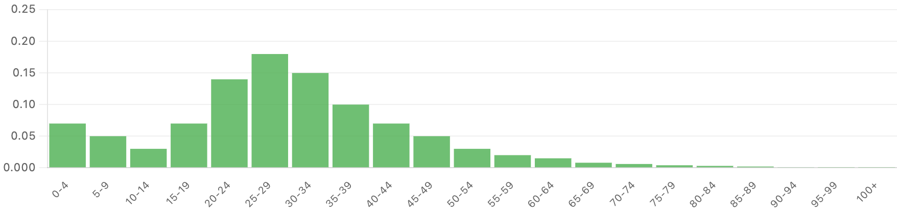
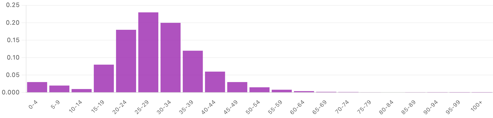

# Population projection tool: How will populations across the world change in the 21st century?

!!! info ""
    :octicons-person-16: **[Daniel Bachler](https://ourworldindata.org/team#daniel-bachler), [Sophia Mersmann](https://ourworldindata.org/team#sophia-mersmann), [Hannah Ritchie](https://ourworldindata.org/team/hannah-ritchie)** • :octicons-calendar-16: May 13, 2026 *(last edit)* • [**:octicons-mail-16: Feedback**](mailto:info@ourworldindata.org?subject=Feedback%20on%20technical%20publication%20-%20Population%20projection%20tool)

Our team have built an interactive visualization tool that provides population projections until the end of the century, based on the user’s selection of three key demographic inputs: fertility rates, life expectancy, and net migration.

This tool is presented in our article [Population tool: How will populations across the world change in the 21st century?](https://ourworldindata.org/population-tool) We also provide a walkthrough of how to use this tool to answer a specific question: what would it take for South Korea to [maintain its current population size](https://ourworldindata.org/south-koreas-population-is-set-to-shrink) throughout this century?

This tool was designed to help people understand and explore how future populations could change based on different demographic assumptions. It is deliberately simple and less complex than expert demographic models. Nonetheless, we hope users find it helpful to understand how population projections respond to changes in key inputs. As we describe below, when given the UN's own demographic assumptions as inputs, our tool closely reproduces its projections.

Here, we want to provide a technical explainer of how this model works, its assumptions, and its limitations. This will be more in-depth than most users need, but it is here for those who want to understand the background.

## What does this model do?

The model draws on historical population and demographic data from the United Nations (UN).

The UN publishes its latest [World Population Prospects](https://population.un.org/wpp/) — typically every two years — giving historical population and demographic data from 1950 through to the present day, plus multiple projection scenarios for how these may change through to 2100\.

We visualize and publish these trends for all countries in our [work on Population Growth](https://ourworldindata.org/explorers/population-and-demography).

The UN’s projections are some of the most commonly used and referenced figures in demography. Our aim is not to replace this work; indeed, our model is a simplified representation that does not include some of the finer details included in these expert assessments.

What the model does do is allow users to see how future populations — in terms of total numbers and age structure — would change based on different assumptions about three key inputs:

* **Total fertility rates:** the total number of births a woman would have if she experienced the birth rates seen in women of each age group in one particular year across her childbearing years.
* **Life expectancy at birth:** the age to which a newborn can expect to live, if age-specific mortality rates in the current year were to stay the same throughout their life.
* **Net migration:** the number of immigrants minus the number of emigrants.

The tool uses the UN’s historical data for 2023 for these metrics, then allows the user to select values for each of the three metrics at three points in time: 2030, 2050, and 2100\.

For example, the user could set the fertility rate to increase from 1.5 births in 2023 to 1.7 by 2030, and then 2 births in 2050 and 2100\.

The model then shows what would happen to the total population, and age structure, of that country over the course of this century. The UN’s medium projection scenario is shown alongside the result for comparison.

## How accurate is it?

One way to assess the accuracy of our simplified model is to run it using the UN’s assumptions for fertility rates, life expectancy, and net migration, and compare its projections with those of the UN's more complex model. That’s what we did.

When we compared populations in 2100 across 237 countries and territories, the mean difference between our model and the UN was 5.1%, and the median difference was 2.4%. Almost 80% of countries came within 5% of the UN projection, and 90% within 10%.

The biggest gaps were for very small territories and in countries whose populations are highly sensitive to migration flows — such as Qatar and the United Arab Emirates. This is because standardized migration age profiles are less accurate than the detailed bilateral flow data that those countries need.

The fact that our simplified model closely replicates the UN’s results in most countries is a strong validation of the approach.

Note that here we are only testing how accurately the model can project future population totals based on assumed demographic inputs; we’re not testing the predictive accuracy (which hinges on how well you can forecast future changes in fertility rates, life expectancy and migration).

## How does it work?

Our model applies the cohort-component method. This approach is also used by the UN in its forecasts, and is commonly used by expert demographers, researchers, and statistical offices.

The approach follows groups of people — cohorts — over time, and applies the expected inputs for fertility, mortality and migration to each cohort.

Cohorts are broken down by age and sex. The projected change for the first year is then based on four changes.

1\. **Deaths:** Some people die, and they are removed from the population total

2\. **Ageing**: Everyone else advances by one year

3\. **Migration**: People arrive or leave the country, and are added or removed from the total

4\. **Births:** Newborns are added to the population at age zero (again, broken down by sex)

The output of this model run for one year then becomes the population cohort input for the next year, and this repeats.

Here are the specifics of each of these four changes.

#### 1\. Deaths

The model uses historical age-sex-specific death rates derived from historical data from the UN.
To translate the life expectancy input into these age-specific rates, it starts from the average mortality profile observed over the most recent 20 years of data (2004–2023) and scales it so that the resulting life expectancy matches your target. It does this for women and men separately, so that the gap in male and female life expectancy matches the gap in recent years.

This scaling results in proportionally larger reductions in mortality at younger and middle ages than at the oldest ages, reflecting how mortality improvements have historically been distributed. At very old ages (older than 85), the model applies a smooth mathematical closure to make sure that mortality rates remain plausible. But this rule is relaxed when the user puts very high life expectancies into the model (often leading to implausible realities).

#### 2\. Ageing

This change is simple: if someone was 47 in the previous year, they become 48 in the next year’s model iteration.

#### 3\. Migration

To model this accurately, we would want detailed breakdowns of migrants by age and sex. What matters for future demographic changes is not just how much people move in or out of a country, but their age and demographic profile (a younger adult could have children in the future, while an older person will not). Unfortunately, this level of migration data is not available for most countries.

Instead, the model takes total net migration rates — which is number of people entering a country minus the number leaving — and assumes they follow a stylized age and sex distribution. There are two distributions that are commonly used.

The **Western standard** is the classic distribution you’d get from labor-market migration in high-income countries. There is a peak of young adults (aged 20 to 35\) who have moved for study or work, with smaller numbers of children and older adults, which reflect family migration.

The **Low Dependency** distribution has a much taller, narrower peak, with most migrants aged 20-30 who moved for work.

For countries with good migration data, the model selects the distribution and sex pattern that best fits the observed population changes over the last 15 or so years. For countries with sparse data, it falls back to pooled defaults.

This choice of profile also varies depending on whether we’re talking about people leaving a country or entering. A country with positive net migration — with more people moving in — tends to have a younger migrant age profile. A country with negative net migration — with more people leaving — the age profile tends to be older. The model adjusts for this depending on the balance of people entering and leaving.

#### 4\. Births

The number of births in a given year is calculated by multiplying the number of women in each age group (from 10 to 54\) by the age-specific fertility rate for that group.

If you increase or decrease the fertility rate in the model, it scales these rates while preserving their relative shapes across women of different ages. So, if 25 to 29-year-olds account for the majority of births, this is assumed to hold across the projected series. This is a limitation we discuss in the next section.

The natural [sex ratio at birth](https://ourworldindata.org/grapher/sex-ratio-at-birth) is around 105 boys per 100 girls, so newborns are split 51.2% male and 48.8% female.

## Limitations of the model

There are several limitations of the model, which means the output of any set of standard inputs may differ from projections from expert demographers. Here are some caveats to keep in mind when using and relying on its outputs.

1. **It starts from historical estimates, which are also uncertain**. The model makes projections based on the UNWPP’s historical population estimates. For many countries, these counts are reliable, but for some without strong statistical capacity, figures for the total population, fertility rates, death rates, and migration are much more uncertain. Inevitably, if the starting point is inaccurate, future projections will be, too. In fact, these discrepancies may even compound over time. This is a challenge for all demographic models, not just ours.

2. **The model uses a linear extrapolation between 2023, 2030, 2050 and 2100**. The user can change values for the input variables at three points in time: 2030, 2050 and 2100\. The model then has to fill these inputs for the years between these points. It does this using a linear extrapolation. This is a simplifcation; in reality, many of these changes would follow non-linear paths, with steeper and shallower changes, and in some cases, temporary reversals.

3. **The age of birth and mortality patterns does not change over time**. If you change the fertility rate input, the model increases or reduces the age-specific rates proportionally. If, in 2023, it is mostly women in their late 20s having the most children, this will remain the case throughout the entire period. In other words, it does not account for the fact that the age pattern of births may change over time. This is also true for mortality: the distribution of who dies at what age is maintained.

4. **It assumes a stylized profile of who migrates**. Population figures will be sensitive not only to how many people migrate to a country, but their age and sex. A woman who is 75 years old is not going to add new children to the population through births; a woman who is 25 when she moves might.
Our model uses a small set of stylized age-sex schedules to distribute net migration across age groups. This works well for most countries, but there are exceptions. It doesn’t fit well for countries where migration is caused by conflict or sudden policy shocks, or where migration is used to fill a specific labor shortage. Gulf countries, such as the United Arab Emirates, are good examples of this, since its migration is dominated by specific labor requirements.

5. **Population data is grouped into 5-year bands**. Both the inputs and outputs of this model have population grouped into 5-year age groups. This will miss some of the nuances and differences within each band, introducing some error.

6. **Like many demographic models, there are is no feedback between demographic changes and societal response**. If there was a dramatic increase in fertility rates — and a subsequent rapid increase in population — a society would be impacted in a number of ways. For example, there may be housing shortages, or pressure on public services. Some people might be priced out of housing, and have fewer children in response.
These types of feedbacks are not incorporated into the model. Depending on the user inputs, this can lead to some scenarios that are plausible mathemetically but implausible in reality.