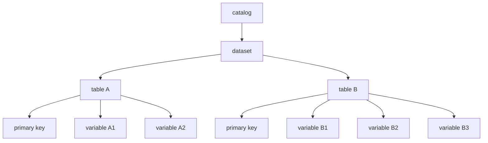

To use data from a wide variety of sources, we need to bring it into a common format.

Our format is inspired by [Frictionless DataPackage format](https://frictionlessdata.io/), which features the following:

- Tables as the fundamental unit of data
- One CSV file per table
- An accompanying YAML file for metadata

We have adapted this format to our needs as follows.

## Levels of data
The following diagram presents an hypothetical dataset with two tables (`Table A` and `Table B`). Both tables have a primary keys and some variables.



### Catalog ([`owid.catalog.CatalogMixin`](https://github.com/owid/owid-catalog-py/blob/master/owid/catalog/catalogs.py))

A catalog is set of datasets, represented on disk as a folder of folders.

### Datasets ([`owid.catalog.Dataset`](https://github.com/owid/owid-catalog-py/blob/master/owid/catalog/datasets.py))

A dataset is a group tables, represented on disk as a folder. Inside the folder, an `index.json` file containing metadata about the dataset as a whole.

The dataset folder is named after the dataset's _short name_, which is a unique identifier for the dataset. The short name is used in URLs, and to identify the dataset in the catalog.

The folder contains one or more Feather files, each of which represents a _table_.

### Tables ([`owid.catalog.Table`](https://github.com/owid/owid-catalog-py/blob/master/owid/catalog/tables.py))

A table is a data file in Feather format (`<short_name>.feather`) or Parquet format (`<short_name>.parquet`) with an accompanying JSON metadata file (`<short_name>.meta.json`).

Feather/Parquet were chosen since they are fast, compact, and preserves types, avoiding the need to describe the types in the table's metadata file.

In Python, the `Table` class is a Pandas `DataFrame` extended to support metadata.

The metadata file indicates the primary key of the table, for example:

```yaml
{ primary_key: ["country", "year"] }
```

All variables in the table share the same primary key. Any column of the table that is not in the primary key is considered to be a _variable_.

### Variables ([`owid.catalog.Variable`](https://github.com/owid/owid-catalog-py/blob/master/owid/catalog/variables.py))

Each variable represents a single indicator, and is equivalent to a Pandas `Series`, including its index.

For example, a table with the columns (`country`, `year`, `population`) and primary key (`country`, `year`) would have one variables: `population`.

## Ergonomics

To make these data types easier to work with, datasets, tables and variables must all have a `short_name` property that uniquely identifies them.

A short name is a lowercase string containing only alphanumeric characters and underscores. It must start with a letter.

## Working with this format

The `owid-catalog` package provides a Python API for working with this format.

It can be installed with:

```
pip install owid-catalog
```

and imported into Python with:

```python
from owid import catalog
```


!!! note

    If you have [set your working environment](../../getting-started/working-environment.md), you will have the `owid-catalog` from `vendor/owid-catalog-py`.
    Make sure that you have the latest version by running  `cd vendor/owid-catalog-py && git pull`.