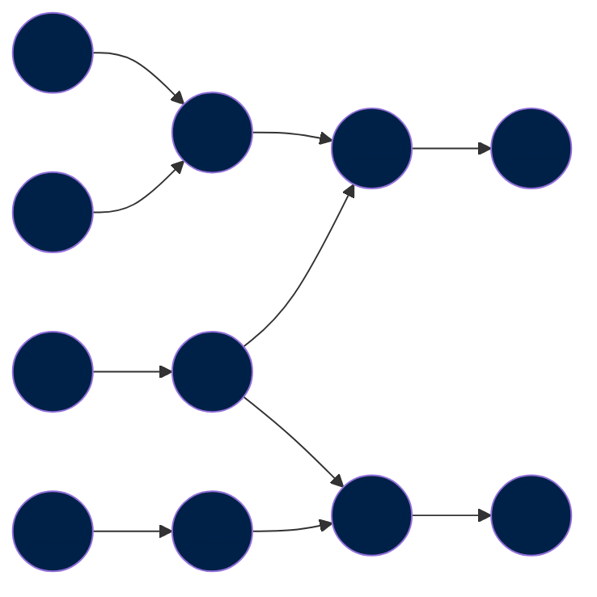
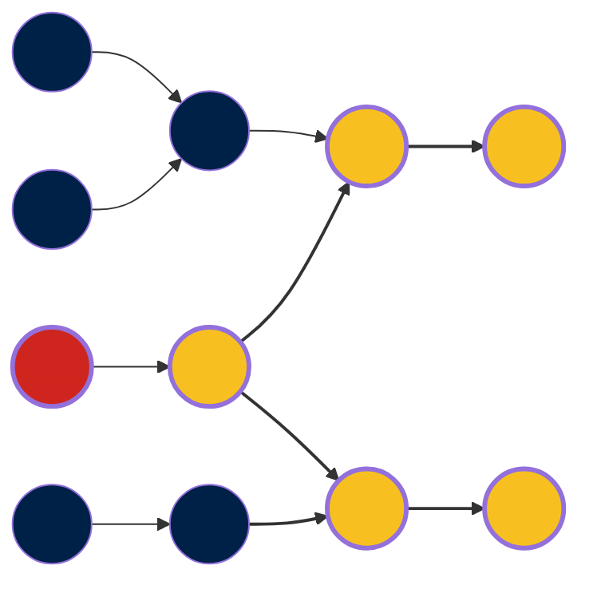

The ETL is a computational graph, that uses a [directed acyclic graph (DAG)](../dag.md) to describe the dependencies between datasets.

The following diagram shows the structure of the computational graph. Each step (or dataset) is represented by a node in the graph, and their dependencies are shown with edges:

Whenever there is a change in a node (red node), all nodes that marked it as a dependency (yellow nodes) will be updated.

!!! info "Learn more about our DAG"

    The computational graph is summarised in our DAG files, which lists all the steps and their dependencies.

    [Read more :octicons-arrow-right-24:](../dag.md)

## Why use a graph?

Graphs present a unique structure that, unlike matrices or tables, the order is not given much priority. Information is stored in terms of node-link. Graphs also can enable distributed computing for large problems, where there are lots of elements. This reduces the computational cost and the time complexity.

A graph is also a simple and easy way to communicate the relationships of our datasets, hence making our processes more transparent and comprehensible by the public.

In addition, it is also an efficient way of organising the data so that the dependency map for a step can be rapidly obtained.

## The nodes and edges

An edge in the computational graph has a very simple meaning: A node depends on another node. For instance, the following graph states that node `B` has node `A` as a dependency:

A node represents a step (or a dataset) in the ETL and is uniquely identified by its URI.

!!! info "Learn more about URIs"

    We use URIs to uniquely identify nodes in the ETL.

    All steps (or nodes) can be uniquely identified throughout the whole ETL. This allows us to reference datasets (and use them) when building a new dataset.

    [Read more :octicons-arrow-right-24:](../uri.md)

There are different types of steps in our ETL, depending on the level of curation of the dataset. We delve deeper into this in the next sections.
