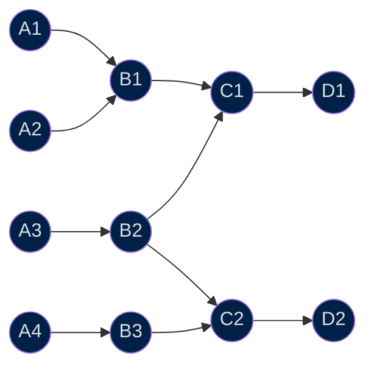

All the steps and dependencies are listed on our DAG. If a step is not listed in the DAG, it will not be tracked by the ETL.

## Format
Consider the following example computational graph:



For instance, we can read that the step `C1` depends on steps `B1` and `B2`, which depend on `A1` and `A2`, and `A3`, respectively.

We keep track of these dependencies using a YAML file that maps steps to their dependencies:


```yaml title="dag.yml"
B1:
  - A1
  - A2
B2:
  - A3
B3:
  - A4
C1:
  - B1
  - B2
C2:
  - B2
  - B3
D1:
  - C1
D2:
  - C2
```

## Our DAG
Now that you are familiar with the format of the DAG, we can dive into the actual DAG that we use.

One key difference with the example DAG presented in the section above is that it consists of several DAG files. All of these coexist in the [`dag/`](https://github.com/owid/etl/tree/master/dag) directory:


```
dag/
├─ agriculture.yml
├─ biodiversity.yml
├─ demography.yml
...
├─ main.yml
...
```

We do this to avoid having a very large single file, which could easily end up having several thousands of lines and would be hard to read. To keep track of all the single files, we have a [`main.yml`](https://github.com/owid/etl/tree/master/dag/main.yml), which has a section that lists them:


```yaml title="dag/main.yml"
...
# Sub-dags to import
include:
  - dag/open_numbers.yml
  - dag/faostat.yml
  - dag/energy.yml
  ...
```

The dependencies are listed under the field `steps`:

```yaml title="dag/demography.yml"
steps:
  # Population
  data://garden/demography/2022-12-08/population:
    - data://garden/hyde/2017/baseline
    - data://garden/gapminder/2019-12-10/population
    - data://garden/un/2022-07-11/un_wpp
    - data://open_numbers/open_numbers/latest/gapminder__systema_globalis
  data://grapher/demography/2023-03-30/population:
    - data://garden/demography/2022-12-08/population
  data://garden/demography/2023-03-31/population:
    - data://garden/hyde/2017/baseline
    - data://garden/gapminder/2023-03-31/population
    - data://garden/un/2022-07-11/un_wpp
    - data://open_numbers/open_numbers/latest/gapminder__systema_globalis
  data://grapher/demography/2023-03-31/population:
    - data://garden/demography/2023-03-31/population
  ...
```

In the above example, we observe that there is a step `data://garden/demography/2022-12-08/population`, which depends on four other steps:

- `data://garden/hyde/2017/baseline`
- `data://garden/gapminder/2019-12-10/population`
- `data://garden/un/2022-07-11/un_wpp`
- `data://open_numbers/open_numbers/latest/gapminder__systema_globalis`


!!! info "Learn more about our URIs"

    We use URIs to uniquely identify nodes in the ETL.

    All steps (or nodes) can be uniquely identified throughout the whole ETL. This allows us to reference datasets (and use them) when building a new dataset.


    [Read more :octicons-arrow-right-24:](uri.md)