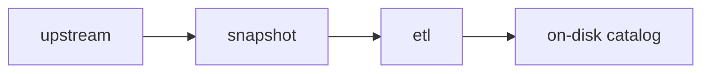

Much of how the ETL is designed falls out of its design goals.

## No special hardware

To ensure that members of the public can run and audit our code, we have designed the ETL to be a standalone Python program that operates on flat files and fetches what it needs on demand.

It should not need any special hardware or services, and individual ETL steps may use no more than 32GB memory.

It should be possible to run the ETL on MacOS, Linux and Windows (via WSL).

## Public by default

All our data work is public by default; we only use private data sources when it is overwhelmingly in the public interest, or when the data is early-access and will shortly become publicly available.

## Outputs as pure functions of inputs

To ensure our work is reproducible, we take our own snapshots of any upstream data that we use, meaning that if in future the upstream data provider changes their site, their data or their API, we can still build our datasets from "raw ingredients".

We secondly keep record all data dependencies in a directed graph or DAG (see YAML files from [`dag/`](https://github.com/owid/etl/blob/master/dag/main.yml)), and forbid steps from using any data as input that isn't explicitly declared as a dependency. This means that the result of any step is a pure function of its inputs.

## Checksums for safe caching

We keep the ETL efficient to build by using a Merkle tree of MD5 checksums:

- Snapshots have a checksum available in their metadata.
- Datasets have a checksum of their inputs available in their metadata (the `source_checksum` field).

When we ask the ETL to build something by running `etl <query>`, it will only build things that are out of date. We can force a rebuild by passing the `--force` flag.

## Ready for data science

Previously, although we could chart data, it was very difficult to work with in Jupyter notebooks.

We have designed the ETL so that data is recorded at different stages of processing. The phase called `meadow` is the version closest to the upstream provider, and the version called `garden` is the best and most useful version of the data. We call data in `garden` "ready for data science".
