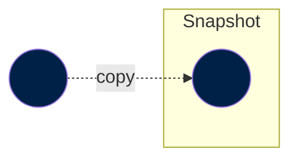

??? info "This section presents a high-level view of our ETL processes."

    The ETL has different types of steps (e.g. `garden`, `meadow` and `grapher`, among others). Some steps, can be understood under the same principle (e.g. `meadow` and `garden` are both "Transform" steps within the ETL).This section does not cover all these steps in detail, but rather describes the very high-level meachanics of ETL.

    [Learn more about all ETL steps :octicons-arrow-right-24:](../workflow/index.md)

In general, an ETL consists of three main processes:

- **Extract**: Downloads data from a source or multiple sources.
- **Transform**: Processes and combines the downloaded data so it is usable.
- **Load**: Moves the transformed data to a data repository (e.g. database).

Our ETL follows these same principles, with different names, and has the following three main building blocks:

- [**Snapshots**](#snapshots): We download files from external sources and store them as snapshots.
- [**Datasets**](#datasets): Next, we curate the downloaded data to have clean datasets. These datasets can depend on snapshots, but also on other curated datasets.
- [**Grapher views**](#grapher-views): We adapt the curated datasets for [Grapher](https://ourworldindata.org/owid-grapher), which are then loaded to Grapher.

As a consequence, nodes in [our DAG](dag.md) can come in different flavours.
<!-- In the next section, we explore these three different types of nodes. -->

## Snapshots

Snapshots are edge nodes in the computational graph. They represent a copy of a upstream data file ー preserving its original format ー at a particular point in time. That is, they are entry points to the ETL, and therefore don't have dependencies within the computational graph.




Snapshots are managed in the ETL using DVC, which allows tracking of different file versions and metadata.

[Their URI](../uri/#path-for-snapshot) begins with the prefix `snapshot://`, therefore using the following format:

```
snapshot://<namespace>/<version>/<filename>
```

!!! example

    ```
    snapshot://aviation_safety_network/2022-10-14/aviation_statistics.csv
    ```

??? warning "Old-style snapshots are managed by the [walden](https://github.com/owid/walden) codebase and begin with the prefix `walden://`."

    There are still several snapshots using this channel.

    !!! example

        ```
        walden://irena/2022-10-07/renewable_power_generation_costs
        ```

## Datasets

Datasets are nodes in the computational graph and the main units of work in the ETL. They represent a transformation from one or more ingredients into a new (and potentially better and more useful) output.

[Their URI](../uri/#path-for-data) begins with the prefix `data://`, and use the following convention:

```
data://<channel>/<namespace>/<version>/<dataset-name>
```

The `channel` is used as the highest level of grouping and represents a stage of data curation. This will either be `meadow` or `garden`. The `namespace` is typically a data provider, like `un`, but it in cases where there are many data providers, it can describe the topic area instead (e.g. `energy`).

The dataset URI is used to identify the code that builds the dataset and also to identify the output file on disk.

!!! example

    From the URI `data://garden/faostat/2022-05-17/faostat_fa` we can derive where the code to produce the dataset is located:

    ```
    etl/steps/data/garden/faostat/2022-05-17/faostat_fa.py
    ```

    or alternatively

    ```
    etl/steps/data/garden/faostat/2022-05-17/faostat_fa/
    ```

    In addition, it also tells us in which S3 bucket it is stored:

    ```
    s3://owid-catalog/garden/faostat/2022-05-17/faostat_fa
    ```

## Grapher views

The Grapher codebase can only accept datasets that are in a particular shape:

```
(entity, year, variable, value)
```

They present a [long format](https://towardsdatascience.com/long-and-wide-formats-in-data-explained-e48d7c9a06cb), where each row is a particular datapoint of a variable:

- `entity`: Identifies the entity (typically a country).
- `year`: Pinpoints the data point to a particular year
- `variable`: Name of the variable.
- `value`: Value of the variable.


However, datasets in the ETL are often in a very different shape instead. For example, they may have data broken down by gender, disease type, fish stock, or some other dimension. Therefore, we need a step that adapts the ETL dataset format into a Grapher friendly format: **The grapher step**.

!!! abstract "Grapher steps"

    Grapher steps are responsible for reshaping a dataset on disk into a grapher view. A single variable may fan out into a large number of grapher views.

These steps use the following URI convention:

```
data://grapher/<namespace>/<version>/<dataset-short-name>
```

Grapher views are still normal datasets, but they adapt the data to the way it must look when being inserted to MySQL. For each grapher view, there is a corresponding matching `grapher://` step automatically generated which does the actual insert to MySQL, if MySQL credentials have been configured.


!!! warning "You should have configured your MySQL credentials during your local Grapher environment setup."


The automatically generated step adapts the data for Grapher, including:

- Generating a Grapher variable for every combination of values of dimensions. For instance, `Death rate (sex=male, age group=60-70)`.
- Converting countries to `entity_id` values that match the `entities` table in MySQL.
- If the dataset has multiple sources, merge them into a single combined source to fit Grapher's data model for sources.
