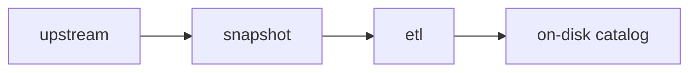

!!! quote "In computing, extract, transform, load (ETL) is a three-phase process where data is extracted, transformed (cleaned, sanitized, scrubbed) and loaded into an output data container ([source](https://en.wikipedia.org/wiki/Extract,_transform,_load))."

We have implemented our own ETL system, which allows us to import data from a wide variety of sources to our catalog.

At a high level, our ETL does the following tasks:


- Captures the data from the source as a snapshot at a particular point in time. This mitigates potential issues trying to access the source site.
- Cleans and brings the data into a common format.
- Describes the data as best as we can for the public using metadata.

In the [following section](workflow/index.md) we detail the different building blocks of the ETL. In this section, we focus more on its high-level principles.

## A compute graph

The ETL is a compute graph, that uses a [directed acyclic graph (DAG)](https://en.wikipedia.org/wiki/Directed_acyclic_graph) to describe the dependencies between datasets. Whenever there is a change in a node, all nodes that marked it as a dependency will be updated.

There are three main types of nodes in the graph:

- Snapshots
- Datasets
- Grapher views

All of these nodes are uniquely identified by a URI, which has the following format:

```
<channel>://<namespace>/<version>/<name>
```

The meaning of the different URI building blocks is explained in the [next section](workflow/index.md). For now, you only need to know that all steps (or nodes) can be uniquely identified throughout the whole ETL. This allows us to reference datasets (and use them) when building a new dataset.


### Snapshots

Snapshots are edge nodes in the compute graph as they represent a copy of an upstream data source in its original format, at a particular point in time. That is, they are entry points to the ETL, and have no dependency within the compute graph.

Snapshots are managed in the ETL using DVC, which allows tracking of different file versions.

Their URIs begin with the prefix `snapshot://` (i.e. their channel is `snapshot`), therefore using the following convention:

```
snapshot://<namespace>/<version>/<filename>
```

!!! example

    ```
    snapshot://aviation_safety_network/2022-10-14/aviation_statistics.csv
    ```

??? warning "Old-style snapshots are managed by the [walden](https://github.com/owid/walden) codebase and begin with the prefix `walden://`."

    There are still several snapshots using this channel.

    !!! example

        ```
        walden://irena/2022-10-07/renewable_power_generation_costs
        ```

### Datasets

Datasets are nodes in the compute graph and the main units of work in the ETL. They represent a transformation from one or more ingredients into a new (and potentially better and more useful) output.

Their URIs begin with the prefix `data://`, and use the following convention:

```
data://<channel>/<namespace>/<version>/<dataset-short-name>
```

The `channel` is used as the highest level of grouping and represents a stage of data curation. This will either be `meadow` or `garden`. The `namespace` is typically a data provider, like `un`, but it in cases where there are many data providers, it can describe the topic area instead (e.g. `energy`).

The dataset URI is used to identify the code that builds the dataset and also to identify the output file on disk.

!!! example

    From the URI `data://garden/faostat/2022-05-17/faostat_fa` we can derive where the code to produce the dataset is located:

    ```
    etl/steps/data/garden/faostat/2022-05-17/faostat_fa.py
    ```

    or alternatively

    ```
    etl/steps/data/garden/faostat/2022-05-17/faostat_fa/
    ```

    In addition, it also tells us in which S3 bucket it is stored:

    ```
    s3://owid-catalog/garden/faostat/2022-05-17/faostat_fa
    ```

### Grapher views

The Grapher codebase can only accept datasets that are in a particular shape:

```
(entity, year, variable, value)
```

That is, they present a [long format](https://towardsdatascience.com/long-and-wide-formats-in-data-explained-e48d7c9a06cb), where each row is a particular datapoint of a variable:

- `entity`: Identifies the entity (typically a country).
- `year`: Pinpoints the data point to a particular year
- `variable`: Name of the variable.
- `value`: Value of the variable.


However, datasets in the ETL are often in a very different shape instead. For example, they may have data broken down by gender, disease type, fish stock, or some other dimension. Therefore, we need a step that adapts the ETL dataset format into a Grapher friendly format: **The grapher step**.

!!! abstract "Grapher steps"

    Grapher steps are responsible for reshaping a dataset on disk into a grapher view. A single variable may fan out into a large number of grapher views.

These steps use the following URI convention:

```
data://grapher/<namespace>/<version>/<dataset-short-name>
```

Grapher views are still normal datasets, but they adapt the data to the way it must look when being inserted to MySQL. For each grapher view, there is a corresponding matching `grapher://` step automatically generated which does the actual insert to MySQL, if MySQL credentials have been configured.


!!! warning "You should have configured your MySQL credentials during your local Grapher environment setup."


The automatically generated step adapts the data for Grapher, including:

- Generating a Grapher variable for every combination of values of dimensions. For instance, `Death rate (sex=male, age group=60-70)`.
- Converting countries to `entity_id` values that match the `entities` table in MySQL.
- If the dataset has multiple sources, merge them into a single combined source to fit Grapher's data model for sources.

## Features and constraints

Much of how the ETL is designed falls out of its design goals.

### No special hardware

To ensure that members of the public can run and audit our code, we have designed the ETL to be a standalone Python program that operates on flat files and fetches what it needs on demand.

It should not need any special hardware or services, and individual ETL steps may use no more than 16GB memory.

It should be possible to run the ETL on MacOS, Linux and Windows (via WSL).

### Public by default

All our data work is public by default; we only use private data sources when it is overwhelmingly in the public interest, or when the data is early-access and will shortly become publicly available.

### Outputs as pure functions of inputs

To ensure our work is reproducible, we take our own snapshots of any upstream data that we use, meaning that if in future the upstream data provider changes their site, their data or their API, we can still build our datasets from "raw ingredients".



We secondly keep record all data dependencies in a directed graph or DAG (see YAML files from [`dag`](https://github.com/owid/etl/blob/master/dag/main.yml)), and forbid steps from using any data as input that isn't explicitly declared as a dependency. This means that the result of any step is a pure function of its inputs.

### Checksums for safe caching

We keep the ETL efficient to build by using a Merkle tree of MD5 checksums:

- Snapshots have a checksum available in their metadata
- Datasets have a checksum of their inputs available in their metadata (the `source_checksum` field)

When we ask the ETL to build something by running `etl <query>`, it will only build things that are out of date. We can force a rebuild by passing the `--force` flag.

### Ready for data science

Previously, although we could chart data, it was very difficult to work with in Jupyter notebooks.

We have designed the ETL so that data is recorded at different stages of processing. The phase called `meadow` is the version closest to the upstream provider, and the version called `garden` is the best and most useful version of the data. We call data in `garden` "ready for data science".
