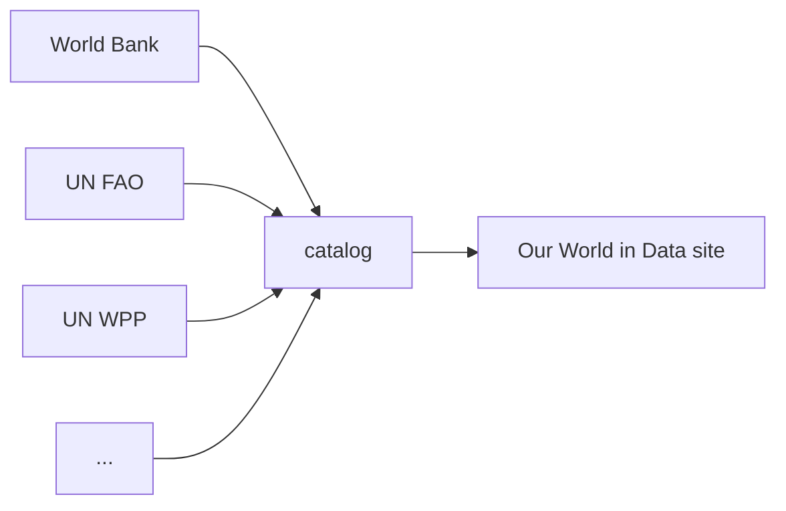
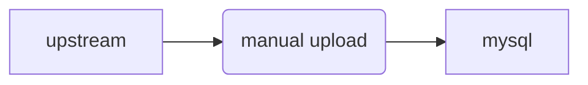

# Architecture

## Our place in the data ecosystem

Our World In Data is a publication that makes very heavy use of data to communicate about global issues.

The best data on global issues comes from the hard work of _data providers_, which can be individual researchers, small research groups, or big institutions like the UN or World Bank.

Since we reuse this work, we are effectively a _data republisher_ that tries to process and understand data from a wide variety of sources, and present it to the public in a unified way.

To use data from a wide variety of sources, we need to:

1. Bring it into a [common format](common-format.md)
2. [Harmonize](harmonization.md) the data so that, wherever possible, the same words mean the same things
3. Explain the data as best as we can for the general public using [metadata](metadata.md)
4. _Respect_ the upstream providers, and ensure they get proper credit for their hard work

## Our journey

We generally do not produce data, but instead stand on the shoulders of big institutions like the UN and World Bank, as well as the work of individual researchers and small research groups. Our work increases the impact of data providers by communicating

In our early days, we developed the [Grapher](https://github.com/owid/owid-grapher) data visualisation library, to give us more control over how we visualise data. Like other tools for data journalism such as Datawrapper, grapher had an admin interface that let you bring your own CSV and make a chart for that.

During the pandemic, we had to update data every day, and clicking through an admin to do it become inefficient. We developed a series of scripts to directly insert data into our database (MySQL) for use on our site, the [importers](https://github.com/owid/importers) repo.

Over time we began _remixing_ data from more sources, and we began noticing that our data scripts did not give us a good access to the data in analytics environments such as Jupyter notebooks.

We developed the current project, the ETL, as the next stage in how we process data.

## Design goals

This project has several design goals:

- **Efficient to use.** This project is the working space for our team of data managers. If they are to do their best work, it should be easy for them to add new datasets and update existing datasets.
- **Pubicly reproducible.** We want members of the public to be able to audit our code and run it themselves. This means no fancy infrastructure, just Python and local files.
- **Ready for data science.**
- **Opinionated workflow.**
- **Supports multiple outputs**

## Our workflow

## A brief history

This document gives some more history that is especially relevant for staff at OWID to understand how various pieces of legacy workflows fit in with ETL.

For context, recall that the basic flow of data from institutional publishers to our site is (and has been for a long time), something like this on the high level:

Originally, there was one way to get data in, using the internal Grapher admin site:

Over time, OWID developed a data team and started importing much larger institutional datasets, ones that needed substantial code for importing. This added a second way to get data in, by running code in the `importers` repository.

.. mermaid::
:align: center

    graph LR

    upstream --> admin(manual upload) --> mysql
    upstream --> importers --> mysql

This project, the ETL, aims replace `importers`, and make our handling of big institutional datasets even better. It also creates an on-disk data catalog that can be reused outside of our site.

.. mermaid::
:align: center

    graph LR

    upstream --> admin(manual upload) --> mysql
    upstream --> etl --> catalog[catalog on disk] --> mysql

The main users of the ETL are data managers. The ETL is desinged to make their work fully repeatable and reviewable. The admin is still available for manual imports, and may be faster for datasets that have been transformed by hand.

## Stages of data management

Our World In Data has a whole team dedicated to data management that takes data from publicly available sources, such as the UN Food and Agriculture Organisation, and makes it available to our researchers to visualise in the articles that they write.

.. mermaid::
:align: center

    graph LR

    upstream --> download --> format --> harmonise --> import --> plot

To make something chartable on the Our World In Data site, a data manager must:

1. Locate the _upstream_ data source
2. _Download_ and keep a copy of the data for later use (`walden`)
3. Bring the data into a _common format_ (`meadow`)
4. _Harmonise_ the names of countries, genders and any other columns we may want to join on (`garden`)
5. _Import_ the data to our internal MySQL database (`grapher`)

After these steps, the data is available to be plotted on our site. Alongside the later steps are optional moments for review by data managers or researchers.

The design of the ETL involves stages that mirror the steps above. These help us to meet several design goals of the project.
