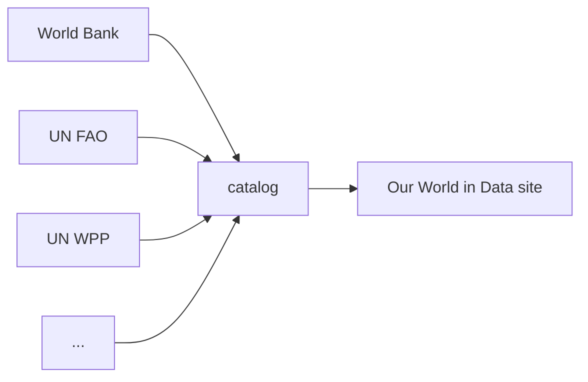
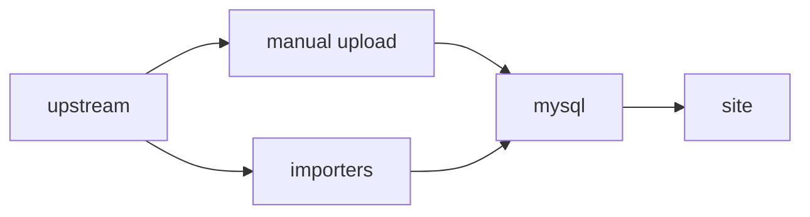
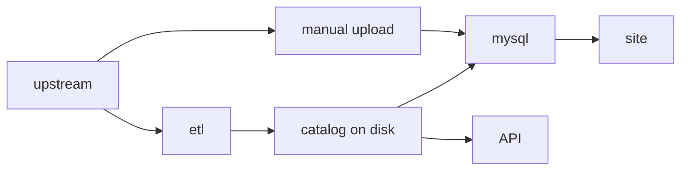
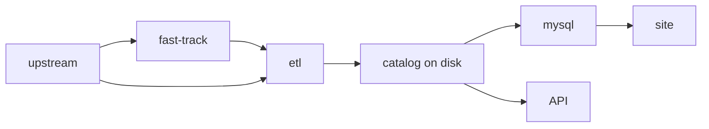

# Architecture

## Our place in the data ecosystem

Our World In Data is a publication that makes very heavy use of data to communicate about global issues.

The best data on global issues comes from the hard work of _data providers_, which can be individual researchers, small research groups, or big institutions like the UN or World Bank.

Since we reuse this work, we are effectively a _data republisher_ that tries to process and understand data from a wide variety of sources, and present it to the public in a unified way.

To use data from a wide variety of sources, we need to:

1. Bring it into a [common format](common-format.md)
2. [Harmonize](harmonization.md) the data so that, wherever possible, the same words mean the same things
3. Describe the data as best as we can for the general public using [metadata](metadata.md)

## Our journey

We generally do not produce data, but instead stand on the shoulders of big institutions like the UN and World Bank, as well as the work of individual researchers and small research groups. Our role is to promote the work of high quality data providers and share it with the public, in a context which makes it understandable.

In our early days, we developed the [Grapher](https://github.com/owid/owid-grapher) data visualisation library to give us more control over how we visualise data. Like other tools for data journalism such as Datawrapper, grapher had an admin interface that let you upload a CSV and make a chart with it.

During the pandemic, we had to update data every day, and clicking through an admin interface to do it become inefficient. We developed a series of scripts to directly insert data into our database (MySQL) for use on our site, the [importers](https://github.com/owid/importers) repo.

Over time we began _remixing_ data from more sources, and we began noticing that our data scripts did not give us a good access to the data in analytics environments such as Jupyter notebooks. We developed the current project, the ETL, as the next stage in how we process data.

The ETL generates an on-disk data catalog based on flat files. We import this catalog into MySQL for use on our site, but we also use it to power a [public API](../api/index.ipynb).

Whilst the ETL is excellent for making data reproducible, it is still slower than doing manual CSV uploads for small datasets. For this reason, we are working on a new "fast track" for small datasets, which will replace the existing manual upload admin.

The main users of the ETL are data managers. The ETL is desinged to make their work fully repeatable and reviewable. The admin is still available for manual imports, and may be faster for datasets that have been transformed by hand.

Read about our [data management workflow](workflow.md) to learn more about how we use the ETL.
