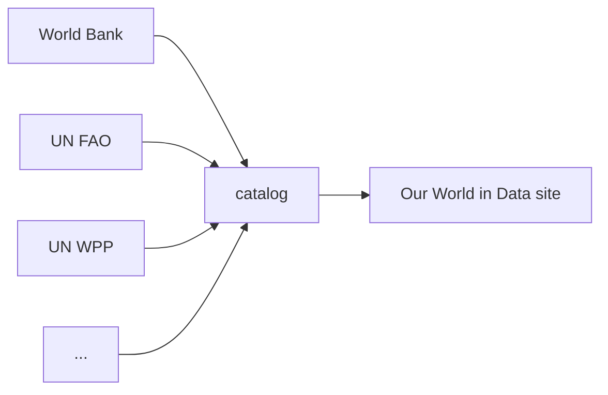
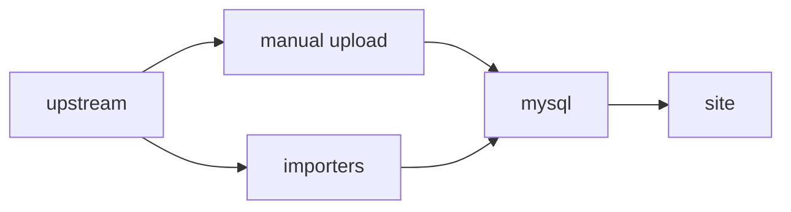
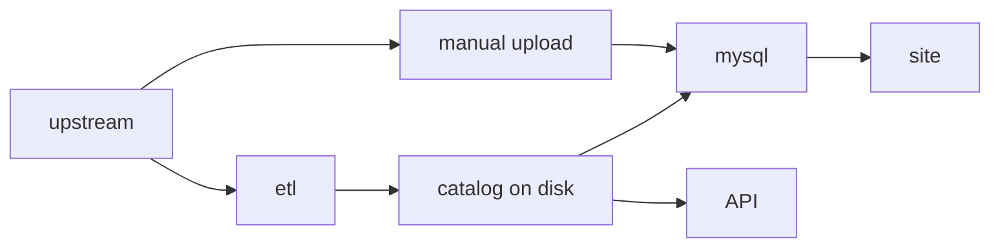

# Our journey

We generally do not produce data, but instead stand on the shoulders of big institutions like the UN and World Bank (and many others), as well as the work of individual researchers and small research groups. Our role is to promote the work of high quality data providers and share it with the public, in a context which makes it understandable.

## Early days

In our early days, we developed the [Grapher](https://github.com/owid/owid-grapher) data visualisation library to give us more control over how we visualise data. Like other tools for data journalism such as Datawrapper, Grapher had an admin interface that let you upload a CSV to a database and make a chart with it for the site.

## Importers

??? failure "Deprecated"

    The `importers` repository is now deprecated and only `etl` repository is used.

During the pandemic, we had to update data every day, and clicking through an admin interface to do it become inefficient. We developed a series of scripts to directly insert data into our database (MySQL) for use on our site, the [importers](https://github.com/owid/importers) repo.

Over time we began _remixing_ data from more sources, and we began noticing that our data scripts were not enough to maintain a constantly growing catalog of datasets.

## ETL: Current solution
We needed a better solution to build a large dataset catalog, which should be scalable and maintainable solution:

- It should be friendly to data scientists and well stablished tools (such as python). Data should be consumable with `python` and in `analytics environments such as Jupyter.
- It should be transparent. Anyone should be able to trace back how the data had been processed, from one of our charts all the way to the original data source.
- Versioning of datasets. Git is great at keeping history of versions, but it is not suitable for large files. Data recipes (scripts) can live in Git, but data files should be in a dedicated disk.

To this end, we developed the current project, the ETL, as the next stage in how we process data. The ETL generates an on-disk data catalog based on flat files. We import this catalog into MySQL for use on our site, but we also use it to power a [public API](../../api/).

The main users of the ETL are data managers. The ETL is desinged to make their work fully repeatable and reviewable. The admin is still available for manual imports, and may be faster for datasets that have been transformed by hand.

<!-- Read about our [data management workflow](workflow/index.md) to learn more about how we use the ETL. -->
