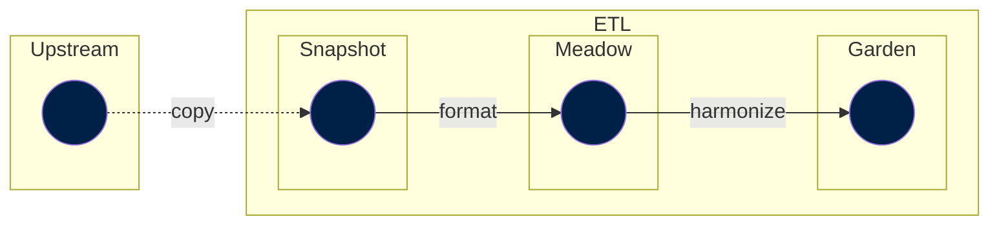

The Garden step is where most of the work falls in. This is where the data manager needs to carefully look at the data, filter outliers, harmonize labels (e.g. country names), improve the dataset metadata, etc.

Garden steps typically depend on meadow steps. For instance, the `garden` step `data://garden/un/2022-07-11/un_wpp`, which generates the dataset _World Population Prospects (UN, 2022)_, depends on this same process but in `meadow`: `data://meadow/un/2022-07-11/un_wpp`. That is, the `meadow` step has done some pre-liminary (and minor) work on re-shaping the UN WPP dataset and now is the turn of the `garden` step to apply the major processing steps to have a curated UN WPP dataset by Our World in Data.

A typical flow up to the Garden step could look like:




However, garden steps could also depend on other garden steps. This is often the case for datasets containing _long-run variables_, where different `garden` datasets are combined.


!!! info "Long-run variables"

    A long-run variable is a variable that has datapoints spanning over a broad period of time and that typically relies on multiple sources.

    For instance, we have a [population variable](https://ourworldindata.org/population-sources) that combines data from the UN and other sources that goes back to 10,000 BCE. In particular, it uses data from the UN, Gapminder and HYDE.

    This is how the dependency graph our population variable looks like:

    ```yaml
      data://garden/demography/2023-03-31/population:
      - data://garden/hyde/2017/baseline
      - data://garden/gapminder/2023-03-31/population
      - data://garden/un/2022-07-11/un_wpp
      - data://open_numbers/open_numbers/latest/gapminder__systema_globalis
    ```

!!! danger "TODO: Add an example of code"
## Harmonizing labels

In order to understand data within a single dataset, we want to know what is meant by the data.

For example, a `country` column containing the value `Korea` could be referring to South Korea, North Korea, or historical unified Korea as it existed a century ago, depending on the context and the intent of the data provider.

Harmonization is the editorial process by which we modify the indexing columns for a dataset to ensure that the data is consistent and unambiguous.

### What does Our World In Data harmonize?

Today, Our World In Data makes a best-effort to harmonize countries and regions. We strive to do this in a way that is consistent with the [ISO 3166-1 standard](https://en.wikipedia.org/wiki/ISO_3166-1), however we use custom editorial labels for countries and regions that are often shorter than those in the standard, in order to make data visualisations richer and more understandable.

Since we also present long-run datasets over multiple centuries, a time period in which national borders have changed, split and merged, we also make a best-effort attempt to harmonize the names of historical countries and regions that no longer exist and are not present in the ISO standard.

### How do we perform harmonization?

There are two methods that we use, both of which are semi-automated and involve some human judgement by our data managers.

#### Command-line harmonization

!!! success "Recommended method"

The [etl](https://github.com/owid/etl) codebase contains an interactive `harmonize` command-line tool which can be used to harmonize a CSV file that contains a column with country names.

```
$ poetry run etl-harmonize --help
Usage: etl-harmonize [OPTIONS] DATA_FILE COLUMN OUTPUT_FILE [INSTITUTION]
                     [NUM_SUGGESTIONS]

 Given a DATA_FILE in feather or CSV format, and the name of the COLUMN representing country
 or region names, interactively generate the JSON mapping OUTPUT_FILE from the given names to
 OWID's canonical names. Optionally, can use INSTITUTION to append "(institution)" to
 countries.

 When a name is ambiguous, you can use:
 - Choose Option (9) [custom] to enter a custom name
 - Type `Ctrl-C` to exit and save the partially complete mapping
 If a mapping file already exists, it will resume where the mapping file left off.

╭─ Options ───────────────────────────────────────────────────────────────────────────────────╮
│ --help      Show this message and exit.                                                     │
╰─────────────────────────────────────────────────────────────────────────────────────────────╯

```

As an example, start the harmonization interactive session for table `undp_hdr` from dataset `meadow/un/2022-11-29/undp_hdr`, which has `country` column with the raw country names:


```bash
$ poetry run harmonize data/meadow/un/2022-11-29/undp_hdr/undp_hdr.feather country mapping.json
206 countries/regions to harmonize
  └ 189 automatically matched
  └ 17 ambiguous countries/regions

Beginning interactive harmonization...
  Select [skip] to skip a country/region mapping
  Select [custom] to enter a custom name

? [1/17] Arab States: (Use shortcuts or arrow keys)
 » 1) Yemen Arab Republic
   2) United States Virgin Islands
   3) United States Minor Outlying Islands
   4) United States
   5) United Arab Emirates
   6) [custom]
   7) [skip]
```

The output mapping is saved in `mapping.json`.

#### Using the Grapher admin

!!! danger  "This method is not preferred. Instead, consider using the `etl-harmonize` command tool."

The [owid-grapher](https://github.com/owid/owid-grapher) codebase contains a interactive country harmonization tool that can be accessed at [http://localhost:3030/admin/standardize](http://localhost:3030/admin/standardize) when running the dev server.

To use the tool, you upload a CSV file containing a column called `Country`, and indicate the encoding of country names.

??? Tip "For staff"

    The interactive harmonization tool for staff is available at [https://owid.cloud/admin/standardize](https://owid.cloud/admin/standardize).


## Metadata
In our [data model](../design/common-format.md), datasets contain tables of data, and those tables contain variables. Each of these levels supports metadata.

!!! warning "This is still being written."

    Our metadata formats are still in flux, and are likely to change substantially over the coming months.


    We are currently working on version 2 of our metadata, for which you can find most up-to-date documentation [on Notion :octicons-arrow-right-24:](https://www.notion.so/owid/Metadata-guidelines-29ca6e19b6f1409ea6826a88dbb18bcc)


!!! info "For more up to date details, see the the classes `DatasetMeta`, `TableMeta` and `VariableMeta` in the [`owid.catalog.meta`](https://github.com/owid/etl/blob/master/lib/catalog/owid/catalog/meta.py) module."
