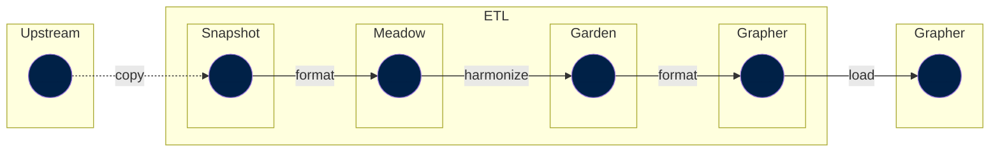

In the `grapher` step the work should be minimal. Here, we create a `grapher` view by adapting our Garden dataset to fit the Grapher requirements.

Grapher views are still normal datasets, but they adapt the data to the way it must look when being inserted to MySQL. For each grapher view, there is a corresponding matching `grapher://` step automatically generated which does the actual insert to MySQL, if MySQL credentials have been configured.

A typical flow up to the Grapher step could look like:

In principle, a grapher step only loads a single garden step.

Note that the diagram shows a final step outside of the ETL. This is when the `grapher://` step is executed, and takes data from the ETL (from the etl `garden` step) and imports it to oure database.

!!! bug "TODO: Add an example of code"
