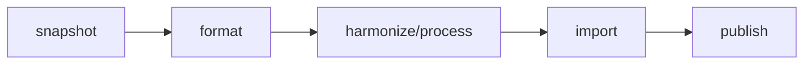
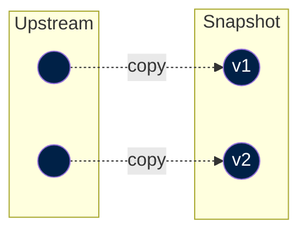
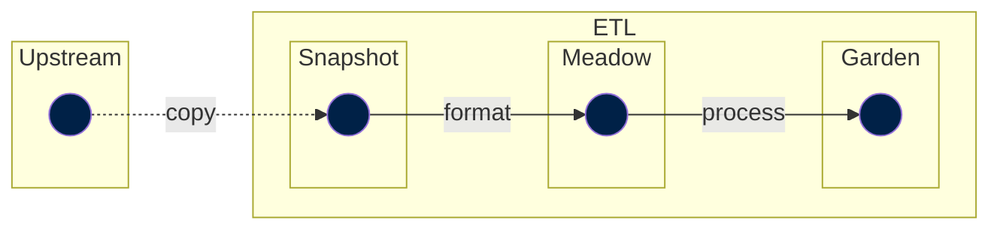
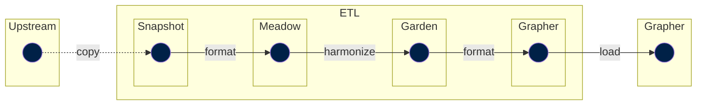

Our World in Data has a whole team dedicated to data management that takes data from publicly available sources (e.g. the _UN Food and Agriculture Organisation_), and makes it available to our researchers to analyse and create visualisation for their articles.

## Five stages

The ETL project provides an opinionated data management workflow, which separates a data manager's work into five stages:



The design of the ETL involves steps that mirror the stages above, which help us to meet several design goals of the project:

1. [Snapshot step](#snapshot): Take a **snapshot** of the upstream data product and store it.
2. [Meadow step](#meadow): Bring the data into a **common format**.
3. [Garden step](#garden): **Harmonise** the names of countries, genders and any other columns we may want to join on. Also do the necessary **data processing** to make the dataset usable for our needs.
4. [Grapher step](#grapher): **Import** the data to our internal MySQL database.

A data manager must implement all these steps to make something chartable on the Our World in Data site.

!!! info

    When all steps (1 to 4) are implemented, the data is available for publication on our site. The publication step can involve creating new charts or updating existing ones with the new data.

    Note that there are [other steps](other-steps), which are used only in specific cases.

## Snapshot

The initial step consists in **transferring an external file from an upstream provider into our platform**. This ensures, that the source data is always accessible. This is because the upstream provider might remove the file at any time, or change it.

The accompanying diagram illustrates the process of importing various versions of the same dataset into our snapshot catalog, depicted over time. Imagine that the vertical axis represents time.



The snapshot step typically consists of a DVC file and a script that downloads the upstream data and saves it to our snapshot catalog. Snapshot files are located in the [`snapshots/`](https://github.com/owid/etl/tree/master/snapshots) directory of the project.

Note that we need a DVC file per upstream data file; hence, in some instances, if the source publishes a dataset using multiple files, we need multiple DVC files.

### Snapshot metadata

A Snapshot is a picture of a data product (e.g. a data CSV file) provided by an upstream data provider at a particular point in time. It is the entrypoint to ETL and where we define metadata attributes of that picture. This is fundamental to ensure that the data is properly documented and that the metadata is propagated to the rest of the system.

The metadata in Snapshot consists mainly of one object: `meta.origin`.

!!! info "Learn more in our [metadata reference](../metadata/reference#origin)."

    This metadata is captured in a DVC file (similar to a YAML file), which contains all the snapshot metadata fields as key-value pairs.

??? example "Example of [`snapshots/animal_welfare/2023-10-24/fur_laws.xlsx.dvc`](https://github.com/owid/etl/blob/master/snapshots/animal_welfare/2023-10-24/fur_laws.xlsx.dvc)"

    This file specifies all the upstream source file details (including link to download it, metadata fields, etc.). Filling the fields of this file requires some manual work, as we are "translating" all the information that the source provides into our snaphsot metadata format.

    ```yaml title="snapshots/animal_welfare/2023-10-24/fur_laws.xlsx.dvc"
    meta:
        origin:
            title: Fur banning
            producer: Fur Free Alliance
            citation_full: Overview national fur legislation, Fur Free Alliance (2023).
            url_main: https://www.furfreealliance.com/fur-bans/
            url_download:
            https://www.furfreealliance.com/wp-content/uploads/2023/10/Overview-national-fur-legislation.xlsx
            date_published: '2023-10-01'
            date_accessed: '2023-10-24'
            license:
            name: CC BY 4.0

    wdir: ../../../data/snapshots/animal_welfare/2023-10-24
    outs:
        - md5: bb6e0f8b9a05a8d7c446be2f1d6f9613
          size: 28585
          path: fur_laws.xlsx
    ```

## Meadow

The meadow step is the first Transform step of our ETL. In it, we load a [`Snapshot`](../../architecture/design/phases/#snapshot) and adapt it to be in a convenient format. A convenient format means creating an instance of a [`Dataset`](../../architecture/design/phases/#datasets), with the appropriate data as a `Table` (or tables).

In this step, you can add and define metadata, but we rarely do this. Instead, we propagate the metadata defined in the Snapshot step and leave it to the Garden step to enhance the metadata.

Meadow steps should only have `snapshot` dependencies and ー by definition ー should not depend on `garden` any other steps.

## Garden

The Garden step is where most of the work falls in. This is where the data manager needs to carefully look at the data, filter outliers, harmonize labels (e.g. country names), improve the dataset metadata, etc.

Garden steps typically depend on meadow steps. For instance, the Garden step `data://garden/un/2024-07-12/un_wpp`, which generates the dataset _World Population Prospects (UN, 2024)_, depends on this same process but in Meadow (i.e. `data://meadow/un/2024-07-12/un_wpp`). After some pre-liminary work (mostly re-formating tables, and some minor cleaning), we can now focus on more complex processing steps in Garden.

A typical flow up to the Garden step could look like:



However, Garden steps could also depend on other garden steps. This is often the case for datasets containing _long-run indicators_, or just in general when different `garden` datasets are combined.

!!! info "Long-run indicators"

    A long-run indicator is an indicator that has datapoints spanning over a broad period of time and that typically relies on multiple sources.

    For instance, we have a [population indicator](https://ourworldindata.org/population-sources) that combines data from the UN and other sources that goes back to 10,000 BCE. In particular, it uses data from the UN, Gapminder and HYDE.

    This is how the dependency graph our population indicator looks like:

    ```yaml
      data://garden/demography/2023-03-31/population:
       - data://garden/hyde/2017/baseline
       - data://garden/gapminder/2023-03-31/population
       - data://garden/un/2022-07-11/un_wpp
       - data://open_numbers/open_numbers/latest/gapminder__systema_globalis
    ```

An important processing step in Garden is to standardize (or harmonize) the country names. You can learn more about this in our [country harmonization guide](../../guides/harmonize-countries).

### Garden metadata

After adapting and processing the origin's data, we have a curated dataset. This dataset, contains indicators (maybe not present in the origin) that we need to properly document.

The metadata in Garden consists mainly of two objects: [`Dataset`](../../architecture/metadata/reference/#dataset) and [`Table`](../../architecture/metadata/reference/#table) (list). The metadata comes as a YAML file next to the processing scripts.

!!! info "Learn more in our [dataset reference](../metadata/reference/#dataset), [tables reference](../metadata/reference/#table) and [indicator reference](../metadata/reference/#variable)."

## Grapher

In the Grapher step the work should be minimal. Here, we create a `Grapher` view by adapting our Garden dataset to adhere to the Grapher requirements.

Grapher views are still normal datasets, but they adapt the data to the way it must look when being inserted into MySQL. For each grapher view, there is a corresponding matching `grapher://` step automatically generated which does the actual insert to MySQL, if MySQL credentials have been configured.

A typical flow up to the Grapher step could look like:



In principle, a Grapher step only loads a single garden step.

Note that the diagram shows a final step outside of the ETL. This is when the `grapher://` step is executed, and takes data from the ETL (from the etl `garden` step) and imports it to our database.

## Export steps

Sometimes we want to perform an action instead of creating a dataset. For instance, we might want to create a TSV file for an explorer, commit a CSV to a GitHub repository, or create a config for a multi-dimensional indicator. This is where the `Export` step comes in.

Export steps are used to perform an action on an already created dataset. This action typically implies making the data available to other parts of the system. There are different types of export steps:

- **Explorers**: Create a TSV file for a data explorer.
- **Multi-dimensional indicators** (Mdim): Create a configuration for a multi-dimensional indicator.
- **Export to GitHub**: Commit a dataset to a GitHub repository.

Export steps should be used after the data has been processed and is ready to be used (post-Garden).

!!! note "Learn more about [export steps](../../guides/data-work/export-data.md)"

### Mdims and explorers
!!! warning "This space is very new and in development"

Mdims (`export://multidim/`) and explorers (`export://explorers/`) are Grapher charts expanded with additional functionalities to facilitate exploration, such as dynamic entity filters or customizable menus. They are usually powered by indicators from OWID's Grapher database.

In ETL, we define these by grouping indicators together into "collections". These collections are then upserted to the database to power explorers and multidims (collection of charts). Having multidim and explorer steps allows us to properly track dependencies and ensure that the data is up-to-date.

These steps must depend only on `data://grapher` steps, since they require indicators to be in the Database. This is because explorers and multidims on the site access indicators in the database.

!!! info "Learn more about creating Data explorers [on Notion :octicons-arrow-right-24:](https://www.notion.so/owid/Creating-Data-Explorers-cf47a5ef90f14c1fba8fc243aba79be7)."

!!! note "Legacy explorers"

    In the past Explorers were manually defined from our Admin. Data was sourced by CSV files generated by ETL [served from S3](https://dash.cloudflare.com/078fcdfed9955087315dd86792e71a7e/r2/default/buckets/owid-catalog), or on GitHub.

    We have slowly transitioned into a new system where explorers are generated from the ETL pipeline. This is a more scalable and maintainable solution.
