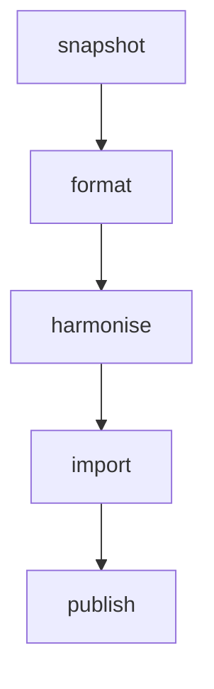
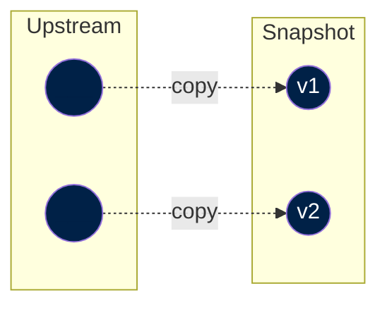
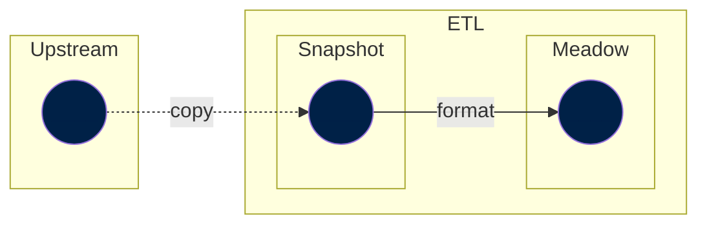
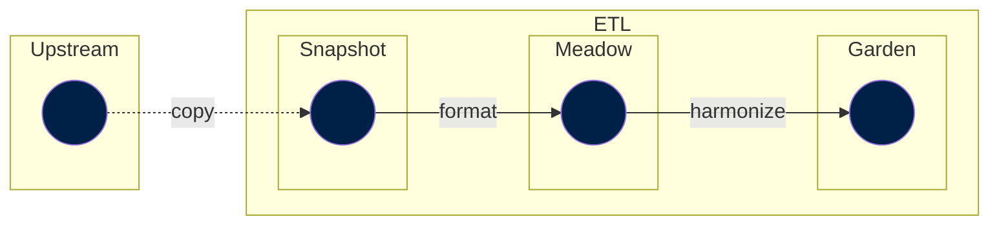
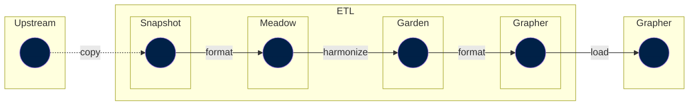

Our World in Data has a whole team dedicated to data management that takes data from publicly available sources (e.g. the _UN Food and Agriculture Organisation_), and makes it available to our researchers to analyse and create visualisation for their articles.

## Five stages

The ETL project provides an opinionated data management workflow, which separates a data manager's work into five stages:



The design of the ETL involves steps that mirror the stages above, which help us to meet several design goals of the project:

1. [Snapshot step](#snapshot): Take a **snapshot** of the upstream data product and store it on our end.
- [Meadow step](#meadow): Bring the data into a **common format**.
- [Garden step](#garden): **Harmonise** the names of countries, genders and any other columns we may want to join on. Also do the necessary data processing to make the dataset usable for our needs.
- [Grapher step](#grapher): **Import** the data to our internal MySQL database.

A data manager must implement all these steps to make something chartable on the Our World in Data site.

!!! info
    When all steps (1 to 4) are implemented, the data is available for publication on our site. The publication step can involve creating new charts or updating existing ones with the new data.

Note that there are [other steps](other-steps), which are used only in specific cases.

## Snapshot

The initial step in importing data from an upstream source involves **transferring an external file directly into our platform**. This process is essential to ensure both reliable and secure access to the file.

It's important to recognize that an external source might remove the file at any time. Furthermore, this method supports the reproducibility of all Extract, Transform, Load (ETL) processes. This is crucial because the content of the file at the source may undergo changes, such as the removal or addition of datapoints, or alterations in field names.

The accompanying diagram illustrates the process of importing various versions of the same dataset into our snapshot catalog, depicted over time. Imagine that the vertical axis represents time.



The snapshot step typically consists of a DVC file and a script that downloads the upstream data and saves it to our snapshot catalog. Snapshot files are located in the [`snapshots/`](https://github.com/owid/etl/tree/master/snapshots) directory of the project.

Note that we need a DVC file per upstream data file; hence, in some instances, if the source publishes a datset using multiple files, we need multiple DVC files.


### Metadata

A Snapshot is a picture of a data product (e.g. a data CSV file) provided by an upstream data provider at a particular point in time. It is the entrypoint to ETL and where we define metadata attributes of that picture. This is fundamental to ensure that the data is properly documented and that the metadata is propagated to the rest of the system.

The metadata in Snapshot consists mainly of one object: `meta.origin`.

!!! info "Learn more in our [metadata reference](../metadata/reference#origin)."


This metadata is captured in a DVC file (similar to a yaml file), which contains all the snapshot metadata fields as key-value pairs.


??? example "Example of [`snapshots/animal_welfare/2023-09-08/fur_laws.pdf.dvc`](`https://github.com/owid/etl/blob/master/snapshots/animal_welfare/2023-09-08/fur_laws.pdf.dvc`)"
    This file specifies all the upstream source file details (including link to download it, metadata fields, etc.). Filling the fields of this file requires some manual work, as we are "translating" all the information that the source provides into our snaphsot metadata format.

    ```yaml title="snapshots/animal_welfare/2023-09-08/fur_laws.pdf.dvc"
    meta:
        origin:
            title: Fur banning
            producer: Fur Free Alliance
            citation_full: Overview national fur legislation, Fur Free Alliance (2023).
            url_main: https://www.furfreealliance.com/fur-bans/
            url_download:
            https://www.furfreealliance.com/wp-content/uploads/2023/04/Overview-national-fur-legislation-General-Provisions.pdf
            date_published: '2023-04-01'
            date_accessed: '2023-09-08'
            license:
            name: CC BY 4.0
        license:
            name: CC BY 4.0
        is_public: true
        wdir: ../../../data/snapshots/animal_welfare/2023-09-08
        outs:
        - md5: e326e86b4c1225f688951df82a2f85af
        size: 178968
        path: fur_laws.pdf
    ```


## Meadow
The meadow step is the first Transform step of our ETL.

In a meadow step, we load a `snapshot` and adapt it to be in a convenient format. A convenient format means creating an instance of a [`Dataset`](../../design/common-format/#datasets-owidcatalogdataset), with the appropriate data as a table (or tables).

In this step, you can add and define metadata, but we rarely do this. Instead, we propagate the metadata defined in the Snapshot step and leave it to the Garden step to enhance the metadata.

Meadow steps should only have `snapshot` (or `walden`) dependencies and ー by definition ー should not depend on `garden` steps.

A typical flow up to the Meadow step could look like:



## Garden
The Garden step is where most of the work falls in. This is where the data manager needs to carefully look at the data, filter outliers, harmonize labels (e.g. country names), improve the dataset metadata, etc.

Garden steps typically depend on meadow steps. For instance, the `garden` step `data://garden/un/2022-07-11/un_wpp`, which generates the dataset _World Population Prospects (UN, 2022)_, depends on this same process but in `meadow`: `data://meadow/un/2022-07-11/un_wpp`. That is, the `meadow` step has done some pre-liminary (and minor) work on re-shaping the UN WPP dataset and now is the turn of the `garden` step to apply the major processing steps to have a curated UN WPP dataset by Our World in Data.

A typical flow up to the Garden step could look like:




However, garden steps could also depend on other garden steps. This is often the case for datasets containing _long-run indicators_, where different `garden` datasets are combined.


!!! info "Long-run indicators"

    A long-run indicator is an indicator that has datapoints spanning over a broad period of time and that typically relies on multiple sources.

    For instance, we have a [population indicator](https://ourworldindata.org/population-sources) that combines data from the UN and other sources that goes back to 10,000 BCE. In particular, it uses data from the UN, Gapminder and HYDE.

    This is how the dependency graph our population indicator looks like:

    ```yaml
      data://garden/demography/2023-03-31/population:
      - data://garden/hyde/2017/baseline
      - data://garden/gapminder/2023-03-31/population
      - data://garden/un/2022-07-11/un_wpp
      - data://open_numbers/open_numbers/latest/gapminder__systema_globalis
    ```

!!! danger "TODO: Add an example of code"
### Harmonizing labels

In order to understand data within a single dataset, we want to know what is meant by the data.

For example, a `country` column containing the value `Korea` could be referring to South Korea, North Korea, or historical unified Korea as it existed a century ago, depending on the context and the intent of the data provider.

Harmonization is the editorial process by which we modify the indexing columns for a dataset to ensure that the data is consistent and unambiguous.

#### What does Our World in Data harmonize?

Today, Our World in Data makes a best-effort to harmonize countries and regions. We strive to do this in a way that is consistent with the [ISO 3166-1 standard](https://en.wikipedia.org/wiki/ISO_3166-1), however we use custom editorial labels for countries and regions that are often shorter than those in the standard, in order to make data visualisations richer and more understandable.

Since we also present long-run datasets over multiple centuries, a time period in which national borders have changed, split and merged, we also make a best-effort attempt to harmonize the names of historical countries and regions that no longer exist and are not present in the ISO standard.

#### How do we perform harmonization?

There are two methods that we use, both of which are semi-automated and involve some human judgement by our data managers.

##### Command-line harmonization

!!! success "Recommended method"

The [etl](https://github.com/owid/etl) codebase contains an interactive `harmonize` command-line tool which can be used to harmonize a CSV file that contains a column with country names.

```
$ poetry run etl harmonize --help
Usage: etl harmonize [OPTIONS] DATA_FILE COLUMN OUTPUT_FILE [INSTITUTION]
                     [NUM_SUGGESTIONS]

 Given a DATA_FILE in feather or CSV format, and the name of the COLUMN representing country
 or region names, interactively generate the JSON mapping OUTPUT_FILE from the given names to
 OWID's canonical names. Optionally, can use INSTITUTION to append "(institution)" to
 countries.

 When a name is ambiguous, you can use:
 - Choose Option (9) [custom] to enter a custom name
 - Type `Ctrl-C` to exit and save the partially complete mapping
 If a mapping file already exists, it will resume where the mapping file left off.

╭─ Options ───────────────────────────────────────────────────────────────────────────────────╮
│ --help      Show this message and exit.                                                     │
╰─────────────────────────────────────────────────────────────────────────────────────────────╯

```

As an example, start the harmonization interactive session for table `undp_hdr` from dataset `meadow/un/2022-11-29/undp_hdr`, which has `country` column with the raw country names:


```bash
$ poetry run harmonize data/meadow/un/2022-11-29/undp_hdr/undp_hdr.feather country mapping.json
206 countries/regions to harmonize
  └ 189 automatically matched
  └ 17 ambiguous countries/regions

Beginning interactive harmonization...
  Select [skip] to skip a country/region mapping
  Select [custom] to enter a custom name

? [1/17] Arab States: (Use shortcuts or arrow keys)
 » 1) Yemen Arab Republic
   2) United States Virgin Islands
   3) United States Minor Outlying Islands
   4) United States
   5) United Arab Emirates
   6) [custom]
   7) [skip]
```

The output mapping is saved in `mapping.json`.

##### Using the Grapher admin

!!! danger  "This method is not preferred. Instead, consider using the `etl harmonize` command tool."

The [owid-grapher](https://github.com/owid/owid-grapher) codebase contains a interactive country harmonization tool that can be accessed at [http://localhost:3030/admin/standardize](http://localhost:3030/admin/standardize) when running the dev server.

To use the tool, you upload a CSV file containing a column called `Country`, and indicate the encoding of country names.

??? Tip "For staff"

    The interactive harmonization tool for staff is available at [https://owid.cloud/admin/standardize](https://owid.cloud/admin/standardize).


### Metadata
After adapting and processing the origin's data, we have a curated dataset. This dataset, contains indicators (maybe not present in the origin) that we need to properly document.

The metadata in Garden consists mainly of two objects: `dataset` and `tables`. The metadata comes as a YAML file next to the processing scripts.

!!! info "Learn more in our [dataset reference](../metadata/reference/#dataset), [tables reference](../metadata/reference/#table) and  [indicator reference](../metadata/reference/#variable)."

## Grapher
In the `grapher` step the work should be minimal. Here, we create a `grapher` view by adapting our Garden dataset to fit the Grapher requirements.

Grapher views are still normal datasets, but they adapt the data to the way it must look when being inserted to MySQL. For each grapher view, there is a corresponding matching `grapher://` step automatically generated which does the actual insert to MySQL, if MySQL credentials have been configured.

A typical flow up to the Grapher step could look like:



In principle, a grapher step only loads a single garden step.

Note that the diagram shows a final step outside of the ETL. This is when the `grapher://` step is executed, and takes data from the ETL (from the etl `garden` step) and imports it to oure database.


!!! bug "TODO: Add an example of code"
