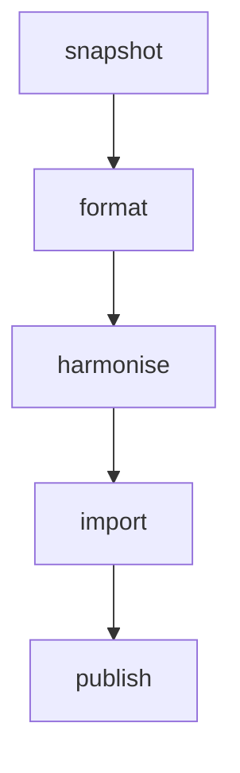

Our World In Data has a whole team dedicated to data management that takes data from publicly available sources, such as the _UN Food and Agriculture Organisation_, and makes it available to our researchers to visualise in the articles that they write.

## Five stages

The ETL project supports an opinionated data management workflow, which separates a data manager's work into several stages:

The design of the ETL involves steps that mirror the stages above, which help us to meet several design goals of the project:

1. [Snapshot step](snapshot.md): Take a **snapshot** of the upstream data source and store it on our end.
- [Meadow step](meadow.md): Bring the data into a **common format**.
- [Garden step](garden.md): **Harmonise** the names of countries, genders and any other columns we may want to join on. Also do the necessary data processing to make the dataset usable for our needs.
- [Grapher step](grapher.md): **Import** the data to our internal MySQL database.

A data manager must implement all these steps to make something chartable on the Our World in Data site.

!!! info
    When all steps (1 to 4) are implemented, the data is available for publication on our site. The publication step can involve creating new charts or updating existing ones with the new data.

Note that there are [other steps](other-steps/), which are less frequently used but are useful in some particular instances.