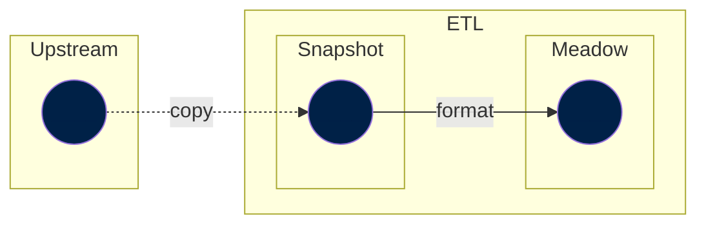

# Meadow
The meadow step is the first Transform step of our ETL.

In a meadow step, we load a `snapshot` and adapt it to be in a convenient format. A convenient format means creating an instance of a [`Dataset`](../../design/common-format/#datasets-owidcatalogdataset), with the appropriate data as a table (or tables).

In this step, you can add and define metadata, but we rarely do this. Instead, we propagate the metadata defined in the Snapshot step and leave it to the Garden step to enhance the metadata.

Meadow steps should only have `snapshot` (or `walden`) dependencies and ー by definition ー should not depend on `garden` steps.

A typical flow up to the Meadow step could look like:

!!! bug "TODO: Add an example of code"