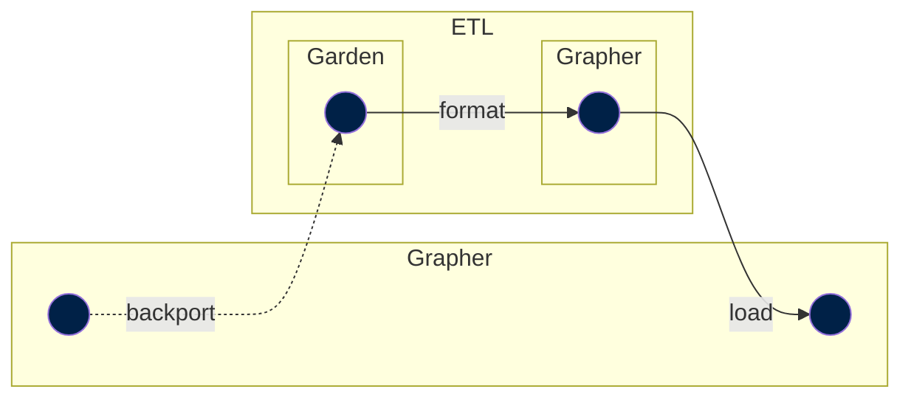

So far you have learned about the standard steps. These should cover most of the cases. However, there are some other steps worth mentioning.

## Backport

Datasets from our production grapher database can be backported to ETL catalog.

These is useful when a dataset was imported to Grapher not by using the ETL (years ago, or manually imported datasets through the admin) and we want to make it available in ETL.




## ETag

A step used to mark dependencies on HTTPS resources. The path is interpreted as an HTTPS url, and a HEAD request is made against the URL and checked for its `ETag`. This can be used to trigger a rebuild each time the resource changes.

!!! warning "This step is rarely used"

    Currently it is only used to import some COVID-19 data, which is published by us in another project.

    ```yaml title="dag/health.yml"
    data://garden/owid/latest/covid:
    - etag://raw.githubusercontent.com/owid/covid-19-data/master/public/data/owid-covid-data.csv
    ```

## GitHub

An empty step used only to mark a dependency on a Github repo, and trigger a rebuild of later steps whenever that repo changes. This is useful since Github is a good store for data that updates too frequently to be snapshotted, e.g. Gapminder's [open-numbers](https://github.com/open-numbers/).

The most recent commit hash of the given branch will be used to determine whether the data has been updated. This way, the ETL will be triggered to rebuild any downstream steps each time the data is changed.

!!! example

    ```yaml title="dag/open_numbers.yml"
    data://open_numbers/open_numbers/latest/bp__energy:
    - github://open-numbers/ddf--bp--energy
    ```

!!! note

    Github rate-limits unauthorized API requests to 60 per hour, so we should be sparing with the use of this step as it is implemented today.

## Private steps

!!! tip "[Learn more about private steps](../../guides/private-import.md)"

In some cases, a source or publisher does not allow for re-publication of their data. When that happends, but we still want to use their data in ETL, we use _private steps_.

Private steps work the same way as regular steps and are the only difference is that the data from these steps is not made available in our catalog and APIs.

In the [DAG](../../design/dag.md), these steps appear with the prefix `data-private://`.

!!! example

    The garden step for the "Drug Use Disorders - Global Burden of Disease Study 2019 (GBD 2019)" dataset by the IHME is private. Their URI looks like:
    ```
    data-private://garden/ihme_gbd/2023-03-29/gbd_drug_disorders
    ```
