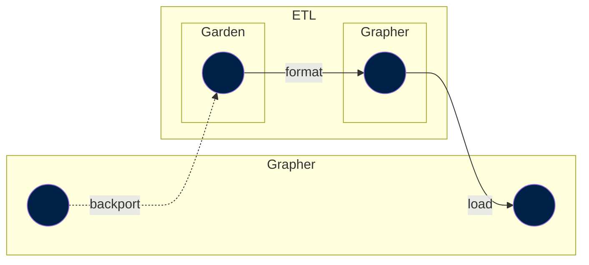

Datasets from our production grapher database can be backported to ETL catalog.

These is useful when a dataset was imported to Grapher not by using the ETL (years ago, or manually imported datasets through the admin) and we want to make it available in ETL.

