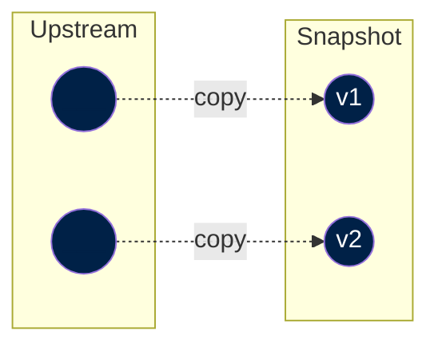

This is the first step to be implemented when importing data from an upstream source. It basically consists in copy-pasting an external file into our platform, to ensure that we have a reliable and secure access to the file.

Note that an external source may decide to delete the file. Also, this enables reproducibility of all the ETL processes, since the file in the source may change (e.g. remove datapoints, add datapoints, change field names, etc.).

The following diagram shows a case where we import a certain dataset to our snapshot catalog. Imagine the vertical axis is time (lower node was published later). In this case, we are importing different versions of the same dataset.



The snapshot step typically consists of a DVC file and a script that downloads the upstream data ands saves it to our snapshot catalog. Snapshot files are located in the [`snapshots/`](https://github.com/owid/etl/tree/master/snapshots) directory of the project.

Note that we need a DVC file per upstream data file; hence, in some instances, if the source publishes a datset using multiple files, we need multiple DVC files.


## Metadata

A Snapshot is a picture of a data product (e.g. a data CSV file) provided by an upstream data provider at a particular point in time.


It is the entrypoint to ETL. This is where we define metadata attributes of the data product and the particular snapshot. This is fundamental to ensure that the data is properly documented and that the metadata is propagated to the rest of the system.

The metadata in Snapshot consists mainly of one object: `meta.origin`. To learn more about it, please refer to [the reference](../reference/origin).


This metadata is captured in a DVC file (similar to a yaml file), which contains all the snapshot metadata fields as key-value pairs.


??? example "Example of [`snapshots/animal_welfare/2023-09-08/fur_laws.pdf.dvc`](`https://github.com/owid/etl/blob/master/snapshots/animal_welfare/2023-09-08/fur_laws.pdf.dvc`)"
    This file specifies all the upstream source file details (including link to download it, metadata fields, etc.). Filling the fields of this file requires some manual work, as we are "translating" all the information that the source provides into our snaphsot metadata format.

    ```yaml title="snapshots/animal_welfare/2023-09-08/fur_laws.pdf.dvc"
    meta:
        origin:
            title: Fur banning
            producer: Fur Free Alliance
            citation_full: Overview national fur legislation, Fur Free Alliance (2023).
            url_main: https://www.furfreealliance.com/fur-bans/
            url_download:
            https://www.furfreealliance.com/wp-content/uploads/2023/04/Overview-national-fur-legislation-General-Provisions.pdf
            date_published: '2023-04-01'
            date_accessed: '2023-09-08'
            license:
            name: CC BY 4.0
        license:
            name: CC BY 4.0
        is_public: true
        wdir: ../../../data/snapshots/animal_welfare/2023-09-08
        outs:
        - md5: e326e86b4c1225f688951df82a2f85af
        size: 178968
        path: fur_laws.pdf
    ```


!!! info "Learn more in our [reference](../metadata/reference/origin.md)."
