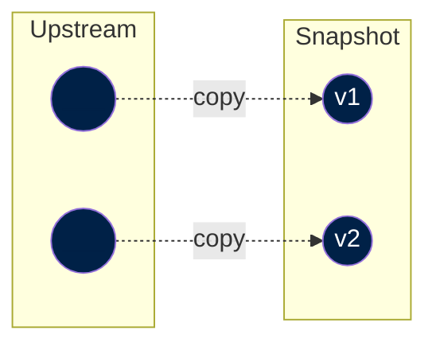

This is the first step to be implemented when importing data from an upstream source. It basically consists in copy-pasting an external file into our platform, to ensure that we have a reliable and secure access to the file.

Note that an external source may decide to delete the file. Also, this enables reproducibility of all the ETL processes, since the file in the source may change (e.g. remove datapoints, add datapoints, change field names, etc.).

The following diagram shows a case where we import a certain dataset to our snapshot catalog. Imagine the vertical axis is time (lower node was published later). In this case, we are importing different versions of the same dataset.



The snapshot step typically consists of a DVC file and a script that downloads the upstream data ands saves it to our snapshot catalog. Snapshot files are located in the [`snapshots/`](https://github.com/owid/etl/tree/master/snapshots) directory of the project.

Note that we need a DVC file per upstream data file; hence, in some instances, if the source publishes a datset using multiple files, we need multiple DVC files.


## Metadata

Snapshots are the raw data provided by upstream data providers. At minimum, they must capture:

- The URL of the upstream data source
- The license the data was provided under
- A human readable description of the data

This is captured in a DVC file (similar to a yaml file), which contains all the snapshot metadata fields as key-value pairs. Find the fields described below


| Field      | Description                          |
| ----------- | ------------------------------------ |
| `namespace`       | Used to organize and group files that fall under a similar topic (e.g. `health`) or the same source (e.g. `un`). |
| `short_name`       | Short name of the file (using snake case) |
| `name`    | Name of the file. |
| `version`    | Version of the file. Typically, we use the access date (`YYYY-mm-dd`) |
| `publication_year`    | Year of the publication of the file by the source. |
| `publication_date`    | Date of the publication of the file by the source.|
| `source_name`    | Name of the source. This is what is typically surfaced in the footer of charts. We recommend using the format `Source (Publication year)`, where `Source` is preferably not a very long name (unless needed).|
| `source_published_by`    | Complete name of the publisher. |
| `url`    | URL to the source site where the data is presented. |
| `source_data_url`    | Direct link to the file (CSV, XLSX, etc.). This field is used to automatically download the file. Sometimes this is not available (e.g. the download link is generated dynamically on the site). |
| `file_extension`    | Extension of the file without the dot (e.g. `csv`, `xlsx`, `zip`, etc.) |
| `license_url`    | URL to the source license. |
| `license_name`    | Name of the license (e.g. `Creative Commons BY 4.0`).|
| `date_accessed`    | Date when you accessed and downloaded the data. |
| `is_public`    | (`True/False`). Defaults to `True`. Set to private if the data cannot be shared with the public. |
| `description`    | Description of the data file.|


??? example "Example of [`snapshots/gapminder/2023-03-31/population.xlsx.dvc`](`https://github.com/owid/etl/blob/master/snapshots/gapminder/2023-03-31/population.xlsx.dvc`)"
    This file specifies all the upstream source file details (including link to download it, metadata fields, etc.). Filling the fields of this file requires some manual work, as we are "translating" all the information that the source provides into our snaphsot metadata format.

    ```yaml title="snapshots/gapminder/2023-03-31/population.xlsx.dvc"
    meta:
        namespace: gapminder
        short_name: population
        name: Population (Gapminder, 2022)
        version: 2023-03-31
        publication_year: 2022
        publication_date: 2022-10-19
        source_name: Gapminder (2022)
        source_published_by: Gapminder, Population (v7) 2022
        url: http://gapm.io/dpop
        source_data_url: https://gapm.io/dl_popv7
        file_extension: xlsx
        license_url: https://docs.google.com/document/d/1-RmthhS2EPMK_HIpnPctcXpB0n7ADSWnXa5Hb3PxNq4/edit?usp=sharing
        license_name: Creative Commons BY 4.0
        date_accessed: 2023-03-31
        is_public: true
        description: |
            Gapminder's population data is divided into two chunks: One long historical trend for the global population that goes back to 10,000 BC. And the second chunk is country estimates that only reaches back to 1800.

            For the first chunk, several sources were used. You can learn more at https://docs.google.com/spreadsheets/d/1hkLbEilJbl630IG68q-aQJlUjuTFm9b_12nQMVd1sZM/edit#gid=0.

            For the second chunk, Gapminder uses UN population data between 1950 to 2100 from the UN Population Division World Population Prospects 2019, and the forecast to the year 2100 uses their medium-fertility variant. For years before 1950, this version uses the data documented in greater detail by Mattias Lindgren in version 3. The main source was Angus Maddison’s data, which CLIO Infra Project maintained and improved.

            Note that when combining version 3 with the new UN data, the trends for a few countries didn't match up in the overlapping year 1950. Minor adjustments were made to the years before and after to smooth out discrepancies between the two sources and avoid spurious jumps in Gapminder's visualisations.

            Visit https://www.gapminder.org/data/documentation/gd003/ to learn more about the methodology used and the data from back to 10,000 BC.
    ```


!!! info "For more up to date details, see the [`SnapshotMeta`](https://github.com/owid/etl/blob/master/etl/snapshot.py#L81) class for all supported fields."
