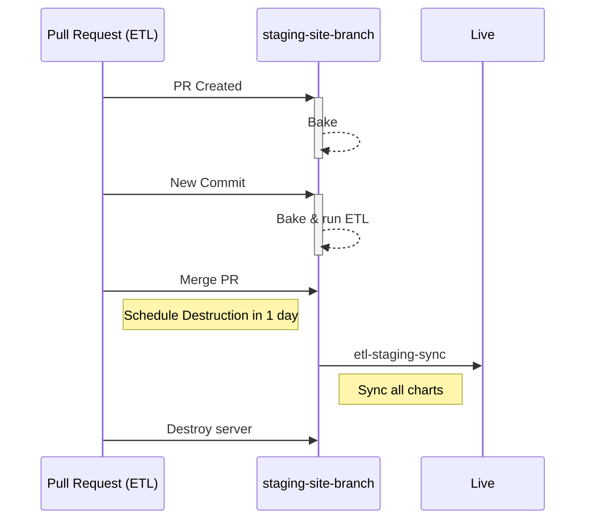
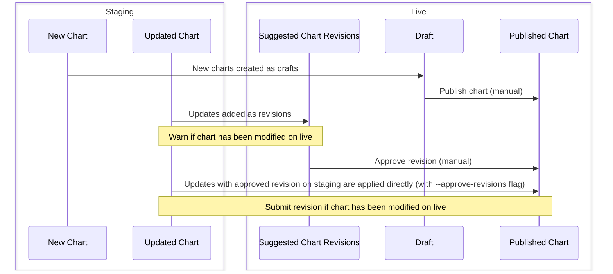

## Data Manager Workflow

Dedicated staging servers are automatically created from every ETL pull request. That gives data manager the ability to share and test their changes before they are merged into the live site.

!!! note "PR staging servers URLs"

    You can visit your PR staging server at `http://staging-site-<branch>`. Note that `<branch>` might differ from the exact branch name, for example `feature/123` will be `feature-123` (all symbols are changed to dashes, and the maximum length is of 50 characters).

    For more details, refer to the [python code](https://github.com/owid/etl/blob/master/apps/staging_sync/cli.py#L284) generating `<branch>` from the branch name.

Once the PR is ready, data manager should merge it into master, wait for deploy process to run ETL with their updates and then migrate all charts to the live site. This has to be done within 24 hours after the PR is merged, then the staging server will be destroyed.

## Staging Sync Workflow

Once the work is merged, data manager should run `etl-staging-sync` to migrate all charts to the live site. This command will sync all charts from staging to live as either draft charts or revisions.

!!! info "Run `etl-staging-sync --help` for more details"
