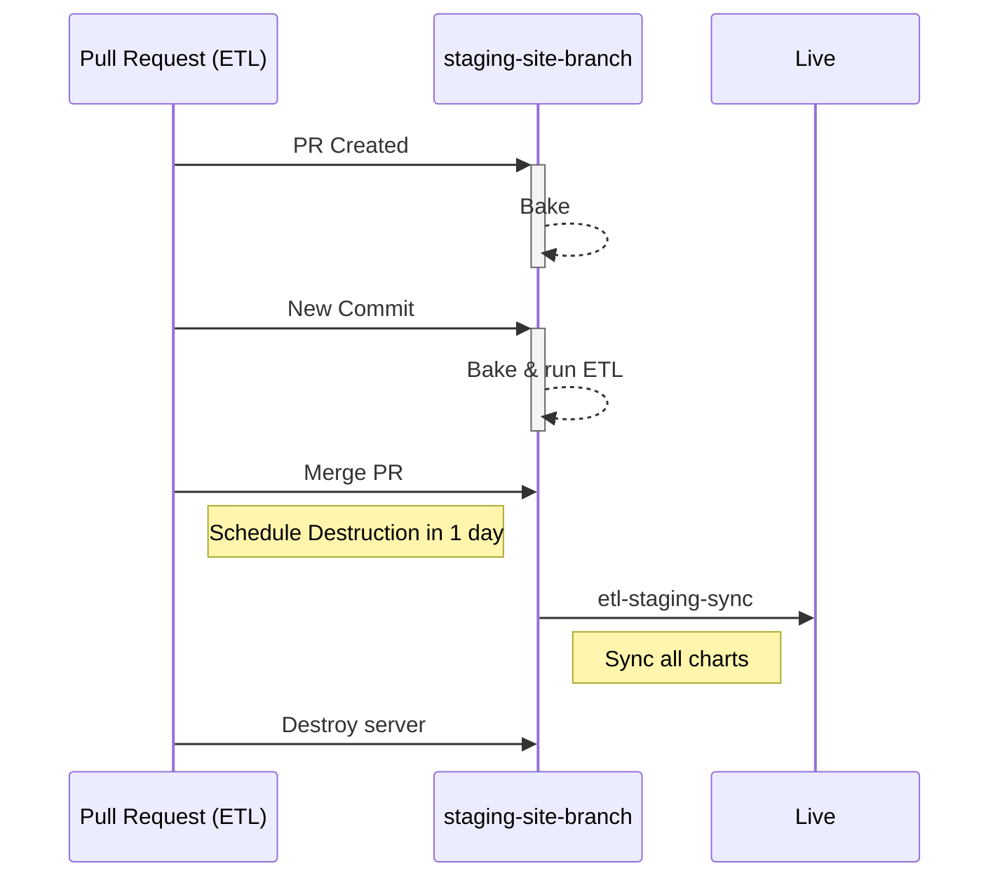
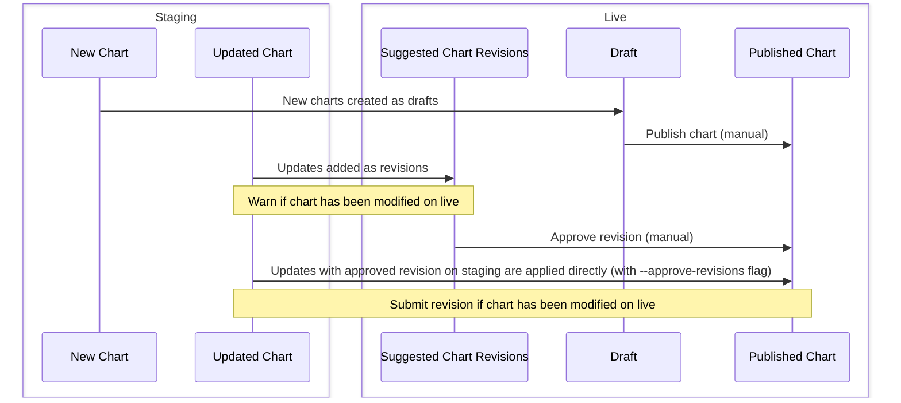

TODO - improve docs

## Data Manager Workflow

```mermaid
sequenceDiagram
    participant PR as Pull Request (ETL)
    participant SSB as staging-site-branch
    participant live as Live

    PR ->>+ SSB: PR Created
    SSB -->>- SSB: Bake
    PR ->>+ SSB: New Commit
    SSB -->>- SSB: Bake & run ETL
    PR ->> SSB: Merge PR
    Note right of PR: Schedule Destruction in 1 day
    SSB ->> live: etl-staging-sync
    Note left of live: Sync all charts
    PR ->> SSB: Destroy server
```

## Staging Sync Workflow

```mermaid
sequenceDiagram
    box Staging
    participant NewChart as New Chart
    participant UpdatedChart as Updated Chart
    end
    box Live
    participant ChartRevision as Suggested Chart Revisions
    participant Draft as Draft
    participant PublishedChart as Published Chart
    end

    # New charts process
    NewChart->>Draft: New charts created as drafts
    Draft->>PublishedChart: Publish chart (manual)

    # Updated charts process
    UpdatedChart->>ChartRevision: Updates added as revisions
    Note over UpdatedChart, ChartRevision: Warn if chart has been modified on live
    ChartRevision->>PublishedChart: Approve revision (manual)

    # Updated charts with revisions, useful for population updates
    UpdatedChart->>PublishedChart: Updates with approved revision on staging are applied directly (with --approve-revisions flag)
    Note over UpdatedChart, PublishedChart: Submit revision if chart has been modified on live
```
