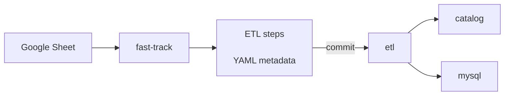

# Using the fast-track

!!! warning "You need Tailscale to access fast-track"
    Alternatively, run fast-track locally with `fasttrack --no-commit`

While the ETL is excellent for making data reproducible, it is still slower than manual CSV uploads for small datasets. For this reason, we provide an alternative path for small datasets. Fast-track is a tool for importing datasets from Google Sheets. The idea is to keep all data and metadata there and use this interface to import or update the data in the Grapher database, where it can be used to create charts. Fast-track also commits your work to the ETL repository, where you can further process your data with Python.

# _Super_ fast-track
!!! warning "_Super_ fast-track should only be used for data exploration, and never for production datasets."

_Super_ fast-track is a variation of fast-track that imports data directly from CSV files without needing a Google Spreadsheet. It is useful for exploring datasets in Grapher but isn't intended for production datasets. _Super_ fast-track was developed to replace the "Import CSV" functionality in the admin interface. However, it doesn't support adding complex metadata in the ETL like regular fast-track does.
