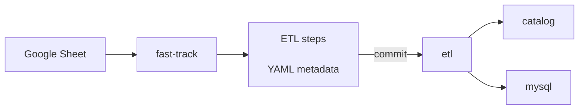
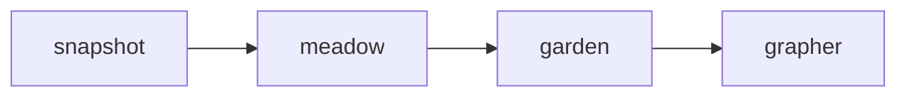

---
tags:
    - 👷 Staff
---

There are different ways you can add data to the catalog, depending on your technical expertise. This section describes these different options, explaining when are they most useful.


<div class="grid cards" markdown>

-   __[:fontawesome-solid-hat-wizard: &nbsp; Wizard](#using-wizard)__  (recommended)

    ---

    Create ETL steps using default templates.

-   __[:material-tools: &nbsp; Manual](#manual)__

    ---

    Create complex steps manually.

-   __[:material-run-fast: &nbsp; Fast-Track](#using-the-fast-track)__

    ---

    For small datasets and when reproducibility is not a concern.

-   __:octicons-question-16: &nbsp; Unsure__

    ---

    Report on Slack: [#data-scientists](https://app.slack.com/client/T3DR40MTQ/C025BDNS5AA/)

</div>


## Using Wizard

!!! info
    Learn more about Wizard in [this dedicated guideline](guides/wizard.md)

The wizard is an interactive web UI that takes the role of our ETL admin. One of the main uses of Wizard is to create ETL steps. It is loaded with templates so that it is easier for you to create a new step just by using Wizard.

### Start the wizard

Wizard consists of a web app that will ask you for various metadata fields (such as `namespace`, `version`, `source_url`, etc.). Based on your input,
it will generate the required files in the appropriate `snapshots/` or `etl/` directory. **Wizard will point you to the commands that you need to run once you
have implemented the step.**

Just start by running

```bash
poetry run etlwiz
```

and going to [localhost:8053](localhost:8053). You can create all the steps from there.


!!! info
    Minor issues with wizard<br>
    [Add a comment to this central issue :octicons-arrow-right-24:](https://github.com/owid/etl/issues/1563)<br>

    Major issue<br>
    [Create a new issue :octicons-arrow-right-24:](https://github.com/owid/etl/issues/new)


### Wizard options
The Wizard currently supports the following stages:

| Option      | Description                                                                                                   |
| ----------- | ------------------------------------------------------------------------------------------------------------- |
| `snapshot`  | Create a Snapshot step: Insert upstream data to our catalog.                                                  |
| `meadow`    | Create a Meadow step: Format data.                                                                            |
| `garden`    | Create a Garden step: Harmonize and process data.                                                             |
| `grapher`   | Create a Grapher step: Transform data to be Grapher-ready.                                                    |
| `charts`    | Tool to update our charts.                                                                                    |

<!-- ::: mkdocs-click
    :module: apps.wizard.cli
    :command: cli -->

Find more details with **`--help`**:
```plaintext
$ etlwiz --help

 Usage: etlwiz [OPTIONS] [[charts|staging_sync|metagpt|expert|metaplay|dataexp|harmonizer|owidle|snapshot|meadow|garden|grapher|fasttrack|all]]

 Run OWID's ETL admin tool, the Wizard.

  ..__    __ _                  _
  ./ / /\ \ (_)______ _ _ __ __| |
  .\ \/  \/ | |_  / _` | '__/ _` |
  ..\  /\  /| |/ | (_| | | | (_| |
  ...\/  \/ |_/___\__,_|_|  \__,_|


 Just launch it and start using it! 🪄

 Note: Alternatively, you can run it as streamlit run apps/wizard/app.py.

╭─ Arguments ───────────────────────────────────────────────────────────────────────────────────────────────────────────────────────────────────────────────────────────────────────────────────────────────────╮
│ PHASE    (charts|staging_sync|metagpt|expert|metaplay|dataexp|harmonizer|owidle|snapshot|meadow|garden|grapher|fasttrack|all)                                                                                 │
╰───────────────────────────────────────────────────────────────────────────────────────────────────────────────────────────────────────────────────────────────────────────────────────────────────────────────╯
╭─ Options ─────────────────────────────────────────────────────────────────────────────────────────────────────────────────────────────────────────────────────────────────────────────────────────────────────╮
│ --run-checks/--skip-checks    Environment checks                                                                                                                                                              │
│                               [default: run-checks]                                                                                                                                                           │
│ --dummy-data                  Prefill form with dummy data, useful for development                                                                                                                            │
│ --port                        Application port                                                                                                                                                                │
│                               (INTEGER)                                                                                                                                                                       │
│                               [default: 8053]                                                                                                                                                                 │
│ --help                        Show this message and exit.                                                                                                                                                     │
╰───────────────────────────────────────────────────────────────────────────────────────────────────────────────────────────────────────────────────────────────────────────────────────────────────────────────╯
```


## Using the fast-track

!!! warning "You need Tailscale to access fast-track"
    Alternatively, run fast-track locally with `fasttrack --no-commit`

While the ETL is excellent for making data reproducible, it is still slower than manual CSV uploads for small datasets. For this reason, we provide an alternative path for small datasets. Fast-track is a tool for importing datasets from Google Sheets. The idea is to keep all data and metadata there and use this interface to import or update the data in the Grapher database, where it can be used to create charts. Fast-track also commits your work to the ETL repository, where you can further process your data with Python.




### _Super_ fast-track
!!! warning "_Super_ fast-track should only be used for data exploration, and never for production datasets."

_Super_ fast-track is a variation of fast-track that imports data directly from CSV files without needing a Google Spreadsheet. It is useful for exploring datasets in Grapher but isn't intended for production datasets. _Super_ fast-track was developed to replace the "Import CSV" functionality in the admin interface. However, it doesn't support adding complex metadata in the ETL like regular fast-track does.


## Manually add a dataset to the ETL

!!! note "Before you begin, make sure you've [set up the ETL working environment](../../getting-started/working-environment.md)."


You will need to add a step to the ETL for each stage of data processing you need to do. The steps are:



### Decide on names

The ETL uses a naming convention to identify datasets. To add a dataset, you will need to choose a short name for the data provider (e.g. `un`, `who`), which will serve as the namespace to add it to.

You will also need to choose a short name for the dataset itself (e.g. `population`), which will be used to identify the dataset in the ETL.

!!! tip "What's a short name?"

    Short names must be unique within a namespace. They must be in lowercase and separated only with underscores. They must not contain any special characters, and should not be too long.

    - ✓ `population`
    - ✓ `electricity_demand`
    - ✗ `Electricity Demand`
    - ✗ `electricity-demand`
    - ✗ `really_long_elaborate_description_of_the_variable_in_question`


### Create a new branch in `etl`

```bash
git checkout -b data/new-dataset
```

### Snapshot step

1. **Create an ingest script**
    - Create a script in `snapshots/<namespace>/<version>/<dataset_short_name>.py`
    - Create the corresponding metadata DVC file in `snapshots/<namespace>/<version>/<dataset_short_name>.<extension>.dvc`
    - Run `make format && make test` to ensure that the step runs well and is well formatted.

2. **Add snapshot data**
    ```bash
    poetry run python snapshots/<namespace>/<version>/<dataset_short_name>.py
    ```

### Meadow step

1. **Create the step**
    - Path of the step should be similar to `etl/steps/data/meadow/<namespace>/<version>/<dataset_short_name>.py`.
    - The step script must contain a `run(dest_dir)` function that loads data from the `snapshot` and creates a dataset
    (a `catalog.Dataset` object) with one or more tables (`catalog.Table` objects) containing the raw data.
    - Run `make format && make test` to ensure that the step runs well and is well formatted.

2. **Add the step to the dag**, including its dependencies.
    Add the dependencies for the dataset to the appropriate dag file.

3. **Run the step**
    ```
    poetry run etl run data://meadow/<namespace>/<version>/<dataset_short_name>
    ```

### Garden step

1. **Create the step**
    - Path of the step should be similar to `etl/steps/data/garden/<namespace>/<version>/<dataset_short_name>.py`.
    - The step must contain a `run(dest_dir)` function that loads data from the last `meadow` step, processes the data and
    creates a dataset with one or more tables and the necessary metadata.
    - Country names must be harmonized (for which the [harmonize](../architecture/workflow/harmonization.md) tool of `etl` can be used).
    - Add plenty of assertions and sanity checks to the step (if possible, compare the data with its previous version and
    check for abrupt changes).
    - Run `make format && make test` to ensure that the step runs well and is well formatted.

2. **Add the step to the dag**, including its dependencies.
    Add the dependencies for the dataset to the appropriate dag file.

3. **Run the step**
    ```
    poetry run etl run data://garden/<namespace>/<version>/<dataset_short_name>
    ```

### Grapher step

1. **Create the step**
    - Path of the step should be similar to `etl/steps/data/grapher/<namespace>/<version>/<dataset_short_name>.py`.
    - The step must contain a `run(dest_dir)` function that loads data from the last `garden` step, processes the data and
    creates a dataset with one or more tables and the necessary metadata.
    - Run `make format && make test` to ensure that the step runs well and is well formatted.


2. **Run the step**
    ```
    poetry run etl run data://grapher/<namespace>/<version>/<dataset_short_name>
    ```

    Add `--grapher` flags to `etl` command to upsert data into grapher database.

    ```
    poetry run etl run data://grapher/<namespace>/<version>/<dataset_short_name> --grapher
    ```

    To test the step, you can run it on the grapher `staging` database, or using
    [a local grapher](https://github.com/owid/owid-grapher/blob/master/docs/docker-compose-mysql.md).

    !!! warning "The `grapher` step to import the dataset to Grapher is now automatic"
        We have automatic deploys to grapher database from ETL. This means that whenever we push to master, `etl --grapher` is automatically run and pushes your data to MySQL. This means:

        - **You don't have to manually push to grapher**. Just merge and wait for CI status on master to turn green.
        - You can still manually push new datasets (a new dataset doesn't have recipe in master yet). This is useful if you want to explore it in grapher, get feedback, iterate on a PR, etc. However, if you manually deploy an existing dataset, it'll be overwritten by the version in master

        Automatic deploys will run on both production and staging. This process is not final, we are still iterating.

3. **Create a pull request** to merge the new branch with the master branch in `etl`. At this point, some further editing of the step files may be required before merging the branch with master.
