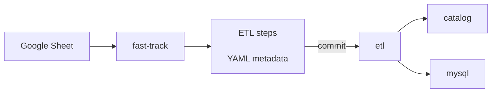

---
tags:
    - 👷 Staff
icon: material/plus
---
# New data

There are different ways you can add data to the catalog, depending on your technical expertise. This section describes these different options, explaining when are they most useful.


* **[Wizard](#using-wizard-recommended) **(recommended): Create ETL steps using default templates.**
* [Manual](#manually-add-a-dataset-to-the-etl): Create complex steps manually.
* [Fast-Track](#using-the-fast-track): For small datasets and when reproducibility is not a concern.
* Unsure: Report on Slack: [:fontawesome-brands-slack: #data-scientists](https://app.slack.com/client/T3DR40MTQ/C025BDNS5AA/)


!!! tip "[Try AI-powered workflow](ai-workflow/)! (experimental)"

## Using Wizard (recommended)
Wizard is an interactive web app that serves as OWID's ETL admin. One of the main uses of Wizard is to create ETL steps, as it is has provides templates to ease the creation of a new step.

Use the command `etlwiz` to start it and then go to [localhost:8053](localhost:8053). There, you will see all options available in Wizard. For the purpose of this guide, we are just interested in those that fall under the section "ETL Steps", with which you can create Snapshot and Data steps (and, alternatively, also Fast-Track steps).

When creating a step, you will be presented with a form to submit the metadata details for your data (fields such as `namespace`, `version`, `date_published`, etc.). Based on this, all necessary files will be created in the appropriate `snapshots/` or `etl/` directories.

!!! note "Learn more"

    **Wizard will guide you through the whole process, describing all the steps you need to follow to successfully create a new ETL step.**

    Learn more about Wizard in [this dedicated guideline :octicons-arrow-right-24:](../wizard.md).

### Adding the dataset to Grapher
Once you have created all the steps, you can run them _and_ push the final version to Grapher with

```
etl run <short_name> --grapher
```


## Using the Fast-Track

!!! warning "You need Tailscale to access fast-track"

    Alternatively, run fast-track locally with `etl fasttrack --no-commit`

While the ETL is excellent for making data reproducible, it is still slower than manual CSV uploads for small datasets. For this reason, we provide an alternative path for small datasets. Fast-track is a tool for importing datasets from Google Sheets. The idea is to keep all data and metadata there and use this interface to import or update the data in the Grapher database, where it can be used to create charts. Fast-track also commits your work to the ETL repository, where you can further process your data with Python.




## Manually add a dataset to the ETL

!!! warning "If possible, use [the Wizard](#using-wizard-recommended)"

    If you are not familiar with the ETL, it is recommended to use Wizard to add a new dataset. This will ensure that the dataset is added in a consistent way and that all necessary metadata is included.

    The guide below might be out of date. Please report any issues.

You will need to add a step to the ETL for each stage of data processing you need to do. The steps are:


### Decide on names

The ETL uses a naming convention to identify datasets. To add a dataset, you will need to choose a short name for the data provider (e.g. `un`, `who`), which will serve as the namespace to add it to.

You will also need to choose a short name for the dataset itself (e.g. `population`), which will be used to identify the dataset in the ETL.

!!! tip "What's a short name?"

    Short names must be unique within a namespace. They must be in lowercase and separated only with underscores. They must not contain any special characters, and should not be too long.

    - ✓ `population`
    - ✓ `electricity_demand`
    - ✗ `Electricity Demand`
    - ✗ `electricity-demand`
    - ✗ `really_long_elaborate_description_of_the_variable_in_question`


### Create a new branch in `etl`

```bash
git checkout -b data/new-dataset
```

### Snapshot step

1. **Create an ingest script**
    - Create a script in `snapshots/<namespace>/<version>/<dataset_short_name>.py`
    - Create the corresponding metadata DVC file in `snapshots/<namespace>/<version>/<dataset_short_name>.<extension>.dvc`
    - Run `make format && make test` to ensure that the step runs well and is well formatted.

2. **Add snapshot data**
    ```bash
    uv run python snapshots/<namespace>/<version>/<dataset_short_name>.py
    ```

### Meadow step

1. **Create the step**
    - Path of the step should be similar to `etl/steps/data/meadow/<namespace>/<version>/<dataset_short_name>.py`.
    - The step script must contain a `run()` function that loads data from the `snapshot` and creates a dataset
    (a `catalog.Dataset` object) with one or more tables (`catalog.Table` objects) containing the raw data.
    - Run `make format && make test` to ensure that the step runs well and is well formatted.

2. **Add the step to the dag**, including its dependencies.
    Add the dependencies for the dataset to the appropriate dag file.

3. **Run the step**
    ```
    etl run data://meadow/<namespace>/<version>/<dataset_short_name>
    ```

### Garden step

1. **Create the step**
    - Path of the step should be similar to `etl/steps/data/garden/<namespace>/<version>/<dataset_short_name>.py`.
    - The step must contain a `run()` function that loads data from the last `meadow` step, processes the data and
    creates a dataset with one or more tables and the necessary metadata.
    - Country names must be harmonized (for which the [harmonize](../architecture/workflow/harmonization.md) tool of `etl` can be used).
    - Add plenty of assertions and sanity checks to the step (if possible, compare the data with its previous version and
    check for abrupt changes).
    - Run `make format && make test` to ensure that the step runs well and is well formatted.

2. **Add the step to the dag**, including its dependencies.
    Add the dependencies for the dataset to the appropriate dag file.

3. **Run the step**
    ```
    etl run data://garden/<namespace>/<version>/<dataset_short_name>
    ```

### Grapher step

1. **Create the step**
    - Path of the step should be similar to `etl/steps/data/grapher/<namespace>/<version>/<dataset_short_name>.py`.
    - The step must contain a `run()` function that loads data from the last `garden` step, processes the data and
    creates a dataset with one or more tables and the necessary metadata.
    - Run `make format && make test` to ensure that the step runs well and is well formatted.


2. **Run the step**
    ```
    etl run data://grapher/<namespace>/<version>/<dataset_short_name>
    ```

    Add `--grapher` flags to `etl` command to upsert data into grapher database.

    ```
    etl run data://grapher/<namespace>/<version>/<dataset_short_name> --grapher
    ```

    To test the step, you can run it on the grapher `staging` database, or using
    [a local grapher](https://github.com/owid/owid-grapher/blob/master/docs/docker-compose-mysql.md).

    !!! warning "The `grapher` step to import the dataset to Grapher is now automatic"

        We have automatic deploys to grapher database from ETL. This means that whenever we push to master, `etl --grapher` is automatically run and pushes your data to MySQL. This means:

        - **You don't have to manually push to grapher**. Just merge and wait for CI status on master to turn green.
        - You can still manually push new datasets (a new dataset doesn't have recipe in master yet). This is useful if you want to explore it in grapher, get feedback, iterate on a PR, etc. However, if you manually deploy an existing dataset, it'll be overwritten by the version in master

        Automatic deploys will run on both production and staging. This process is not final, we are still iterating.

3. **Create a pull request** to merge the new branch with the master branch in `etl`. At this point, some further editing of the step files may be required before merging the branch with master.
