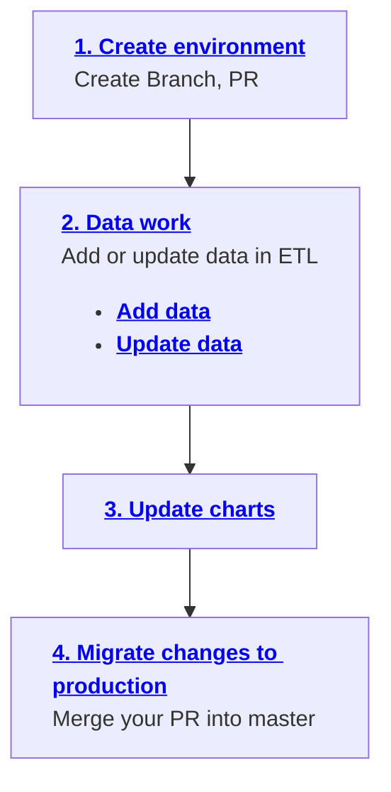

---
tags:
  - 👷 Staff
---

# Data work

Adding and updating datasets in ETL is part of our routinary work. To this end, we've simplified the process as much as possible. Find below the list of the steps involved in the workflow. Click on each step to learn more about it.



## 1. Create environment

The first thing you need to do is to create a new branch for your work.

```
git checkout -b new-branch
```

Next, we recommend you create a Pull request so that a staging server is automatically created for you. This will allow you to test your changes before merging them into the live site.

To create one, first push your branch (you can add an empty commit):

```
git commit --allow-empty -m "initiate branch with empty commit"
git push origin new-branch
```

Then, create a [pull request](https://github.com/owid/etl/pulls) as a draft (should be the default option).

After all CI/CD jobs are executed, you will have a staging server ready for you to test your changes at `http://staging-site-new-branch` (requires Tailscale).

Also, shortly after latest commit, GitHub user @owidbot will post a comment to the PR with all the workflow-relevant links (see image below).

<figure markdown="span">
  
  <figcaption>@owidbot will post a message with relevant links.</figcaption>
</figure>

You can now start the data work!

## 2. Data work

Once you have your environment ready, it is time to actually start working on your task!

The first question you have to ask yourself is whether you want to add a new dataset or update an existing one. The workflow is slightly different depending on your choice.

[**Adding a new dataset**](add-data) typically involves creating various ETL steps for a dataset that did not exist before (maybe it existed in Grapher database, but not in ETL).

[**Updating a dataset**](update-data), on the other hand, involves updating the existing ETL steps to reflect the changes in the dataset.

## 3. Update charts

For details on how to update charts, please refer to the [**update charts guide**](update-charts).

## 4. Migrate changes

Once you are happy with your changes, your code has been reviewed and approved, and all the CI/CD jobs are successfully passed, you can merge your PR into the `master` branch.

This will trigger an ETL build, which will update the production database with your dataset changes.

!!! warning "Migrating your charts"

    After your PR is merged, you will need to run the [`chart-sync`](../etl-cli/#etl-chart-sync) command to migrate all your chart changes.

    In the near future, this will be executed automatically.
