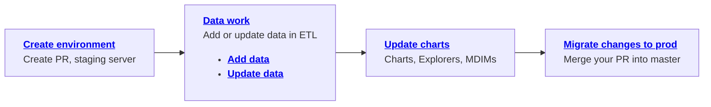
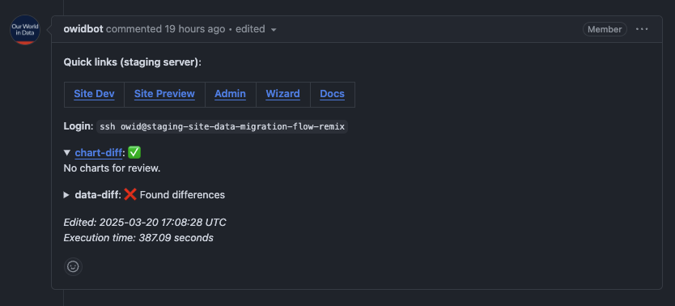

---
tags:
  - 👷 Staff
---
# Data work

Adding and updating datasets in ETL is part of our routinary work. To this end, we strive to keep this process as simple as possible. Find below the list of the steps involved in the workflow. Click on each step to learn more about it.



## Create environment

The first thing you need to do is creating a new environment for your work. To do this simply pull the latest changes from the `master` branch and use our command [etl pr](../etl-cli/#etl-pr).

```bash
git checkout master
git pull origin master
etl pr "some description of your work"
```

This will create a new branch, push it to the remote repository, and create a draft PR for you. It will also create a staging server for you to test your changes. Shortly after creating the PR, @owidbot will post a comment to the PR with all the workflow-relevant links (see image below).

<figure markdown="span">
  
  <figcaption>@owidbot will post a message with relevant links.</figcaption>
</figure>

!!! note

  Ensure that, in your `.env` file, you have set STAGING=1


## Data work

Once you have your environment ready, it is time to actually start working on your task!

The first question you have to ask yourself is whether you want to add a new dataset or update an existing one. The workflow is slightly different depending on your choice.

- [**Adding a new dataset**](add-data) typically involves creating various ETL steps for a dataset that did not exist before (maybe it existed in Grapher database, but not in ETL).
- [**Updating a dataset**](update-data), on the other hand, involves updating the existing ETL steps to reflect the changes in the dataset.

## Update charts
Once you have the data ready in the database, you can now [**update any chart**](update-charts) (or create new ones).

Here, you can also decide whether you want to create or update an Explorer or an MDIM with the new data. This is done with [**export steps**](export-data.md).

## Migrate changes

Once you are happy with your changes, your code has been reviewed and approved, and all the CI/CD jobs are successfully passed, you can merge your PR into the `master` branch.

This will trigger an ETL build, which will update the production database with your dataset changes.

!!! warning "Migrating your charts"

    After your PR is merged, you will need to run the [`chart-sync`](../etl-cli/#etl-chart-sync) command to migrate all your chart changes.

    In the near future, this will be executed automatically.
