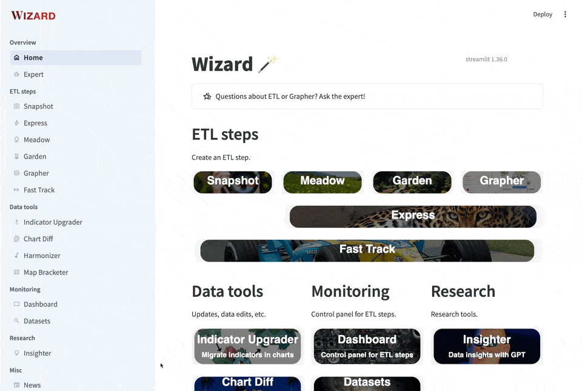
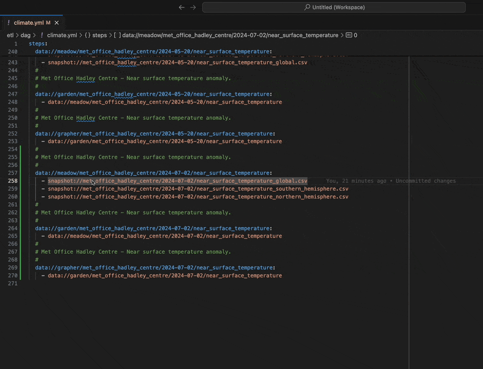
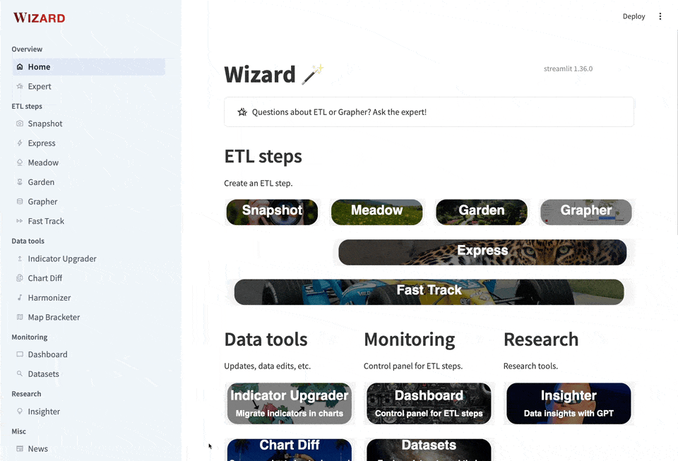
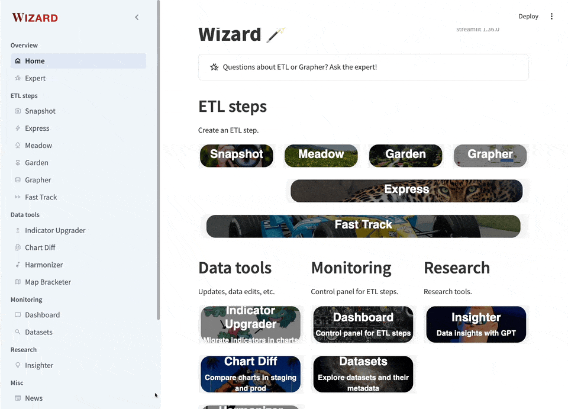
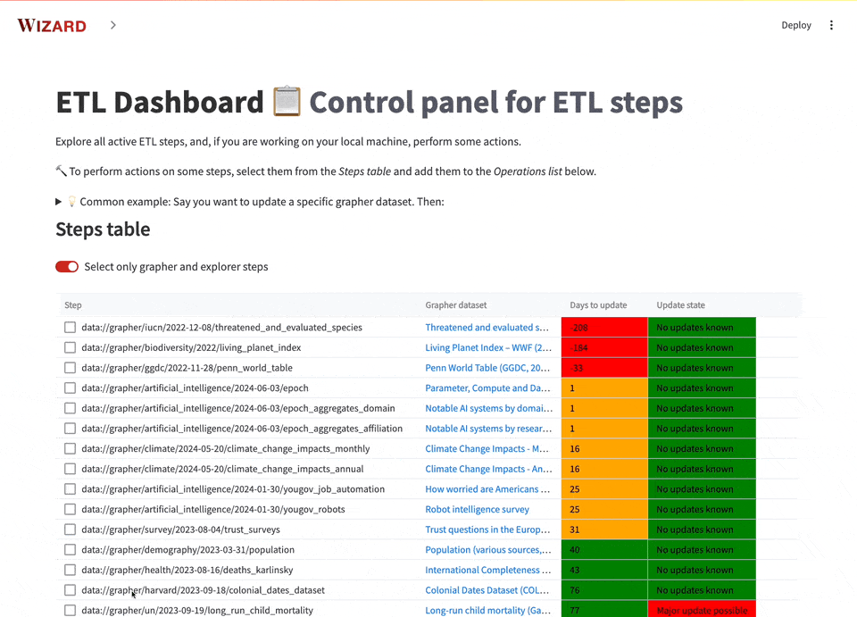

---
tags:
  - 👷 Staff
---

# Update data

!!! tip "Quick summary guide"
    In a nutshell, these are the steps to follow:

    - Create a "reference" git branch.
    - Use the ETL Dashboard to create new versions of the steps (by duplicating the old ones).
    - Commit the new files (without any further changes, and without committing changes to the dag) and push them to the "reference" branch.
    - Create a "review" branch (which is a sub-branch of the "reference" branch). This will also create a staging server where your chart work will take place.
    - Adapt the code of the new steps and ensure ETL (e.g. `etlr step-names --grapher`) can execute them successfully.
    - Commit changes to the code to the "review" branch.
    - Use Indicator Upgrader to update the charts (so they use the new variables instead of the old ones).
        - If needed, adapt existing charts or create new ones on the staging server.
    - Archive old steps (i.e. move old steps from the dag to the archive dag).
    - Commit all your final work to the "review" branch, and set your PR (merging "review" to "reference") to be ready for reviewed.
        - Make any further changes, if any is suggested by the reviewer.
    - Once approved, edit your PR, so that it merges "review" to "master", and merge the PR.
    - Archive old grapher dataset(s).
    - Announce your update.


This guide explains the general workflow to update a dataset that already exists in ETL.

For simplicity, let's go through it with a real example: Assume you have to update the "Near-surface temperature anomaly" dataset, by the Met Office Hadley Centre.

This guide assumes you have already a working installation of `etl`, and use VSCode with the appropriate configuration and plugins.

These are the steps to follow:

## 1. Duplicate the old steps and set up your staging server
Firstly, you will create the "reference" code, which is the code that the final pull request (PR) be compared against.
This is not strictly necessary, but it will be very helpful for the PR reviewer.

- Go to ETL `master` branch, and ensure it's up-to-date in your local repository (by running `git pull`).
    - Ensure that, in your `.env` file, you have set `STAGING=1`.
- Create a "reference" branch (a temporary branch that will be convenient for the reviewer later on):
```bash
etl d draft-pr temp-update-temperature-anomaly
```
This will create a new git branch in your local repository, which will be pushed.
It will also create a draft pull request in github, and a staging server.
All these things are temporary (which is why we added the `temp-` in the name of the branch).
In a few moments you will know the reason why.
- Wait a few minutes, until you receive an email from `owidbot` saying that the staging server [http://staging-site-temp-update-temperature-anomaly/admin/login](http://staging-site-temp-update-temperature-anomaly/admin/login) has been created.
- Then, run your local ETL Wizard:
```bash
etlwiz
```
And click on "Dashboard".
- Update steps using the ETL Dashboard:
    
    - On the Steps table, select the grapher dataset you want to update. Click on "Add selected steps to the Operations list".
In this case, it has only 1 chart, so it will be an easy update.
    - Scroll down to the Operations list, and click on "Add all dependencies".
    - Click on "Remove non-updateable (e.g. population)" (although, for this simple example, it makes no difference).
    - Scroll down and expand the "Additional parameters to update steps" box, to deactivate the "Dry run" option.
    - Then click on "Update X steps" (in this case, X equals 6).
This will create all the new ETL code files needed for the update, and write those steps in the dag (in this case, in the `climate.yml` dag file).
You can close the Wizard (and kill it with ++ctrl+c++).
- Commit those new files in `snapshots` and `etl` folders to your branch:
```bash
git add etl
git add snapshots
git commit -m "Duplicate previous Met Office steps"
```

    !!! note
        For convenience, do not commit the changes in the `dag`. In a few moments you will see why.

- Create a "review" branch (the branch that will be reviewed):
```bash
etl d draft-pr update-temperature-anomaly --base-branch temp-update-temperature-anomaly --title "Update Near-surface temperature anomaly data" --category data
```
This will create a sub-branch in your local repository, which will be pushed.
It will also create a draft pull request in github, and a staging server.
- Wait a few minutes, until you receive an email from `owidbot` saying that the staging server `http://staging-site-update-temperature-anomaly/admin/login` has been created.

## 2. Update and run the new steps
This is where the main update work happens.

- Edit the snapshot metadata files in VSCode, if any modifications are needed (for example, the `date_published` field may need to be manually updated).
    
    - For convenience (throughout the rest of the work), open the corresponding dag file in a tab (++cmd+p++ to open the Quick Open bar, then type `climate.yml` and `enter`).
    - To open a specific snapshot, go to the bottom of the dag, where the new steps are. Select the dag entry of one of the snapshots (without including the `snapshot://`), namely `met_office_hadley_centre/2024-07-02/near_surface_temperature_global.csv`, and then hit ++cmd+c++, ++cmd+p++, ++cmd+v++, ++enter++.
- Execute the snapshot:
```bash
python snapshots/met_office_hadley_centre/2024-07-02/near_surface_temperature.py
```
- In a similar fashion, edit the `meadow`, `garden`, and `grapher` steps, if needed, and execute them. You can do that either one by one:
```bash
etlr meadow/met_office_hadley_centre/2024-07-02/near_surface_temperature
etlr garden/met_office_hadley_centre/2024-07-02/near_surface_temperature
etlr grapher/met_office_hadley_centre/2024-07-02/near_surface_temperature
etlr grapher/met_office_hadley_centre/2024-07-02/near_surface_temperature --grapher
```
Or all at once:
```bash
etlr near_surface_temperature --grapher
```

    !!! note
        The ETL code is run locally, but the database you are accessing is the one from the staging server.

- Commit your changes to the branch (now you should also include the changes in the dag).
```bash
git add .
git commit -m "Update snapshots and data steps"
git push origin update-temperature-anomaly
```

## 3. Upgrade indicators used in charts
Now we adapt charts so that they use the new data.

- Open the ETL wizard again:
```bash
etlwiz
```
And click on "Indicator Upgrader".
- Update indicators following the steps.
    
    - By default, you should see selected the new grapher dataset (which has no charts), and its corresponding old version (with one chart). Press "Next".
    - Ensure the mapping from old to new indicators is correct. Press "Next".
    - Ensure the list of affected charts is as expected. Press "Update charts".
    - If you have more datasets to update, simply refresh the page (++cmd+r++) and, by default, the next new dataset will be selected.
- You can make any further changes to charts in your staging server, if needed.

    !!! note
        You should be making changes to charts in the "review" branch (namely [http://staging-site-update-temperature-anomaly/](http://staging-site-update-temperature-anomaly/)), and **not** in the "reference" branch (namely [http://staging-site-temp-update-temperature-anomaly/](http://staging-site-temp-update-temperature-anomaly/)).

## 4. Approve chart differences
Review all changes in charts.

- In the ETL wizard, open Chart Diff.
- Approve changes following the steps.
    
    - Inspect the changes in the charts, and approve them if everything looks good.
    - If you notice some issues, you can go back to the code and do further changes.

## 5. Archive unused steps
Move the old steps to the archive dag.
This is not strictly necessary, but it's convenient for us to minimize the risk of using outdated steps by mistake.

- In the ETL wizard, open the Dashboard again.
- Archive steps using the ETL Dashboard:
    
    - On the Steps table, select the old step (the one that you have just updated, and that now should appear as "Archivable"), and click on "Add selected steps to the Operations list".
    - Scroll down to the Operations list, and click on "Add all dependencies".
    - Scroll down and expand the "Additional parameters to archive steps" box, to deactivate the "Dry run" option.
    - Then click on "Archive X steps" (in this case, X equals 6).
- To ensure nothing has been archived by mistake, you ran run `etl d version-tracker`.
- Commit the changes in the dag files.

## 6. Get your pull request reviewed
Get a second opinion.
!!! note
    Your current draft PR (called "📊 Update Near-surface temperature anomaly data") attempts to merge the sub-branch `update-temperature-anomaly` into `temp-update-temperature-anomaly`.

We do it this way so that the reviewer will see how the code has changed with respect to its previous version.
Otherwise, if the PR was comparing your branch with `master`, the reviewer would need to see all the code (that was already reviewed in the past) as if the steps were new.

- In the GitHub page of the draft PR, check that all checks have a green tick.
    - If any of them has a red cross ❌, click on "Details", to open Buildkite.
    - Click on the job that failed, and click on "Retry". Sometimes this fixes the problem. If not, ask for support.
- If you see that "All checks have passed", the PR is ready for review.
    - Add a meaningful description, stating all the main changes you made, possibly linking to any relevant issues.
    - Add a reviewer. If the PR is very long and you want to have multiple reviewers, specify in the description what each one should review.
    - Finally, click on "Ready for review".
- Wait for the review, and implement any changes brought up by the reviewer.

## 7. Publish your work
Share the result of your work with the world.

- Once the PR is approved, click on "Edit" on the right of the PR title. You will see a dropdown to select the "base" of the PR. Change it to `master`, and confirm.
- Click on "Squash and merge" and confirm.
    - After this, the code for the new steps will be integrated with `master`. ETL will build the new steps in production, and, under the hood, all changes you made to charts on your staging server will be synced with public charts.

## 8. Archive old grapher datasets
For convenience, we should archive grapher datasets that have been replaced by new ones.

!!! note
    This step is a bit cumbersome, feel free to skip if you don't feel confident about it. There is [an open issue](https://github.com/owid/owid-grapher/issues/3308) to make this easier.

- Go to [the grapher dataset admin](https://admin.owid.io/admin/datasets).
- Search for the dataset (type "Near-surface"). Click on it.
- Copy the dataset id from the URL (e.g. if the URL is `https://admin.owid.io/admin/datasets/6520`, the dataset id is `6520`).
- Access the production database (e.g. using DBeaver), search for the dataset with that id, and set `isPrivate` and `isArchived` to 1.

## 9. Wrap up
- Close any relevant issues from the `owid-issues` or `etl` repositories.
- Have a look at some of the public charts (like [the chart on temperature anomaly](https://ourworldindata.org/grapher/temperature-anomaly)) and their metadata.
- If your changes affect explorers, you can run `etl explorer-update`.
    - It may take a few minutes, and it will update all `*-explorer.tsv` files in your `owid-content` repository.
    - You can access the `owid-content` repository, and commit any useful changes (otherwise, you can revert them with `git restore .`).
    - Push those changes and create a new PR in `owid-content`.
- If it's an important update, announce it on slack `#article-and-data-updates` channel.
