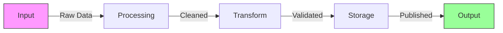
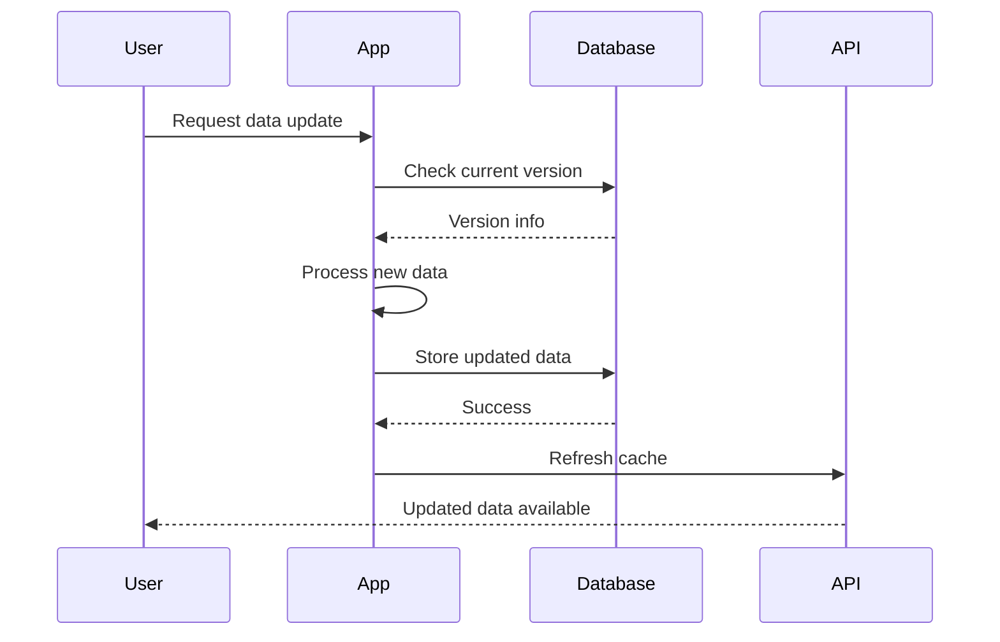
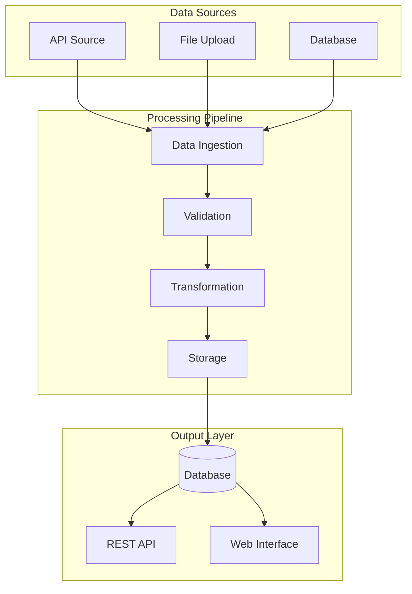

!!! warning "Unofficial Demo - Review with Caution"
    **This page was generated with assistance from Large Language Models (LLMs) and should be reviewed with caution.** It is not an official resource and was initially drafted as an internal reference to showcase a subset of Zensical's capabilities within our ETL documentation context.

    **For authoritative and up-to-date information, please refer to the official [Zensical documentation](https://zensical.org/docs/get-started/).** The official docs provide comprehensive guidance on all features, best practices, and the latest updates to this modern static site generator.

# Demo Page - Zensical Features Showcase

This page demonstrates the powerful authoring capabilities available in Zensical, a modern static site generator. You'll find examples of rich formatting, interactive elements, and technical documentation features.

!!! tip "Navigation Note"
    This page has the table of contents (TOC) hidden via front matter. Remove the following line from the YAML header to restore it.

    ```markdown
    hide:
      - toc
    ```

## Links and References

### Basic Links

You can create [internal links](../index.md) to other pages or [external links](https://ourworldindata.org) to websites.

### Links with Tooltips

Zensical supports [hoverable tooltips](https://zensical.org "Click to learn more about Zensical!") using the title attribute.

You can also use abbreviations for inline tooltips. Hover over the abbreviation below:

The API endpoint processes requests through multiple stages.

*[API]: Application Programming Interface - A way for applications to communicate

### Links with preview
Check out [our API](../api/index.md){ data-preview }.

### Reference-style Links

Check out our [data API][api-ref] and [metadata system][metadata-ref].

[api-ref]: ../api/index.md
[metadata-ref]: ../architecture/metadata/index.md

## Page Status Indicators

The status indicator at the top of this page is set via front matter: `status: new`

Available status options:

- `new` - Recently added content
- `deprecated` - Outdated or superseded content

## Admonitions (Callouts)

### Standard Types

!!! note "Information Note"
    This is a note admonition with a custom title. Great for highlighting important information.

!!! abstract "Summary"
    Use abstract for summaries or TL;DR sections.

!!! info "Additional Context"
    Info admonitions provide supplementary details.

!!! tip "Pro Tip"
    Tips offer helpful suggestions and best practices.

!!! success "Success Story"
    Celebrate achievements and successful outcomes.

!!! question "FAQ"
    Use questions for frequently asked questions.

!!! warning "Caution"
    Warnings alert users to potential pitfalls.

!!! failure "Common Mistake"
    Highlight errors or things to avoid.

!!! danger "Critical Warning"
    Danger indicates serious risks or breaking changes.

!!! bug "Known Issue"
    Document known bugs or limitations.

!!! example "Code Example"
    Provide illustrative examples.

!!! quote "Citation"
    Quote sources or include testimonials.

### Collapsible Admonitions

??? note "Click to Expand"
    This admonition starts collapsed. Click the title to reveal the content.

    Perfect for optional details or advanced topics.

???+ tip "Starts Expanded"
    This collapsible admonition begins in the expanded state.

    Users can collapse it if they want to focus on other content.

### Inline Admonitions

!!! info inline end "Sidebar Info"
    This admonition floats to the right side of the page, allowing text to flow around it.

Lorem ipsum dolor sit amet, consectetur adipiscing elit. Nulla et euismod nulla. Curabitur feugiat, tortor non consequat finibus, justo purus auctor massa, nec semper lorem quam in massa. This text wraps around the inline admonition.

Pellentesque habitant morbi tristique senectus et netus et malesuada fames ac turpis egestas. Vestibulum tortor quam, feugiat vitae, ultricies eget, tempor sit amet, ante.

## Buttons

You can create styled buttons for calls to action:

[Getting Started :material-rocket-launch:](../getting-started/index.md){ .md-button .md-button--primary }
[View on GitHub :fontawesome-brands-github:](https://github.com/owid/etl){ .md-button }
[API Documentation](../api/index.md){ .md-button }

## Code Blocks

### Basic Syntax Highlighting

```python
def process_data(data: list) -> list:
    """Process and clean the input data."""
    # Remove duplicates
    data = list(set(data))

    # Filter invalid values
    data = [x for x in data if x > 0]

    return sorted(data)
```

### With Title and Line Numbers

```python title="data_processor.py" linenums="1"
from typing import Dict, Any
import json

def load_config(config_path: str) -> Dict[str, Any]:
    """Load configuration from JSON file."""
    with open(config_path, 'r') as f:
        return json.load(f)

def process_records(records: list, config: Dict[str, Any]) -> list:
    """Process records according to configuration."""
    # Filter records
    filtered = [r for r in records if r.get('active', True)]

    # Transform according to config
    transformed = [transform_record(r, config) for r in filtered]

    return transformed
```

### With Highlighted Lines

```python hl_lines="2 3 5-7" linenums="1"
import json
from pathlib import Path
from datetime import datetime

# Load data file
data_path = Path("data/records.json")
with open(data_path, 'r') as f:
    records = json.load(f)

# Process records
processed = [process(r) for r in records]
```

### With Annotations

```python
def validate_config(config: dict) -> bool:
    """Validate configuration structure."""
    required_keys = {'name', 'version', 'settings'}  # (1)!

    if not all(key in config for key in required_keys):  # (2)!
        return False

    return True
```

1. Define the required configuration keys that must be present.
2. Check that all required keys exist in the configuration dictionary.

### Multiple Languages

=== "Python"

    ```python
    def calculate_growth_rate(current, previous):
        """Calculate percentage growth rate."""
        return ((current - previous) / previous) * 100
    ```

=== "SQL"

    ```sql
    SELECT
        country,
        year,
        ((value - LAG(value) OVER (ORDER BY year)) / LAG(value) OVER (ORDER BY year)) * 100 AS growth_rate
    FROM
        indicators
    WHERE
        indicator_name = 'GDP'
    ORDER BY
        country, year;
    ```

=== "Bash"

    ```bash
    # Build documentation
    make docs.build

    # Serve locally
    make docs.serve
    ```

## Mermaid Diagrams

### Flow Chart



### Sequence Diagram



### System Architecture



## Tabs

### Content Tabs

=== "Overview"

    The ETL system is Our World in Data's content-addressable data pipeline with DAG-based execution. It processes global development data through multiple stages with rich metadata.

=== "Core Stages"

    - **Snapshot**: DVC-tracked raw files
    - **Meadow**: Basic cleaning and standardization
    - **Garden**: Business logic and harmonization
    - **Grapher**: MySQL database ingestion
    - **Export**: Final outputs and APIs

=== "Key Features"

    ✓ Content-based checksums for change detection
    ✓ Automatic dependency resolution
    ✓ Rich metadata at every level
    ✓ Reproducible data workflows
    ✓ Version control integration

## Tables

### Simple Table

| Stage | Purpose | Output Format |
|-------|---------|---------------|
| Snapshot | Raw data storage | CSV, Excel, JSON |
| Meadow | Initial cleaning | Feather |
| Garden | Business logic | Feather |
| Grapher | Database ready | MySQL tables |

### Advanced Table with Alignment

| Command | Description | Example |
|:--------|:------------|--------:|
| `etl run` | Execute ETL steps | *Common* |
| `etl harmonize` | Country name mapping | *Essential* |
| `etl diff` | Compare datasets | *Debug* |
| `etl graphviz` | Generate DAG visualization | *Planning* |

### Table with Links

| Documentation | Description |
|---------------|-------------|
| [Getting Started](../getting-started/index.md) | Installation and setup |
| [Guides](../guides/index.md) | How-to guides for common tasks |
| [API Reference](../api/index.md) | API documentation |
| [Metadata](../architecture/metadata/index.md) | Metadata system overview |

## Grids

<div class="grid cards" markdown>

-   :material-clock-fast:{ .lg .middle } __Quick Start__

    ---

    Install dependencies and run your first ETL step in under 10 minutes.

    [:octicons-arrow-right-24: Getting Started](../getting-started/index.md)

-   :material-book-open-variant:{ .lg .middle } __User Guides__

    ---

    Step-by-step guides for adding data, updating datasets, and managing charts.

    [:octicons-arrow-right-24: Browse Guides](../guides/index.md)

-   :material-chart-line:{ .lg .middle } __Data API__

    ---

    Programmatic access to OWID data via REST API and catalog system.

    [:octicons-arrow-right-24: API Docs](../api/index.md)

-   :material-cog:{ .lg .middle } __Architecture__

    ---

    Deep dive into ETL design principles, workflow, and data model.

    [:octicons-arrow-right-24: Design Docs](../architecture/index.md)

</div>

## Footnotes

The ETL pipeline[^1] processes data from multiple international organizations[^2] and makes it available through our API[^3].

[^1]: ETL stands for Extract, Transform, Load - the three core stages of data processing.

[^2]:
    Major data providers include:

    - World Health Organization (WHO)
    - World Bank
    - United Nations
    - OECD
    - National statistical agencies

[^3]: Our REST API provides programmatic access to all OWID datasets. See the [API documentation](../api/index.md) for details.

## Mathematical Notation

### Inline Math

The growth rate can be calculated as $r = \frac{P_t - P_{t-1}}{P_{t-1}} \times 100$, where $P_t$ is the current population.

### Block Math

$$
\text{Life Expectancy} = \frac{\sum_{i=1}^{n} \text{age}_i \times \text{deaths}_i}{\sum_{i=1}^{n} \text{deaths}_i}
$$

The GDP per capita growth rate:

$$
g = \left(\frac{GDP_{t}}{GDP_{t-1}}\right)^{\frac{1}{t-(t-1)}} - 1
$$

## Images

### Basic Image


### Image with Caption

<figure markdown>
  { width="300" }
  <figcaption>The ETL processing pipeline at Our World in Data</figcaption>
</figure>

### Image Grid

<div class="grid" markdown>

{ width="200" }

{ width="200" }

{ width="200" }

</div>


## Keyboard Keys

Use ++ctrl+shift+r++ to hard refresh your browser and clear the favicon cache.

Common ETL commands:

- Run a step: ++ctrl+enter++
- Stop execution: ++ctrl+c++
- Search documentation: ++ctrl+k++ or ++cmd+k++

## Progress Bars

Track your ETL learning progress:

<progress value="75" max="100"></progress> 75% Complete

Dataset processing status:

<progress value="100" max="100"></progress> Snapshot ✓
<progress value="100" max="100"></progress> Meadow ✓
<progress value="60" max="100"></progress> Garden
<progress value="0" max="100"></progress> Grapher

## Icons

Zensical includes thousands of icons from multiple [icon sets](https://zensical.org/docs/authoring/icons-emojis/?h=icon). Some examples:

- :material-database: Database operations
- :material-chart-line: Data visualization
- :material-code-braces: Code development
- :fontawesome-brands-python: Python programming
- :fontawesome-brands-github: Version control
- :octicons-git-branch-16: Git branching
- :simple-mysql: MySQL database

## Horizontal Rules

Use horizontal rules to separate major sections:

---

## Summary

This demo page showcases the rich authoring capabilities available in Zensical:

✓ Interactive elements (buttons, tabs, collapsible sections)
✓ Rich formatting (admonitions, grids, cards)
✓ Technical content (code blocks, diagrams, math)
✓ Documentation features (tooltips, footnotes, cross-references)
✓ Visual elements (images, icons, progress bars)

!!! success "Ready to Start?"
    Explore the [Getting Started guide](../getting-started/index.md) to begin building your own documentation!
