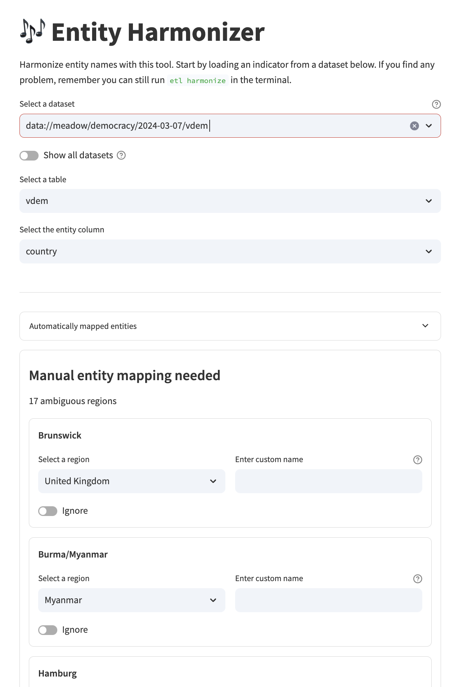

A crucial step in the ETL process is harmonizing country names. This is because different datasets or providers may use different names to refer to the same country. We want to keep country names consistent, and use names from our standardised list.

!!! info

    All our standardised country names are defined in our regions dataset (see [:fontawesome-brands-github: this YAML file](https://github.com/owid/etl/blob/master/etl/steps/data/garden/regions/2023-01-01/regions.yml)).

Typically, harmonizing country names is done while developing the Garden step, and is consolidated into a JSON dictionary, which maps the source's country names to our standard names:

```json
// some_step.countries.json
{
  "United States of America": "United States",
  "Congo, Democratic Republic of": "Democratic Republic of Congo",
  "DPRK": "North Korea"
}
```

## Our methodology

Harmonization is the editorial process by which we modify the indexing columns for a dataset to ensure that the data is consistent and unambiguous.

Harmonizing a country name can sometimes be done automatically, based on mappings done in the past. However, in many cases, manual intervention is needed. For example, a `country` column containing the value `Korea` could be referring to South Korea, North Korea, or historical unified Korea, depending on the context and the intent of the data provider. In such case, human judgement is needed.

We strive to harmonize country names in a way that is consistent with the [:octicons-link-external-16: ISO 3166-1 standard](https://en.wikipedia.org/wiki/ISO_3166-1), however we use custom editorial labels for countries and regions that are often shorter than those in the standard, in order to make data visualisations richer and more understandable.

Since we also present long-run datasets over multiple centuries, a time period in which national borders have changed, split and merged, we also make a best-effort attempt to harmonize the names of historical countries and regions that no longer exist and are not present in the ISO standard.

Our harmonization tool relies on [:fontawesome-brands-github: rapidfuzz](https://github.com/rapidfuzz/RapidFuzz).

## Guidelines for harmonization
Our harmonizer is available from [Wizard :material-arrow-down:](#using-wizard), the terminal with [our CLI :material-arrow-down:](#using-our-cli), and the [interactive shell :material-arrow-down:](#using-the-interactive-shell).


### Using Wizard

After generating a Meadow dataset, one can use the Harmonizer page in Wizard to generate a JSON mapping file for the Garden step.

<figure markdown="span">
  
  <figcaption>Harmonizer page in Wizard. You can choose default names from the dropdowns or enter custom names.</figcaption>
</figure>

### Using the interactive window

If you are editing a step script in VS Code, it can be helpful to have access to the harmonizer tool from the interactive window (or interactive shell).

You can simply invoke it with the following code:

```python
# Run interactive harmonizer to create mapping file
paths.regions.harmonizer(tb)
```

This assumes that you have a `PathFinder` instance defined as `paths` and that `tb` has a column `"country"` to harmonize. If you want to use a different column, you can pass it as the `country_col` argument.

```python
# Harmonize a different column
paths.regions.harmonizer(tb, country_col="region")
```

The harmonizer will present a form with a list of ambiguous country names and ask you to select the correct country name from a list of suggestions (ranked by similarity).

<figure markdown="span">
  
  <figcaption>Harmonizer interactive tool in VS Code.</figcaption>
</figure>

After running the harmonizer to create the mapping file, you can apply the harmonization to your table:

```python
# Apply harmonization using the created mapping file
tb_harmonized = paths.regions.harmonize_names(tb)
```


### Using our CLI

Our [ETL client](etl-cli/){ data-preview } contains an interactive `harmonize` command-line tool which can be used to harmonize a CSV file that contains a column with country names.

```
~ etl harmonize --help

Usage: etl harmonize [OPTIONS] DATA_FILE COLUMN OUTPUT_FILE

Generate a dictionary with the mapping of country names to OWID's canonical names.
Harmonize the country names in COLUMN of a DATA_FILE (CSV or feather) and save the mapping
to OUTPUT_FILE as a JSON file. The harmonization process is done according to OWID's
canonical country names.

The harmonization process is done interactively, where the user is prompted with a list of
ambiguous country names and asked to select the correct country name from a list of
suggestions (ranked by similarity).

When the mapping is ambiguous, you can use:

• Choose Option [custom] to enter a custom name.
• Type Ctrl-C to exit and save the partially complete mapping

If a mapping file already exists, it will resume where the mapping file left off.

╭─ Options ────────────────────────────────────────────────────────────────────────────────╮
│ --institution      -i  TEXT     Append '(institution)' to countries                      │
│ --num-suggestions  -n  INTEGER  Number of suggestions to show per entity. Default is 5   │
│                                 [default: 5]                                             │
│ --help                          Show this message and exit.                              │
╰──────────────────────────────────────────────────────────────────────────────────────────╯
```

As an example, start the harmonization interactive session for table `undp_hdr` from dataset `meadow/un/2025-05-07/undp_hdr`, which has `country` column with the raw country names:

```bash
uv run etl harmonize data/meadow/un/2025-05-07/undp_hdr/undp_hdr.feather country mapping.json
206 countries/regions to harmonize
  └ 188 automatically matched
  └ 18 ambiguous countries/regions

Beginning interactive harmonization...
  Select [skip] to skip a country/region mapping
  Select [custom] to enter a custom name

? [1/18] Arab States: (Use shortcuts or arrow keys)
 » 1) Yemen Arab Republic
   1) United States Virgin Islands
   2) United States Minor Outlying Islands
   3) United States
   4) United Arab Emirates
   5) [custom]
   6) [skip]
```

The output mapping is saved in `mapping.json`. If this file existed before, it will resume the session from where it left off.

