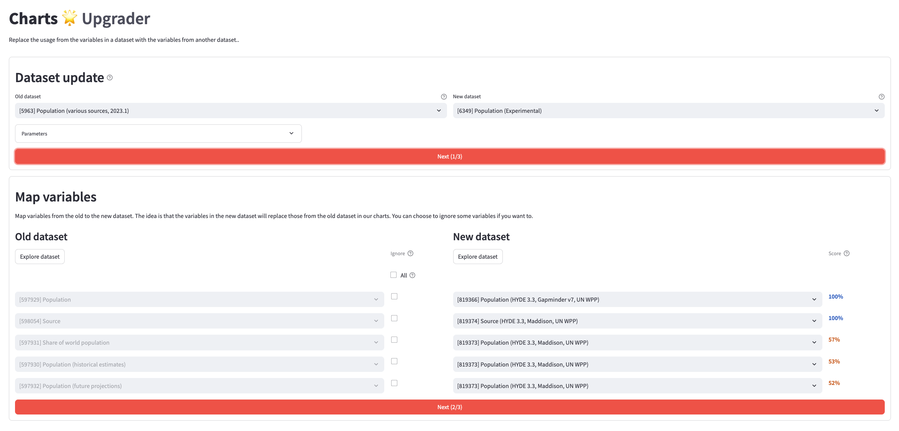
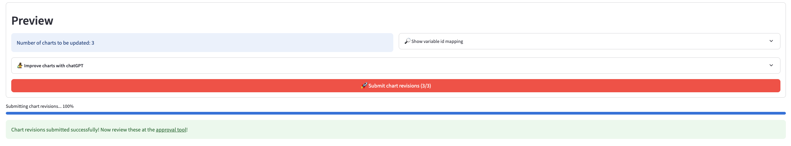
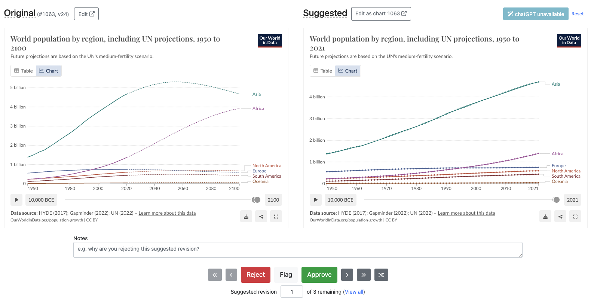
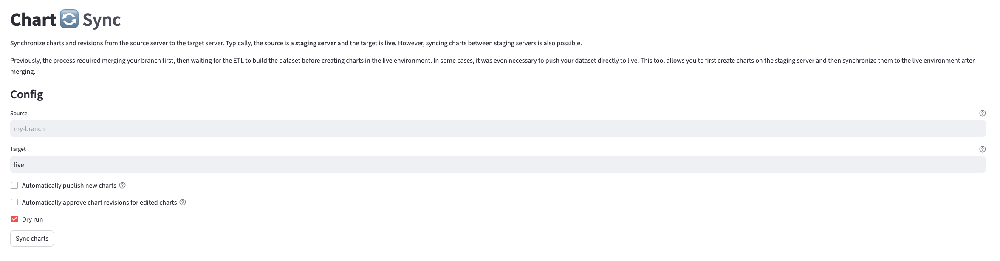

---
tags:
    - 👷 Staff
---

# Indicator upgrade
Consider as an example that the UN releases a new dataset on their Population estimates. In our catalog, we have an old version of it, and rely on its indicators for various charts on our site. As a consequence of UN's new release, we now need to update our catalog with the new version, and, because of that, we also need to update all the charts that rely on the old indicators.

This process is very common in our workflow, and we have tools to help us with it. This guide will walk you through these.

## Create the new steps
In the etl repository, create a new branch for your work.

```bash
git checkout -b data/new-dataset
```

Create all the new steps required to import the new dataset. Note that this guide only applies to those datasets that make it to the database (e.g. have Grapher steps). Other datasets are not relevant, since they are not used by any charts.

Creating new steps (or updating old ones) can be done using the [Wizard](../wizard).

## Add the new dataset to grapher
Once you have implemented all the steps, test if the dataset can successfully be added to the Grapher:

```
etl run <short_name> --grapher
```

!!! note "Choose the database"
    Note that you can choose which database to push your changes to (local environment or personal staging server, etc.) by setting the `ENV_FILE` variable:

    ```
    ENV_FILE=.env.yourname etl run <short_name> --grapher
    ```

    [Learn more about environments :octicons-arrow-right-24:](../environments)


If that works, push all your changes to your branch `data/new-dataset`. This will trigger an ETL build, and your dataset will be available in the Grapher admin from the PR staging server.

!!! info "Learn more about [staging servers](../staging-servers)"


After this, all the new indicators will be now available from the admin page.

## Match old indicators to new ones
!!! abstract "Chart revision"
    Charts at Our World in Data are based on a config file, which contains several configuration parameters (variable IDs in use, title, subtitle, etc.).

    `etlwiz` assists you with the creation and update of these configuration files.

Once a dataset is available on the Grapher database, you can create charts from its indicators.

Start the Wizard _Chart Upgrader_ app with

```
ENV_FILE=.env.yourname etlwiz charts
```

<figure markdown="span">
  
  <figcaption>Using Wizard to upgrade the indicators from dataset 5963 with those in dataset 6349.</figcaption>
</figure>

This tool will help you match indicators from the old dataset to indicators from the new one by asking which dataset is being updated (old and new one) and how each indicator is mapped to a new one. The tool will guide you through the whole process of creating _chart revisions_.


!!! tip "Tips"
    - Under the expandable window "Parameters", check the "Explore indicator mappings" option to display indicator comparisons on the fly.
    - You can use the [live Wizard version for this](http://etl.owid.io/wizard/Chart%20Revision%20Baker).


Once you have finished, your chart revisions are submitted to the Grapher database, and are ready to be reviewed from there.

<figure markdown="span">
  
  <figcaption>Once you submit the chart revisions, a link to the chart approval tool will be displayed.</figcaption>
</figure>

!!! note "Notes"
    - All chart suggestions are stored in the grapher database table `suggested_chart_revisions`.
    - Again, `ENV_FILE` will determine to which database you are submitting your chart revisions.

## Approving new charts

Once you have successfully created and submitted your chart revisions, go to the admin tool "Suggested chart revisions" (in the environment determined by `ENV_FILE`). You can find it in the admin panel, on the right menu bar under "DATA".

In there, you will be presented with all the chart revisions, which you can approve or reject. Approving a chart revision means that the chart will be updated with the new configuration. You can read further under the "Instructions" tab. Note that you can filter these by the user that created them.

<figure markdown="span">
  
  <figcaption>Chart approval tool. All chart revisions are presented there.</figcaption>
</figure>

For the chart approval process, feel free to involve other stakeholders (data managers, researchers, etc.) to ensure that the revision is done correctly.

Optionally, once the charts are approved, you can further fine-tune them in their respective edit pages.

## Merge your changes
After approving all the new charts in your PR staging, and your PR code has been approved, you can merge your changes to the master branch.

Once your branch is merged, the ETL will run again, and the new dataset will be available in the live site (this might take some time).

## Sync the changes to live
Once the new dataset is available in the live site, you should sync all the approved charts from the PR staging server to the live site. This can be done with the `Chart Sync` app in Wizard (or `etl chart-sync` command).

<figure markdown="span">
  
  <figcaption>Chart Sync. Migrate chart upgraded versions between servers.</figcaption>
</figure>

In there, you need to specify the source and target servers, which typically are the PR staging server and the live site, respectively.


## Final chart approval in live
Once your charts are synced with live, these will be avaialble as suggested revisions, under the "Chart Approval" tool.

This means that you will need to approve the charts once again. This serves as a double-check to ensure that the charts are correctly updated in the live site.

