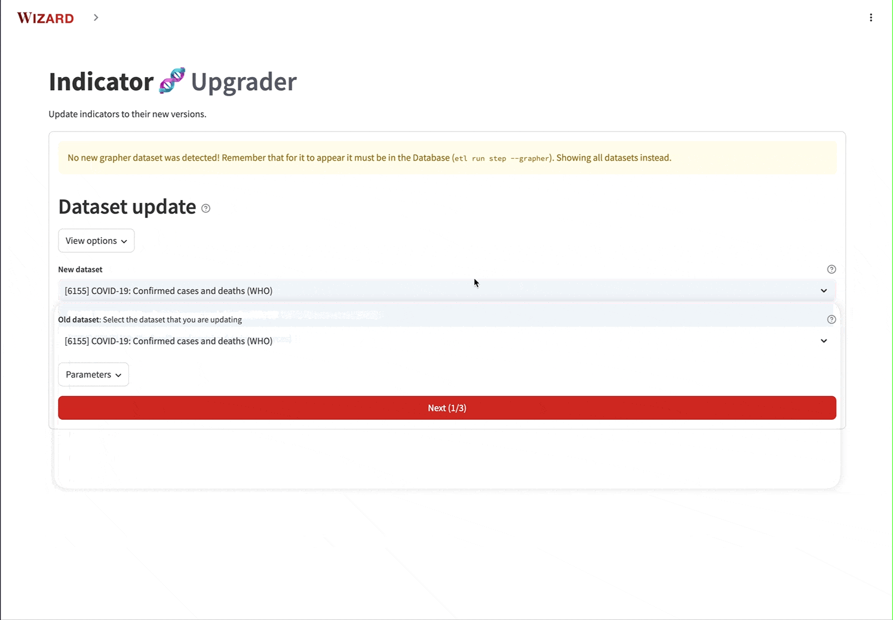

---
tags:
  - 👷 Staff
---

# Update charts

Consider as an example that the UN releases a new dataset on their Population estimates. In our catalog, we have an old version of it, and rely on its indicators for various charts on our site. As a consequence of UN's new release, **we now need to update our catalog with the new version**, and, because of that, **we also need to update all the charts that rely on the old indicators**.

This process is very common in our workflow, and we have tools to help us with it. This guide will walk you through these.

This guide assumes:

- [You have created your environment](../#1-create-environment).
- You have [added](add-data) (or [updated](update-data)) the new dataset in the ETL catalog. Also, the dataset should be available in the database from your staging server.

<!--
## Create the new steps
In the etl repository, create a new branch for your work.

```bash
git checkout -b data/new-dataset
```

Create all the new steps required to import the new dataset. Note that this guide only applies to those datasets that make it to the database (e.g. have Grapher steps). Other datasets are not relevant, since they are not used by any charts.

You can create these steps manually, by duplicating the steps from older versions of the dataset and updating them accordingly. Alternatively, you can use the [Wizard](../wizard). -->

<!-- ## Add the new dataset to grapher
Once you have implemented all the steps, test if the dataset can successfully be added to the Grapher:

```
etl run <short_name> --grapher
```

!!! note "Choose the database"
    We recommend using the environment variable `STAGING` to select which staging server to upload the new dataset to. Here, you can use your personal staging server.

    ```
    STAGING=yourname etl run <short_name> --grapher
    ```

    Learn more about [setting up your personal staging server :octicons-arrow-right-24:](../environment#personal-staging-environment) -->
<!--
If that works, push all your changes to the remote branch `data/new-dataset` and create a draft Pull request (PR). This will trigger several things:

- [A dedicated staging server](../staging-servers) will be created for your PR, in which the OWID admin site and databe will be running (you need tailscale to access this server).
- An etl build will be executed in this new server, with the new steps you created.

Consequently, your dataset and all its indicators will be available from the admin page of the PR staging server. -->

## Indicator upgrader

If you are running a dataset update, you will need to migrate several charts so that they use the indicators from the new dataset. This is done with **Indicator Upgrader** in Wizard, which is accessible in the admin site of your PR staging server (at https://staging-site-name/etl/wizard/).

Start Wizard with

```
etlwiz
```

!!! tip "Make sure to use the database from the staging server"

    Make sure to use Tailscale and set `STAGING=1` in your local `.env` file to connect to the staging server from your local machine.

    [→ More information](../../environment/#working-with-staging-environments)

This tool will help you match indicators from an old dataset to indicators from the new one. By default, it attempts to detect what is the new dataset your environment (compared to production), and matches it with the old one. You can also manually specify the datasets you want to compare with the various options available in the tool.

Once you have selected the datasets, the tool will show the indicators from both and will ask you to map them. Some might be mapped automatically, based on short-name-matching (you can disable this in the tool options).

There is also an "explore" mode which you can use to quickly compare two indicators and make sure that your mapping makes sense.

<figure markdown="span">
  
  <figcaption>Using Wizard to upgrade the indicators from dataset 5963 with those in dataset 6349.</figcaption>
</figure>

Once you have finished mapping indicators, you will see a preview of the affected charts. Finally approve and run all chart updates.

<figure markdown="span">
  
  <figcaption>Once you submit the chart revisions, a link to the chart approval tool will be displayed.</figcaption>
</figure>

## Chart diff

With Chart diff you can compare the charts from your PR staging server with the charts from the live site. This is useful to see what charts have been modified and need to be approved.

Modifications in charts can occur due to changes in the database or in ETL.

### Types of chart changes

#### Changes in the database

Changes in the database come frome changes in the chart config:

- You've run **indicator upgrader**, which changes the `variableId` and the `version` fields from the chart config.
- You've manually modified the FASTT of a chart from the admin.

To detect these changes, we compare the chat config JSON files.

#### Changes in ETL

Changes in ETL can originate from two sources:

- **The values of an indicator have changed**. This can happen if someone has modified the python scripts in ETL, and now the timeseries for the indicator is different. Note that changes in indicator values can also originate from changes in the processing of some other indicator that affects it.
- **The metadata of an indicator has changed**. This can happen if someone has modified the metadata YAML fiels in ETL, and now the indicator has different units, description, etc. Remember that some metadata fields are surfaced in the FASTT and in the "Learn more about this data" modal.

To detect these changes, we use checksums and compare them to detect changes.

### Using chart diff

Using chart diff is straightforward. Just start `etlwiz` and go to "Chart diff". In there you will have a preview of all charts that have been modified in your PR staging server.

<figure markdown="span">
  
  <figcaption>Example of chart diff. On the left, the version in production. On the right, the version in your staging server. You can share a link to an individual chart-diff using the link shown in the upper-right part of the container.</figcaption>
</figure>

By default, a chart diff is set to "Pending" state. You can then approve or reject each chart diff. The state of a chart diff persists between sessions, so you can come back later and continue reviewing the charts.

!!! note "You need to review all charts to be able to merge your PR"

    You need to either approve or reject all the charts in the chart diff tool to be able to merge your PR. @owidbot will remind you of this in the PR with a comment.

If you approve a chart diff and then go and update anything on the chart in staging, the chart diff will be unapproved and you will need to review it again.

If someone edited a chart in production, the chart diff will show that the chart has been modified in production, and you will need to resolve the conflict by manually integrating the changes in the chart.

!!! warning "Adding tags to existing charts"

    There is a technical limitation related to chart tags: If you create a new chart and add tags to it, the `Chart Sync` tool (see below) will be able to transfer those tags from your current environment to production. However, if you edit the tags of an existing chart, those changes will not be synced.

<!-- ## Merge your changes
After approving all the new charts in your PR staging, and your PR code has been approved, you can merge your changes to the master branch.

Once your branch is merged, the ETL will run again, and the new dataset will be available in the live site (this might take some time).

## Sync the changes to live
Once the new dataset is available in the live site, you should sync all the approved charts from the PR staging server to the live site. This can be done with the `Chart Sync` app in Wizard (or `etl chart-sync` command).

<figure markdown="span">
  
  <figcaption>Chart Sync. Migrate chart upgraded versions between servers.</figcaption>
</figure>

In there, you need to specify the source and target servers, which typically are the PR staging server and the live site, respectively.


## Final chart approval in live
Once your charts are synced with live, these will be avaialble as suggested revisions, under the "Chart Approval" tool.

This means that you will need to approve the charts once again. This serves as a double-check to ensure that the charts are correctly updated in the live site. -->
