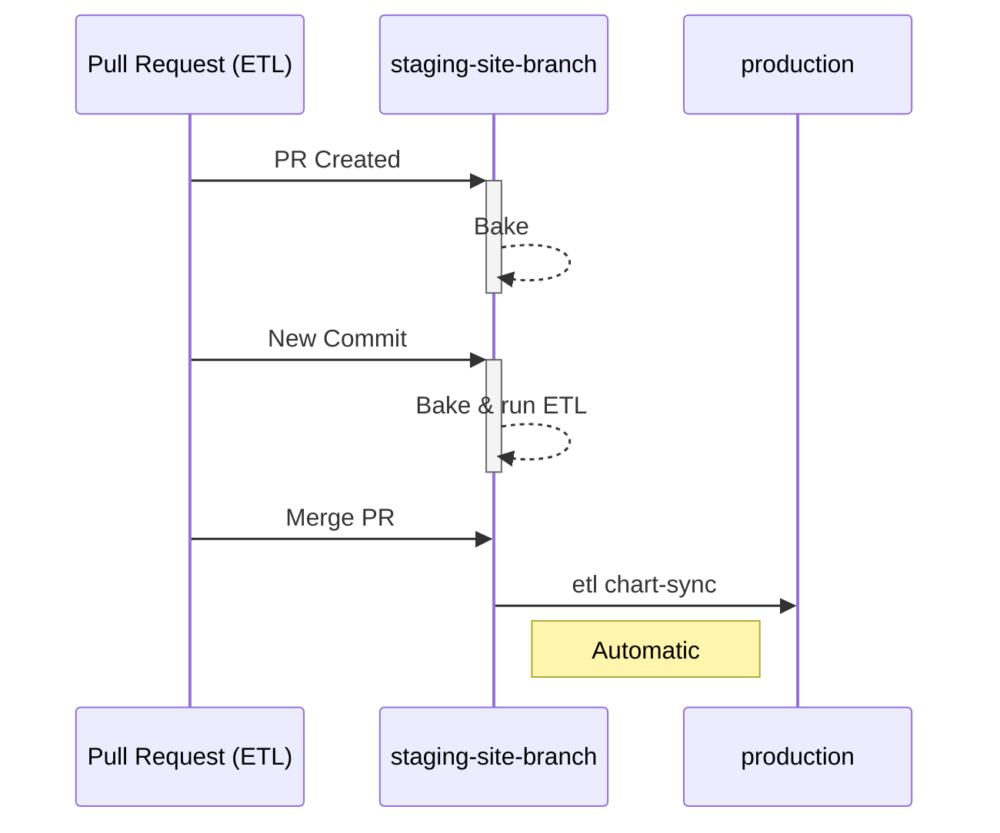
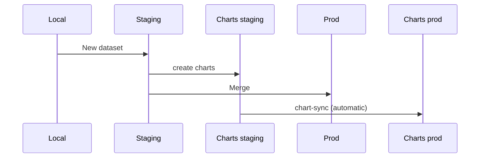
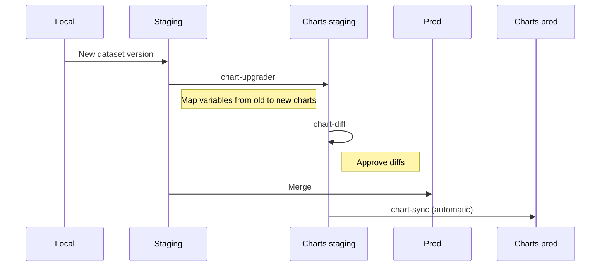

---
tags:
  - 👷 Staff
---

## Data Manager Workflow

Dedicated staging servers are automatically created from every ETL pull request. That gives data manager the ability to share and test their changes before they are merged into the live site.

!!! note "PR staging servers URLs"

    You can visit your PR staging server at `http://staging-site-<branch>`. Note that `<branch>` might differ from the exact branch name, for example `feature/123` will be `feature-123` (all symbols are changed to dashes, and the maximum length is of 50 characters).

    For more details, refer to the [python code](https://github.com/owid/etl/blob/master/apps/chart_sync/cli.py#L284) generating `<branch>` from the branch name.

Once the PR is ready and data manager merges into master, ETL will deploy the changes and automatically run `chart-sync` that syncs approved charts to production. Then the staging server is stopped and destroyed after 3 days.

## Creating a new dataset

When creating a new dataset, the manager creates a PR with a staging server and then creates charts on it. Charts need to be approved in chart-diff before merging the PR.Once the work is done and merged, charts are automatically synced to production.

## Updating a dataset

When updating a dataset, the workflow is slightly more complex. In addition to creating a PR with a staging server, data manager has to map variables from the old dataset to the new one in staging.

