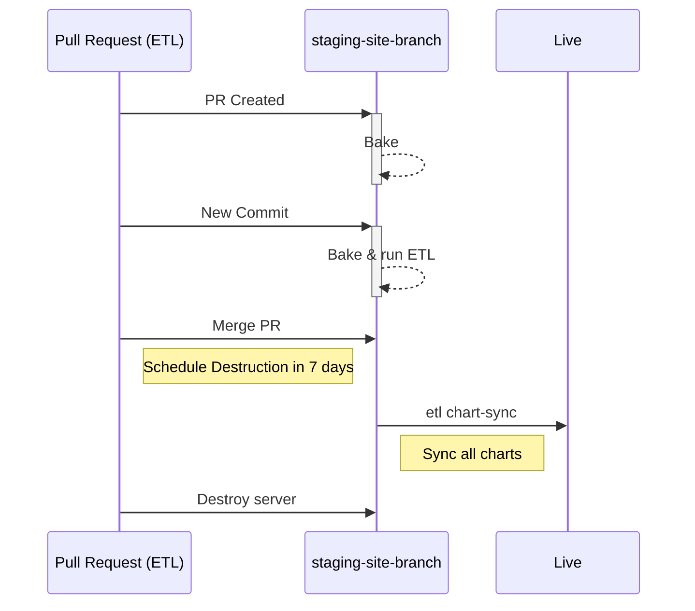
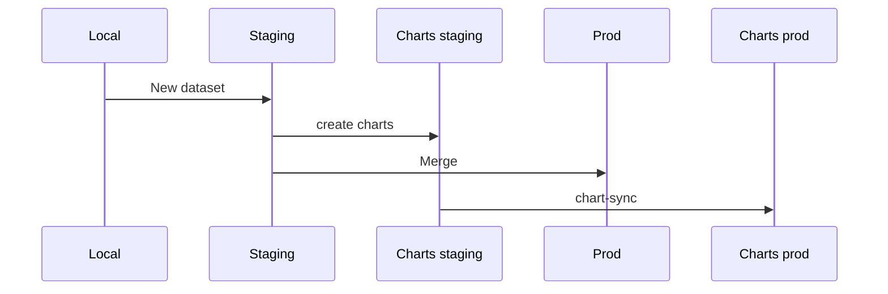
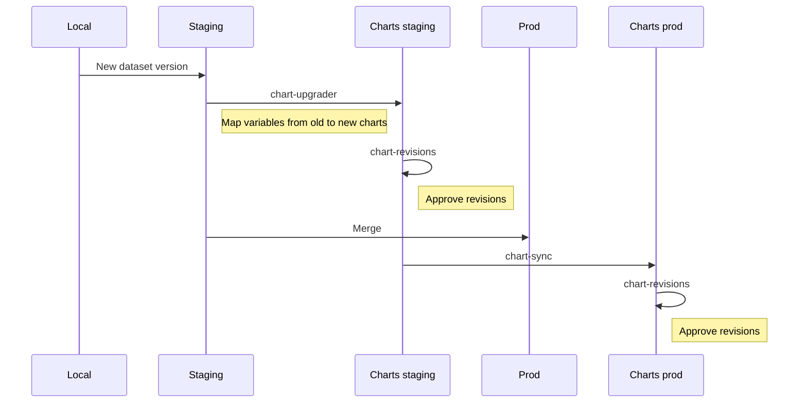
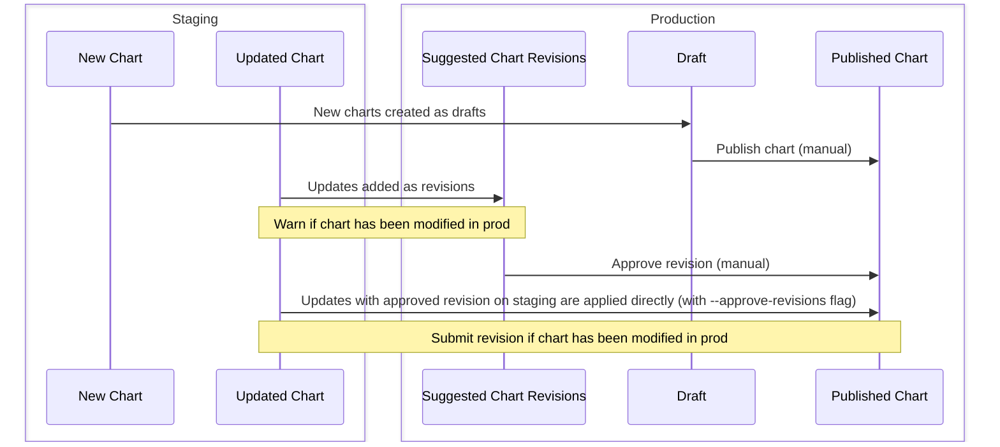

---
tags:
    - 👷 Staff
---

## Data Manager Workflow

Dedicated staging servers are automatically created from every ETL pull request. That gives data manager the ability to share and test their changes before they are merged into the live site.

!!! note "PR staging servers URLs"

    You can visit your PR staging server at `http://staging-site-<branch>`. Note that `<branch>` might differ from the exact branch name, for example `feature/123` will be `feature-123` (all symbols are changed to dashes, and the maximum length is of 50 characters).

    For more details, refer to the [python code](https://github.com/owid/etl/blob/master/apps/staging_sync/cli.py#L284) generating `<branch>` from the branch name.

Once the PR is ready, data manager should merge it into master, wait for deploy process to run ETL with their updates and then migrate all charts to the live site. This has to be done within 7 days after the PR is merged, then the staging server will be destroyed.

## Creating a new dataset

When creating a new dataset, the manager creates a PR with a staging server and then creates charts on it. Once the work is done and merged, the manager should sync all charts to production.

## Updating a dataset

When updating a dataset, the workflow is slightly more complex. In addition to creating a PR with a staging server, data manager has to map variables from the old dataset to the new one in staging, which will create revisions. These revisions have to be approved then. After merging, running `chart-sync` would sync all changes to production where the charts must be approved again (or you could automatically approve them).

## chart-sync

`etl chart-sync` tool is used to sync charts from staging to production. It's gonna take all changed charts from the staging server and migrate them to production as either draft charts or revisions.

!!! info "Run `etl chart-sync --help` for more details"
