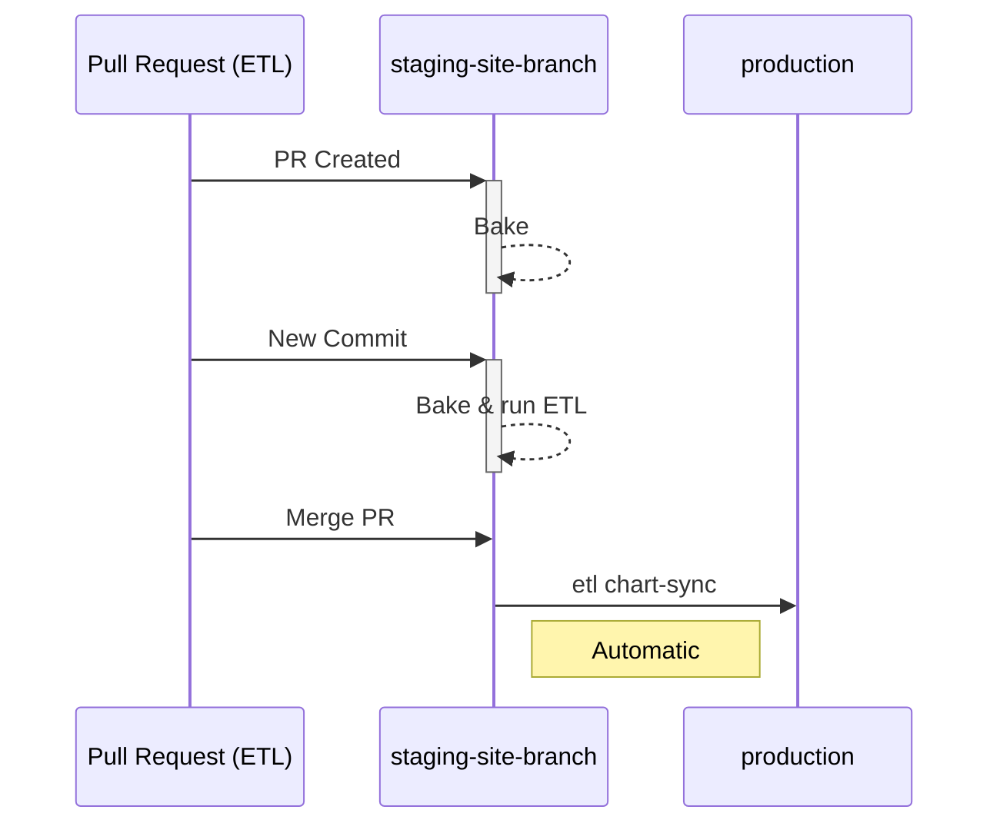
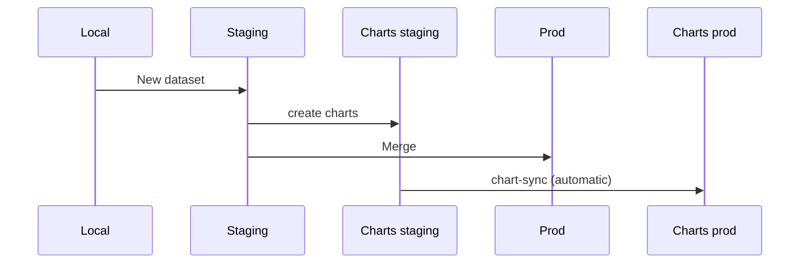
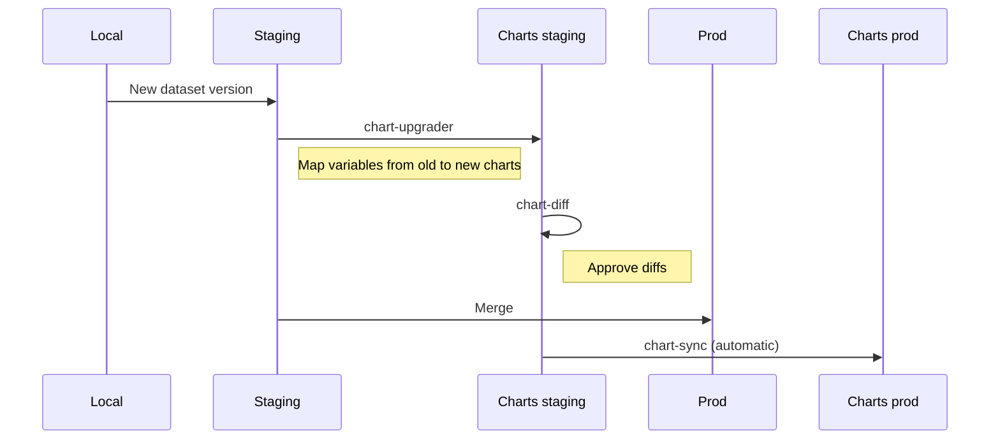

## Data Manager Workflow

Dedicated staging servers are automatically created from every ETL pull request. That gives data manager the ability to share and test their changes before they are merged into the live site.

## Using a specific owid-grapher branch

By default, a staging server runs the `master` branch of owid-grapher.

Sometimes your etl branch needs grapher changes that are not in master yet — for example, a new admin API endpoint that your etl code calls. To make the staging server deploy those changes, open a pull request in owid-grapher whose branch has the **same name** as your etl branch.

Two details matter:

- The pairing requires an open owid-grapher **pull request**. Pushing a branch to owid-grapher without opening a pull request does nothing: the staging server stays on master.
- If you have no grapher changes of your own and only need an existing grapher branch deployed (a common case for stacked pull requests), base the owid-grapher pull request on that branch, add an empty commit, and open it as a draft. Close it when your etl pull request is merged or closed.

If possible, open the owid-grapher pull request before creating the etl pull request, so the staging server picks the right grapher branch from the start.

!!! note "PR staging servers URLs"

    You can visit your PR staging server at `http://staging-site-<branch>` or `https://<branch>.owid.pages.dev/`. Note that `<branch>` might differ from the exact branch name, for example `feature/123` will be `feature-123` (all symbols are changed to dashes, and the maximum length is of 50 characters).

    For more details, refer to the [:fontawesome-brands-github: python code](https://github.com/owid/etl/blob/master/apps/chart_sync/cli.py#L284) generating `<branch>` from the branch name.

OWID site on staging servers is **public** by default. If you want to keep the work private (e.g. for embargoed data), use `-private` suffix in the branch name. This will make it available only on `http://staging-site-<branch>`.

Once the PR is ready and data manager merges into master, ETL will deploy the changes and automatically run `chart-sync` that syncs approved charts to production. Then the staging server is stopped and destroyed after 3 days.

```mermaid
sequenceDiagram
    participant PR as Pull Request (ETL)
    participant SSB as staging-site-branch
    participant production as production

    PR ->>+ SSB: PR Created
    SSB -->>- SSB: Bake
    PR ->>+ SSB: New Commit
    SSB -->>- SSB: Bake & run ETL
    PR ->> SSB: Merge PR
    SSB ->> production: etl chart-sync
    Note left of production: Automatic
```

## Creating a new dataset

When creating a new dataset, the manager creates a PR with a staging server and then creates charts on it. Charts need to be approved in chart-diff before merging the PR.Once the work is done and merged, charts are automatically synced to production.

```mermaid
sequenceDiagram
    Local ->> Staging: New dataset
    Staging ->> Charts staging: create charts
    Staging ->> Prod: Merge
    Charts staging ->> Charts prod: chart-sync (automatic)
```

## Updating a dataset

When updating a dataset, the workflow is slightly more complex. In addition to creating a PR with a staging server, data manager has to map variables from the old dataset to the new one in staging.

```mermaid
sequenceDiagram
    Local ->> Staging: New dataset version
    Staging ->> Charts staging: chart-upgrader
    Note right of Staging: Map variables from old to new charts
    Charts staging ->> Charts staging: chart-diff
    Note right of Charts staging: Approve diffs
    Staging ->> Prod: Merge
    Charts staging ->> Charts prod: chart-sync (automatic)
```
