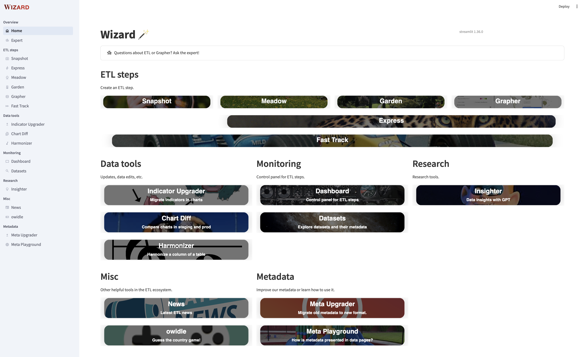

# Wizard
!!! info

    Wizard is a living project, and is constantly being improved and new features are being added. Consequently, this documentation might be slightly out of sync.

_The Wizard_ is OWID's ETL admin tool. It is an interactive [:octicons-link-external-16: streamlit](https://streamlit.io/)-based web app that provides a user-friendly interface to manage our ETL catalog.

It was initially developed to ease the creating of ETL steps by means of templating, but it has evolved to more than that and now provides a wide range of functionalities in the ETL workflow.

Run it locally with the following command:

```bash
etlwiz
```

and then visit [localhost:8053](localhost:8053).

!!! info "Run it from admin and staging servers"

    - Wizard is available from any server that bakes OWID's site (e.g. [staging servers](staging-servers.md)), including live admin page. Just look for "Wizard" in the navigation menu.
    - The production version runs at [etl.owid.io/wizard](http://etl.owid.io/wizard/) (needs Tailscale).
    - Note that some of the functionalities might not be enabled in a remote setting. For instance, creating steps is currently only available when running locally.

<!--
!!! tip "Use [different environments](environment.md)"

    If your Wizard session interacts with Grapher database (e.g. submit chart revisions), you can use `ENV_FILE` to connect to the appropriate server:

    ```
    ENV_FILE=.env.name etlwiz
    ``` -->

## The different pages in Wizard

Wizard is structured into different sections, each of them grouping different pages (or apps) depending on what they do.

In the following sections we try to give a brief overview of each of the sections and the pages they contain.

!!! tip "Get latest details from the app"

    The best way to know what Wizard can do is to run it and check the available options. The app is constantly being updated and new features are being added.

<figure markdown="span">
  
  <figcaption>Wizard as of November 2025.</figcaption>
</figure>

### Create ETL steps

Create new ETL steps from Wizard, including **Snapshot**, **Data** (Meadow, Garden, Grapher) and also **Collection** steps. Additionally, **Fast-Track** steps can also be created using the Wizard.


In each step creation, a form is presented to the user so that they can fill in the necessary metadata fields. Based on the input, new files (e.g. python scripts, metadata YAML files, etc.) are created and modifications to existing ones (e.g. the DAG) are done.

After submitting each of the forms, a short guideline is shown so that the user knows what they need to do next.

<div class="grid cards" markdown>

- { width="100%" }

    ---

    Snapshot step creation

- { width="100%" }

    ---

    Data step creation

- { width="100%" }

    ---

    Collection step creation

</div>

### Expert

GPT-based assistant to help resolve doubts. Doubts can include anything ETL-related (metadata structure, environment setup, etc.). This documentation is fed to the Expert, so it should be able to answer most of the questions concerning this documentation.

Additionally, Expert can also help out create Datasette queries!

<figure markdown="span">
  
  <figcaption>Asking the Expert a data question.</figcaption>
</figure>

### Update tools

Pages to help us improve our charts (e.g. keeping them up to date). The current pages are:

- **Step upgrader**: Monitor datasets and update them quickly!
- [**Indicator Upgrader**](data-work/update-charts/#indicator-upgrader){ data-preview }: Upgrade old indicators with their corresponding new versions to keep the charts up to date. You will need to (mostly) manually map "old indicators" to "new indicators". Then, the tool will update all affected charts with the new indicators. These modified charts can be reviewed with **Chart diff**.
- [**Chart diff**](data-work/update-charts/#using-chart-diff){ data-preview }: Shows all charts in your environment (e.g. staging server) that have been modified compared to the production. This is useful to review the changes before they are pushed to the production. Additionally, we provide MDIM and Explorer diff (experimental).

!!! info "Learn more about [updating charts](data-work/update-charts.md) section"

### Data tools

- **Anomalist**: Presents all anomalies detected in a given selected dataset. By default, it attempts to load anomalies from the newly added datasets (and, if applicable, it also compares the new indicators with the old counterparts).
- [**Harmonizer**](harmonize-countries/){ data-preview }: Harmonize the entity names of a table.
<!--
- **Dataset Explorer**: A tool to explore the datasets in the ETL catalog. You can check the step dependancies and its metadata. If it is a Garden step, you can also perform some actions with it. -->

### Assistant

- **Insighter**: Generate insights from a chart using LLMs.
- **Chart animation**: Animate a chart over time and export it as a GIF.

### Search (experimental)

- **Indicator search**: Browse indicators.
- **Related charts**: Given a chart, find related charts based on semantic similarity.


### Explorers

- **Map Bracketer**: Define map brackets for explorers smartly.
- **ID to Path**: Convert an explorer that is ID-based to a path-based explorer.

### Misc

- **News**: Brief summary of the latest activity in the ETL repository. This is only available in production.
- **owidle**: Daily challenge where you have to guess the country based on the data provided.
- **Servers dashboard**: Track the status of all our servers.
<!--
### Metadata

- **Meta Upgrader**: Upgrade v1 metadata YAML files to v2. This tool uses chatGPT to suggest the new YAML structure.
- **Meta Playground**: A playground to test the metadata of a step. It is useful to check if the metadata is valid and to see how it will look like in a data page of an indicator. -->

## Adding new functionalities to Wizard

The code for the Wizard lives in [:fontawesome-brands-github: apps/wizard](https://github.com/owid/etl/tree/master/apps/wizard). It is a streamlit app, so you can also run it with `streamlit run apps/wizard/app.py`.


!!! note "We are trying to keep Wizard as modular as possible, so that it is easy to add new pages to it."

We encourage everyone to experiment with tools from which the team can benefit. Make sure to discuss your ideas with the rest of the team, so that you can make a good use of your time.

To add a new page, follow these steps:

1. Create a new python script, and place it under [:fontawesome-brands-github: `apps/wizard/app_pages`](https://github.com/owid/etl/tree/master/apps/wizard/app_pages). This script should be a [:octicons-link-external-16: streamlit](https://streamlit.io/) python script, and should contain the code to render the page.
2. Add an entry in the config file [:fontawesome-brands-github:  `apps/wizard/config/config.yml`](https://github.com/owid/etl/blob/master/apps/wizard/config/config.yml) describing your new page. You should first decide in which section you should add your page to or create a new one. You will find more details on how to add your page in the config file itself.
