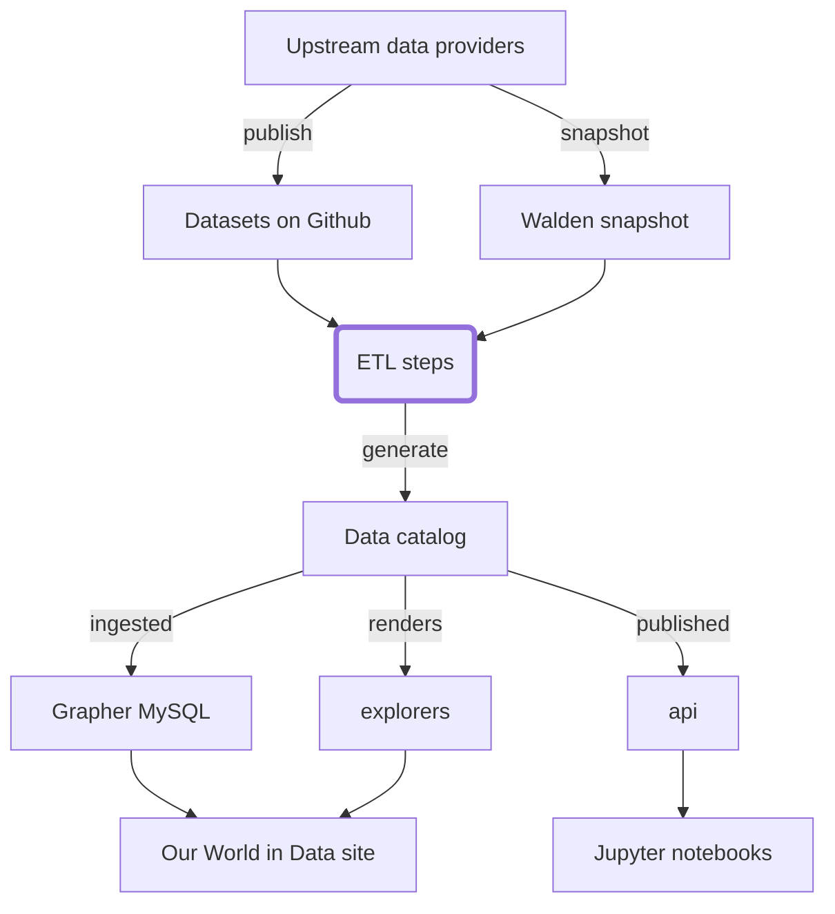

# Old README

_Not visible in rendered docs, we should incorporate or delete it._



## Environment setup

### Dependencies

You need to install the following:

- Python 3.9+. Guide for all platforms [here](https://realpython.com/installing-python/). If you are using multiple different versions of Python on your machine, you may want to use `pyenv` to manage them (instructions [here](https://github.com/pyenv/pyenv)).
- `poetry`, for managing dependencies, virtual envs, and packages. Installation guide [here](https://python-poetry.org/docs/#installation).
- `make`. You likely already have this, but otherwise it can be installed using your usual package manager (e.g. on Mac, `brew install make`).
- MYSQL client (and Python dev headers). If you don't have this already,
  - On Ubuntu: `sudo apt install python3.9-dev mysql-client default-libmysqlclient-dev build-essential`
  - On Mac: `brew install mysql-client`
- [AWS CLI](https://aws.amazon.com/cli/) (`pip install awscli`) and you should have an `~/.aws/config` file configured (ask someone for credentials) so that you can upload to walden etc.

WSL users need to set up Linux executables only by including/editing the `/etc/wsl.conf` file.
- Run `sudo vi /etc/wsl.conf`, copy this:
```
[interop]
appendWindowsPath = false
```
- Press `ESC` and type `:qw` to save and exit.

### Installation

We use `poetry` to manage the virtual environment for the project, and you'll typically do your work within that virtual environment.

1. Run `git submodule update --init`
2. Run `poetry install`, which creates a virtual environment in `.venv` using `make`
3. Activate the virtual env with `poetry shell`

To run all the checks and make sure you have everything set up correctly, try

```
make test
```

if `make test` fails report it in #data-architecture or #tech-issues. The `etl` is undergoing constant development so it may not be your local setup causing `make test` to fail and therefore shouldn't stop you progressing to the next step.

## Example commands

### Build specific datasets

To run a subset of examples, you can try (for example)

```
poetry run etl covid
```

or

```
poetry run etl examples
```

These will generate files in `./data` directory according to their recipes in `./etl/steps` (with their dependencies defined in `dag.yml`).

Scripts in `./etl/steps/data/examples/examples/latest` showcase basic functionality and can help you get started (mainly `script_example.py`).

### Build all known tables

You can also build all known data tables into the `data/` folder with:

```
poetry run etl
```

However, processing all the datasets will take a long time and memory.

_Note_: `poetry run` runs commands from within the virtual environment. You can also activate it with `poetry shell` and then simply run `etl ...`.

## Creating the pipeline of a new dataset

You can start an interactive walkthrough that will guide you through all the steps of creating a new dataset. Start it with

```
poetry run walkthrough snapshot
```

and then follow the instructions (two more steps are ran subsequently with `poetry run walkthrough meadow` and `poetry run walkthrough garden`).

In case you only want to get a better intuition of the process and see what files get generated, run

```
poetry run walkthrough snapshot --dummy-data
```

If you end up with error `Address already in use`, try to kill the process with `kill -9 $(lsof -t -i tcp:8082)` and run the command again.

Alternatively, these are the steps to create a data pipeline for a dataset called `example_dataset`, from an institution called
`example_institution`, with version `YYYY-MM-DD` (where this date tag can typically be the current date when the dataset
is being added to `etl`, or the date when the source data was released or updated):

0. Activate the virtual environment (running `poetry shell`).
1. **Create a new branch in the `walden` submodule**.
2. **Create an ingest script** (e.g. `etl/vendor/walden/ingests/example_institution.py`) to download the data from its
   original source and upload it as a new data snapshot into the S3 `walden` bucket.
   This step can also be done manually (although it is preferable to do it via script, to have a record of how the data was
   obtained, and to be able to repeat the process in the future, for instance if another version of the data is released).
   Keep in mind that, if there is additional metadata, it should also be ingested into `walden` as part of the snapshot.
   If the data is in a single file for which you have a download link, this script may not be required: you can add
   this link directly in the index file (see next point). There is guidance on how to upload to `walden` manually in the [`walden` README](https://github.com/owid/walden#manually).
3. **Create an index file** `etl/vendor/walden/index/example_institution/YYYY-MM-DD/example_dataset.json` for the new
   dataset.
   You can simply copy another existing index file and adapt its content.
   This can be done manually, or, alternatively, the ingest script can also write one (or multiple) index files.
4. **Run `make test` in `walden`** and make changes to ensure the new files in the repository have the right style and structure.
5. **Create a pull request** to merge the new branch with the master branch in `walden`. When getting started with the `etl` you should request a code review from a more experienced `etl` user.
6. **Create a new branch in `etl`**.
7. **Create a new `meadow` step file** (e.g. `etl/etl/steps/data/meadow/example_institution/YYYY-MM-DD/example_dataset.py`).
   The step must contain a `run(dest_dir)` function that loads data from the `walden` bucket in S3 and creates a dataset
   (a `catalog.Dataset` object) with one or more tables (`catalog.Table` objects) containing the raw data.
   Keep in mind that both the dataset and its table(s) should contain metadata. Additionally, all of the column names must be snake case before uploading to `meadow`. There is a function in the `owid.catalog.utils` module that will do this for you: `tb = underscore_table(Table(full_df))`.
8. **Add the new meadow step to the dag**, including its dependencies.
9. **Run `make test` in `etl`** and ensure the step runs well. To run the step: `etl data://meadow/example_institution/YYYY-MM-DD/example_dataset`
10. **Create a new garden step** (e.g. `etl/etl/steps/data/garden/example_institution/YYYY-MM-DD/example_dataset.py`).
    The step must contain a `run(dest_dir)` function that loads data from the last `meadow` step, processes the data and
    creates a dataset with one or more tables and the necessary metadata.
    Country names must be harmonized (for which the `harmonize` tool of `etl` can be used).
    Add plenty of assertions and sanity checks to the step (if possible, compare the data with its previous version and
    check for abrupt changes).
11. **Add the new garden step to the dag**, including its dependencies.
12. **Run `make test` in `etl`** and ensure the step runs well.
13. **Create a new grapher step** (e.g. `etl/etl/steps/data/grapher/example_institution/YYYY-MM-DD/example_dataset.py`).
    The step must contain a `run(dest_dir)` function that loads data from the last `garden` step, processes the data and
    creates a dataset with one or more tables and the necessary metadata.
    Add `--grapher` flags to `etl` command to upsert data into grapher database.
    To test the step, you can run it on the grapher `staging` database, or using
    [a local grapher](https://github.com/owid/owid-grapher/blob/master/docs/docker-compose-mysql.md).
14. **Create a pull request** to merge the new branch with the master branch in `etl`.
    At this point, some further editing of the step files may be required before merging the branch with master.

## Reporting problems

Please file any bugs or issues at https://github.com/owid/etl/issues. We are not currently seeking external contributions, but any member of the public should be able to run this codebase and recreate our catalog.

## Architecture

The `etl` project is the heart of OWID's future data architecture, containing all data transformations and publishing rules to take data from the raw snapshots kept in [walden](https://github.com/owid/walden) to the MySQL copy kept by [grapher](https://github.com/owid/grapher) for publishing the OWID charts and site.


The ETL is the place where several key steps can be done:

- **Syntactic harmonization**: get data from institutional formats into a common OWID format with as few changes as possible
- **Semantic harmonization**: harmonize dimension fields like country, region, gender, and others to create OWID's reference data set
- **Remixing**: generating combined datasets and indicators, e.g. taking population from one dataset and using it to transforming another indicator into a per-capita version
- **Republishing** (OWID only): export OWID's reference data set for a variety of consumers

## Design principles

- **Dependencies listed**: all transformation steps and their dependencies are collected in a single file `dag.yml`
- **URI style steps**: all steps have a URI style format, e.g. `data://garden/who/2021-07-01/gho`
- **Filenames by convention**: We use convention to reduce the amount of config required
  - `walden://<path>` steps match data snapshots in the [walden](https://github.com/owid/walden) index at `<path>`, and download the snapshots locally when executed
  - `data://<path>` steps are defined by a Python or Jupyter notebook script in `etl/steps/data/<path>.{py,ipynb}`, and generate a new dataset in the `data/<path>` folder when executed
- **Data stored outside Git**: unlike the importers repo, only tiny reference datasets and metadata is kept in git; all actual datasets are not stored and are instead regenerated on demand from the raw data in Walden

## Data formats

The core formats used are the `Dataset` and `Table` formats from [owid-catalog-py](https://github.com/owid/owid-catalog-py).

- Dataset: a folder full of data files (e.g. `my_dataset/`), with overall metadata in `index.json` (e.g. `my_dataset/index.json`)
- Table: a CSV or Feather file (e.g. `my_table.feather`) with table and variable metadata in a `.meta.json` file (e.g. `my_table.meta.json`)

Visit the `owid-catalog-py` project for more details on these formats or their Python API.

## Step types

### Walden (`walden://...`)

[Walden](https://github.com/owid/walden) is OWID's data store for bulk data snapshots. It consists of a data index stored in git, with the snapshots themselves stored in S3 and available over HTTPS.

Walden steps, when executed, find the matching data snapshot in Walden's index and ensure its files are downloaded, by calling `ensure_downloaded()` on it. Walden stores such locally cached files in `~/.owid/walden`.

### Data (`data://...`)

Each data step is defined by its output, it must create a new folder in `data/` containing a dataset at the matching path. The name also indicates where the script to run for this step lives.

For example, suppose we have a step `data://a/b/c`. Then:

- The step must create when run a dataset at `data/a/b/c`
- It must have a Python script at `etl/steps/data/a/b/c.py`, a module at `etl/steps/data/a/b/c/__init__.py`, or a Jupyter notebook at `etl/steps/data/a/b/c.ipynb`

Data steps can have any dependencies you like. The ETL system will make sure all dependencies are run before the script starts, but the script itself is responsible for finding and consuming those dependencies.

### Github (`github://...`)

An empty step used only to mark a dependency on a Github repo, and trigger a rebuild of later steps whenever that repo changes. This is useful since Github is a good store for data that updates too frequently to be snapshotted into Walden, e.g. OWID's [covid-19-data](https://github.com/owid/covid-19-data).

Example: `github://owid/covid-19-data/master`

The most recent commit hash of the given branch will be used to determine whether the data has been updated. This way, the ETL will be triggered to rebuild any downstream steps each time the data is changed.

NOTE: Github rate-limits unauthorized API requests to 60 per hour, so we should be sparing with the use of this step as it is implemented today.

### ETag (`etag://...`)

A step used to mark dependencies on HTTPS resources. The path is interpreted as an HTTPS url, and a HEAD request is made against the URL and checked for its `ETag`. This can be used to trigger a rebuild each time the resource changes.

Example: `etag://raw.githubusercontent.com/owid/covid-19-data/master/public/data/owid-covid-data.csv`

### Grapher (`grapher://...`)

A step to load a dataset from `grapher` channel into the grapher mysql database. This step is not defined in DAG, but is generated dynamically with the `--grapher` flag. The job of this script is to make the input dataset fit the constrained grapher data model where we only have the exact dimensions of year and entity id. The latter is the numeric id of the entity (usually the country) and the former can also be the number of days since a reference date. The dataset from `grapher` channel is re-fitted for the grapher datamodel and the rest is taken care of by the ETL library.

The `.metadata.namespace` field will be used to decide what namespace to upsert this data to (or whether to create this namespace if it does not exist) and the `.metadata.short_name` field will be used to decide what dataset to upsert to (again, this will be created if no dataset with this name in this namespace exists, otherwise the existing dataset will be upserted to). `.metadata.sources` will be used to upsert the entries for the sources table. Tables from the dataset will be upserted as an entry in the variables table.

The actual data values aren't upserted to mysql, but are loaded from respective parquet files in the grapher channel.

## Writing a new ETL step

Firstly, edit `dag.yml` and add a new step under the `steps` section. Your step name should look like `data://<path>`, meaning it will generate a dataset in a folder at `data/<path>`. You should list as dependencies any ingredients your dataset will need to build.

### Python step

To define a Python data step, create a new python module at `etl/steps/data/<path>.py`. Your module must define a `run()` method, here is the minimal one:

```python
from owid.catalog import Dataset

def run(dest_dir: str) -> None:
    ds = Dataset.create_empty(dest_dir)
    ds.metadata.short_name = 'my_dataset'
    ds.save()
```

You can use `make etl` to rebuild everything, including your new table. Or you can run:

`.venv/bin/etl data://<path>`

just to run your step alone.

### Jupyter notebook step

A Jupyter notebook step is nearly identical to the Python step above, but instead of a Python module you create a new notebook at `etl/steps/data/<path>.ipynb`.

Run `make lab` to start the Juypter Lab environment, then navigate to the folder you want, start a new notebook and rename it to match name in `<path>`.

Your notebook must contain a cell of parameters, containing `dest_dir`, like this:

```python
dest_dir = '/tmp/my_dataset'
```

If we tag this cell correctly, at runtime `dest_dir` will get filled in by the ETL system. To tag the cell, click on the cell, then the cog on the top right of the Jupyter interface. Add the tag `parameters` to the cell.

Add a second cell containing the minimal code to create a dataset:

```
from owid.catalog import Dataset

ds = Dataset.create_empty(dest_dir)
ds.metadata.short_name = 'my_dataset'
ds.save()
```

Then run `make etl` to check that it's working correctly before fleshing out your ETL step.

### Examples

Frequently used patterns are provided in the `etl/steps/data/examples` folder. You can run them with

```
etl examples --force
```

or use them as starting templates for your own steps.

## Harmonizing countries

An interactive country harmonizing tool is available, which can generate a country mapping file.

```
.venv/bin/harmonize <path/to/input.feather> <country-field> <path/to/output.mapping.json>
```

## Private steps

Most of the steps have private versions with `-private` suffix (e.g. `data-private://...`, `walden-private://...`) that remember and enforce a dataset level `is_public` flag.

When publishing, the index is public, but tables in the index that are private are only available over s3 with appropriate credentials. `owid-catalog-py` is also updated to support these private datasets and supports fetching them over s3 transparently.

### Uploading private data to walden

It is possible to upload private data to walden so that only those with S3 credentials would be able to download it.

```python
from owid.walden import Dataset

local_file = 'private_test.csv'
metadata = {
  'name': 'private_test',
  'short_name': 'private_test',
  'description': 'testing private walden data',
  'source_name': 'test',
  'url': 'test',
  'license_url': 'test',
  'date_accessed': '2022-02-07',
  'file_extension': 'csv',
  'namespace': 'private',
  'publication_year': 2021,
}

# upload the local file to Walden's cache
dataset = Dataset.copy_and_create(local_file, metadata)
# upload it as private file to S3
url = dataset.upload(public=False)
# update PUBLIC walden index with metadata
dataset.save()
```

## Running private ETL

`--private` flag rebuilds everything including private datasets

```
etl --private
reindex
publish --private
```

## Release process

CRON job is running on a server every 5 minutes looking for changes on master on the etl repo. If there are changes it will run `make publish` which is equivalent to running

```
1. `etl` (build/rebuild anything that’s missing/out of date)
2. `reindex` (generate a catalog index in `data/` for each channel)
3. `publish` (rsync the `data/` folder to an s3 bucket s3://owid-catalog/)
```

Then the s3 bucket has a CloudFlare proxy on top (https://catalog.ourworldindata.org/). If you use the [owid-catalog-py](https://github.com/owid/owid-catalog-py) project from Python and call `find()` or `find_one()` you will be doing HTTP requests against the static files in the catalog.

## Backporting

Datasets from our production grapher database can be backported to ETL catalog. The first step is getting them to Walden using

```
bulk_backport
```

(specify `--limit` to make it process only a subset of datasets). It goes through all public datasets with at least one variable used in a chart and uploads them to Walden catalog (or skip them if they're already there and have the same checksum). If you set `--skip-upload` flag, it will only persist the datasets locally. **You need S3 credentials to upload them to Walden.**

Note that you still have to commit those updates to [Walden index](https://github.com/owid/walden/tree/master/owid/walden/index), otherwise others won't be able to rerun the ETL. (If you don't commit them, running `etl` and `publish` steps will still work for you in your local repository, but not for others).

Backported walden datasets can be processed with ETL using

```
etl --backport
```

(or `etl backport --backport`). This will transform original datasets from long format to wide format, optimize their data types, convert metadata and add them to the catalog. Then you can run `publish` to publish the datasets as usual.


## Staging

_Internal OWID staff only_

We have a staging environment for ETL that runs automatically on every push to `staging` branch. You can push directly to `staging` branch as it's quite unlikely someone else would be using it at the same time. Don't bother with creating pull requests for merging to `staging`. Pushing to staging goes something like this:

```bash
# rebase your branch on master
git checkout mybranch
git rebase origin/master

# reset staging to your branch
git checkout staging
git reset --hard mybranch

# push staging and let it execute automatically
git push
```

If the ETL fails on staging, you'll see it in `#analytics-errors` channel on Slack. You can check logs in `/tmp/etl-staging.log` on our `owid-analytics` server or ssh into it and rerun the ETL manually:

```bash
ssh owid-analytics
cd etl-staging
.venv/bin/etl garden explorers
```

## Local development with Admin

_Internal OWID staff only_

Grapher step writes metadata to mysql and stores data as parquet files in the grapher channel. Admin still uses two ways of loading data - from table `data_values` for manually uploaded datasets and now from bucket `owid-catalog` in S3 (proxied by https://owid-catalog.nyc3.digitaloceanspaces.com/) for ETL datasets.

During local development your data isn't yet in S3 catalog, but is stored in your local catalog. You have to add the following env variable to `owid-grapher/.env`

```
CATALOG_PATH=/path/to/etl/data
```


## Deployment to production

_Internal OWID staff only_

Running `ENV=.env.prod etl mystep --grapher` is not enough to get your dataset into production. Data values in parquet format also need to be published into S3 bucket `owid-catalog`. That happens automatically when you merge to `master` branch. Then you have to run `ENV=.env.prod etl mystep --grapher` as usual (this is gonna be automated soon). If you are only making changes to the metadata and want to test it out, you don't have to merge it and just run `ENV=.env.prod etl mystep --grapher` locally.
