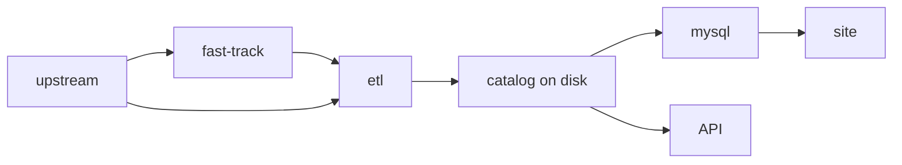

# Using the fast track

Whilst the ETL is excellent for making data reproducible, it is still slower than doing manual CSV uploads for small datasets. For this reason, we provide an alternative path for small datasets. Fastback is a service that polls grapher database for dataset updates and **backports** them as fast as possible. When it detects a change it will:

1. Run `backport` to get the backported dataset to **local** Snapshot catalog (without uploading to S3)
2. Run ETL on the backported dataset
3. Publish new ETL catalog to S3

All these steps have been optimized to run in a few seconds (except of huge datasets) and make them available through [data-api](https://github.com/owid/data-api).

## Using fast track

!!! bug "TODO"