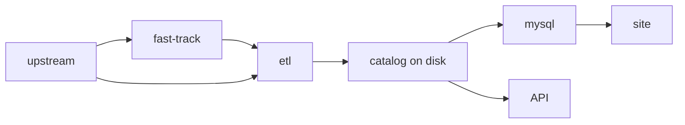

# Using the fast track

Whilst the ETL is excellent for making data reproducible, it is still slower than doing manual CSV uploads for small datasets. For this reason, we provide an alternative path for small datasets: [Fast track](../tutorials/fast-track.md).

