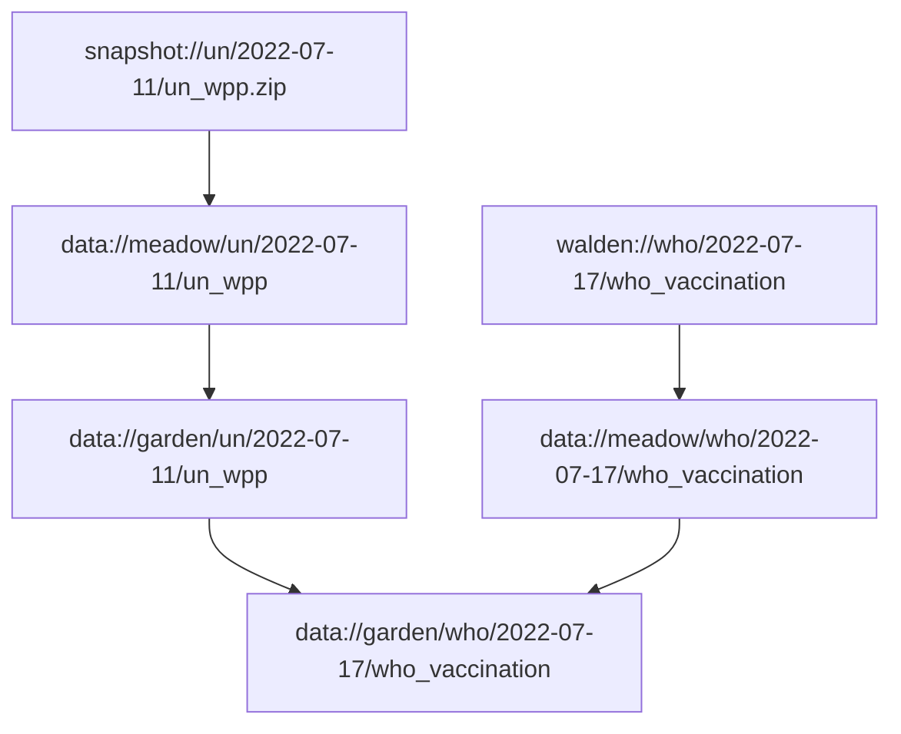

## About this dataset

## Dependencies

This diagram shows the inputs that are used in constructing this table. Dependencies are tracked
on the level of "datasets" only, where one "dataset" is a collection of tables in one directory.

To make sense of these dependencies, it helps to understand our terminology of the different processing levels,
namely snaphots/walden, then meadow, then garden and finally grapher. See [our documentation](https://docs.owid.io/projects/etl/en/latest/) for more details.

