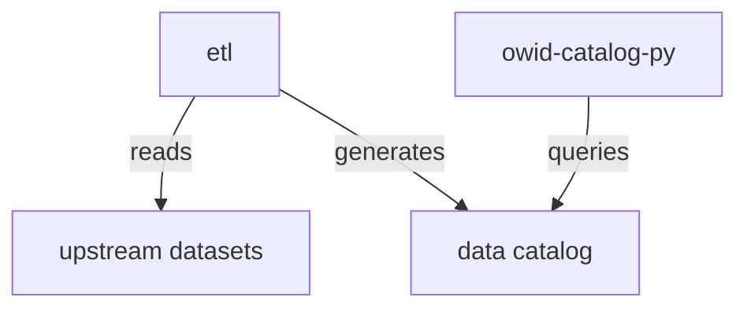

[](https://buildkite.com/our-world-in-data/owid-catalog-unit-tests)
[](https://badge.fury.io/py/owid-catalog)


# owid-catalog

_A Pythonic API for working with OWID's data catalog._

Status: experimental, APIs likely to change

## Overview

Our World in Data is building a new data catalog, with the goal of our datasets being reproducible and transparent to the general public. That project is our [etl](https://github.com/owid/etl), which going forward will contain the recipes for all the datasets we republish.

This library allows you to query our data catalog programmatically, and get back data in the form of Pandas data frames, perfect for data pipelines or Jupyter notebook explorations.



We would love feedback on how we can make this library and overall data catalog better. Feel free to send us an email at info@ourworldindata.org, or start a [discussion](https://github.com/owid/etl/discussions) on Github.

## Quickstart

Install with `pip install owid-catalog`. Then you can get data in two different ways.

### Charts catalog

This API attempts to give you exactly the data you in a chart on our site.

```python
from owid.catalog import charts

# list all available charts
slugs = charts.list_charts()

# get the data for one chart by its slug
df = charts.get_data('life-expectancy')
```

### Data science API

We also curate much more data than is available on our site. To access that in efficient binary (Feather) format, use our data science API.

This API works very well in a Jupyter notebook.

```python
from owid import catalog

# look for Covid-19 data, return a data frame of matches
catalog.find('covid')

# load Covid-19 data from the Our World in Data namespace as a data frame
df = catalog.find('covid', namespace='owid').load()

# load data from other than the default `garden` channel
lung_cancer_tables = catalog.find('lung_cancer_deaths_per_100000_men', channels=['open_numbers'])
df = lung_cancer_tables.iloc[0].load()
```

## Development

You need Python 3.8+, `poetry` and `make` installed. Clone the repo, then you can simply run:

```
# run all unit tests and CI checks
make test

# watch for changes, then run all checks
make watch
```

## Changelog

- `dev`
  - Add experimental chart data API in `owid.catalog.charts`
- `v0.3.8`
  - Switch from isort & black & fake8 to ruff
- `v0.3.8`
  - Pin dataclasses-json==0.5.8 to fix error with python3.9
- `v0.3.7`
  - Fix bugs.
  - Improve metadata propagation.
  - Improve metadata YAML file handling, to have common definitions.
  - Remove `DatasetMeta.origins`.
- `v0.3.6`
  - Fixed tons of bugs
  - `processing.py` module with pandas-like functions that propagate metadata
  - Support for Dynamic YAML files
  - Support for R2 alongside S3
- `v0.3.5`
  - Remove `catalog.frames`; use `owid-repack` package instead
  - Relax dependency constraints
  - Add optional `channel` argument to `DatasetMeta`
  - Stop supporting metadata in Parquet format, load JSON sidecar instead
  - Fix errors when creating new Table columns
- `v0.3.4`
  - Bump `pyarrow` dependency to enable Python 3.11 support
- `v0.3.3`
  - Add more arguments to `Table.__init__` that are often used in ETL
  - Add `Dataset.update_metadata` function for updating metadata from YAML file
  - Python 3.11 support via update of `pyarrow` dependency
- `v0.3.2`
  - Fix a bug in `Catalog.__getitem__()`
  - Replace `mypy` type checker by `pyright`
- `v0.3.1`
  - Sort imports with `isort`
  - Change black line length to 120
  - Add `grapher` channel
  - Support path-based indexing into catalogs
- `v0.3.0`
  - Update `OWID_CATALOG_VERSION` to 3
  - Support multiple formats per table
  - Support reading and writing `parquet` files with embedded metadata
  - Optional `repack` argument when adding tables to dataset
  - Underscore `|`
  - Get `version` field from `DatasetMeta` init
  - Resolve collisions of `underscore_table` function
  - Convert `version` to `str` and load json `dimensions`
- `v0.2.9`
  - Allow multiple channels in `catalog.find` function
- `v0.2.8`
  - Update `OWID_CATALOG_VERSION` to 2
- `v0.2.7`
  - Split datasets into channels (`garden`, `meadow`, `open_numbers`, ...) and make garden default one
  - Add `.find_latest` method to Catalog
- `v0.2.6`
  - Add flag `is_public` for public/private datasets
  - Enforce snake_case for table, dataset and variable short names
  - Add fields `published_by` and `published_at` to Source
  - Added a list of supported and unsupported operations on columns
  - Updated `pyarrow`
- `v0.2.5`
  - Fix ability to load remote CSV tables
- `v0.2.4`
  - Update the default catalog URL to use a CDN
- `v0.2.3`
  - Fix methods for finding and loading data from a `LocalCatalog`
- `v0.2.2`
  - Repack frames to compact dtypes on `Table.to_feather()`
- `v0.2.1`
  - Fix key typo used in version check
- `v0.2.0`
  - Copy dataset metadata into tables, to make tables more traceable
  - Add API versioning, and a requirement to update if your version of this library is too old
- `v0.1.1`
  - Add support for Python 3.8
- `v0.1.0`
  - Initial release, including searching and fetching data from a remote catalog
