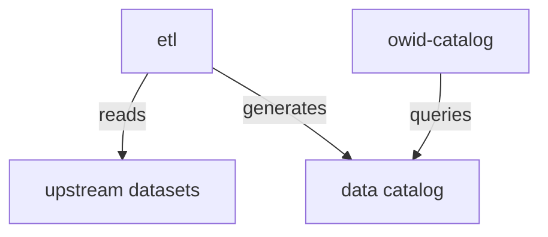

[](https://buildkite.com/our-world-in-data/owid-catalog-unit-tests)
[](https://badge.fury.io/py/owid-catalog)


# owid-catalog

_A Pythonic library for working with OWID data._

The `owid-catalog` library is the foundation of Our World in Data's data management system. It provides:

1. **Data APIs**: Access OWID's published data through unified client interfaces
2. **Data Structures**: Enhanced pandas DataFrames with rich metadata support

## Installation

```bash
pip install owid-catalog
```

> **Note**: The library is currently in Release Candidate stage (v1.0.0-rc2). Install with: `pip install owid-catalog==1.0.0rc2`

## Quick Examples

### Accessing OWID Data

```python
from owid.catalog import fetch, search

# Search for charts (default)
charts = search("population")
tb = charts[0].fetch()

# Fetch data from OWID Chart at ourworldindata.org/grapher/life-expectancy
tb = fetch("life-expectancy")

# Search for tables
tables = search("population", kind="table", namespace="un")
tb = tables[0].fetch()

# Search indicators (using semantic search)
search("renewable energy", kind="indicator")
```

### Working with Data Structures

```python
from owid.catalog import Table
from owid.catalog import processing as pr

# Tables are pandas DataFrames with metadata
tb = Table(df, metadata={"short_name": "population"})

# Metadata propagates through operations
tb_filtered = tb[tb["year"] > 2000]  # Keeps metadata
tb_merged = pr.merge(tb1, tb2, on="country")  # Merges metadata
```

## Documentation

For detailed documentation, see:
- **[API Reference](https://docs.owid.io/projects/etl/en/latest/api/catalog/api/)**: ChartsAPI, IndicatorsAPI, TablesAPI
- **[Data Structures](https://docs.owid.io/projects/etl/en/latest/api/catalog/structures/)**: Dataset, Table, Variable, metadata handling
- **[Full Documentation](https://docs.owid.io/projects/etl/en/latest/api/catalog/)**: Complete library documentation

## Architecture



This library is part of OWID's [ETL project](https://github.com/owid/etl), which contains recipes for all datasets we publish.

## Development

You need Python 3.10+, `uv` and `make` installed. Clone the repo, then you can simply run:

```
# run all unit tests and CI checks
make test

# watch for changes, then run all checks
make watch
```

## Changelog

### `v1.0.0rc2` (Release Candidate)
- **Highlights**
    - **Integrate `Table` object into API module:** All `fetch()` methods now return `owid.catalog.Table` objects with full metadata support, including charts.
    - **Popularity scores**: Search results now include `popularity` field (0.0-1.0) based on analytics views
    - **CatalogPath helper**: New pathlib-like class for parsing catalog paths (e.g., `grapher/who/2024/gho/table#indicator`)
    - **Performance improvements**: Replaced slow `iterrows()` with vectorized operations in TablesAPI
    - **refresh_index parameter**: New `search(..., refresh_index=True)` to force catalog index reload
- **Others**
    - Embedded catalog index loading directly in TablesAPI (removed ETLCatalog dependency)
    - Modularized `search()` into helper methods: `_filter_index()`, `_fetch_popularity()`, `_to_results()`
    - API URLs now immutable with Pydantic `Field(frozen=True)` - consistent flow from Client → API → Result
    - Improved `.latest()` method with better version handling and timestamps
    - Legacy catalog code moved to `owid.catalog.api.legacy` module
    - Results sorted by popularity by default (most viewed first)

<details>
<summary>See previous versions</summary>

### `v1.0.0rc1` (Release Candidate)
- **Highlights**
  - **New unified Client API**: Complete API refactor with `owid.catalog.Client` as single entry point
  - **Specialized APIs**: `ChartsAPI`, `IndicatorsAPI`, `TablesAPI`, `SiteSearchAPI` for different data access patterns
  - **Lazy loading**: All data access uses lazy loading with `@property` decorators for performance
  - **Rich result types**: `ChartResult`, `IndicatorResult`, `TableResult`, `PageSearchResult` with comprehensive metadata
  - **Breaking changes**:
    - `catalog.find()` deprecated in favor of `Client().tables.search()` (backwards compatibility maintained)
    - `catalog.charts` module has been removed in favor of `Client().chart`  - **Others**
  - New dependencies: `pydantic` (v2.0+), `deprecated` for data models and deprecation warnings
  - Documentation restructure: Split into intro, API reference, and data structures guides
  - Method renames: `ChartsAPI.metadata()` → `get_metadata()`, `config()` → `get_config()` for consistency
  - Enhanced type checking with pydantic `BaseModel` for all result types
  - Backwards compatibility layer maintains support for legacy `catalog.find()` calls
  - `ResponseSet` container with iteration, indexing, and DataFrame conversion
  - Loading indicators for long-running API requests
  - Comprehensive exception handling: `ChartNotFoundError`, `LicenseError`


#### `v0.4.5`
- Allow both `table` and `dataset` parameters in `find()` (they can now be used together)
- Migrate from pyright to ty type checker for improved type checking

#### `v0.4.4`
- Enhanced `find()` with better search capabilities:
  - Case-insensitive search by default (use `case=True` for case-sensitive)
  - Regex support enabled by default for `table` and `dataset` parameters
  - New fuzzy search with `fuzzy=True` - typo-tolerant matching sorted by relevance
  - Configurable fuzzy threshold (0-100) to control match strictness
- New dependency: `rapidfuzz` for fuzzy string matching

#### `v0.4.3`
- Fixed minor bugs

#### `v0.4.0`
- **Highlights**
  - Support for Python 3.10-3.13 (was 3.11-3.13)
  - Drop support for Python 3.9 (breaking change)
- **Others**
  - Deprecate Walden.
  - Dependencies: Change `rdata` for `pyreadr`.
  - Support: indicator dimensions.
  - Support: MDIMs.
  - Switched from Poetry to UV package manager.
  - New decorator `@keep_metadata` to propagate metadata in pandas functions.
- Fixes: `Table.apply`, `groupby.apply`, metadata propagation, type hinting, etc.

#### `v0.3.11`
- Add support for Python 3.12 in `pypackage.toml`

#### `v0.3.10`
- Add experimental chart data API in `owid.catalog.charts`

#### `v0.3.9`
- Switch from isort & black & fake8 to ruff

#### `v0.3.8`
- Pin dataclasses-json==0.5.8 to fix error with python3.9

#### `v0.3.7`
- Fix bugs.
- Improve metadata propagation.
- Improve metadata YAML file handling, to have common definitions.
- Remove `DatasetMeta.origins`.

#### `v0.3.6`
- Fixed tons of bugs
- `processing.py` module with pandas-like functions that propagate metadata
- Support for Dynamic YAML files
- Support for R2 alongside S3

#### `v0.3.5`
- Remove `catalog.frames`; use `owid-repack` package instead
- Relax dependency constraints
- Add optional `channel` argument to `DatasetMeta`
- Stop supporting metadata in Parquet format, load JSON sidecar instead
- Fix errors when creating new Table columns

#### `v0.3.4`
- Bump `pyarrow` dependency to enable Python 3.11 support

#### `v0.3.3`
- Add more arguments to `Table.__init__` that are often used in ETL
- Add `Dataset.update_metadata` function for updating metadata from YAML file
- Python 3.11 support via update of `pyarrow` dependency

#### `v0.3.2`
- Fix a bug in `Catalog.__getitem__()`
- Replace `mypy` type checker by `pyright`

#### `v0.3.1`
- Sort imports with `isort`
- Change black line length to 120
- Add `grapher` channel
- Support path-based indexing into catalogs

#### `v0.3.0`
  - Update `OWID_CATALOG_VERSION` to 3
  - Support multiple formats per table
  - Support reading and writing `parquet` files with embedded metadata
  - Optional `repack` argument when adding tables to dataset
  - Underscore `|`
  - Get `version` field from `DatasetMeta` init
  - Resolve collisions of `underscore_table` function
  - Convert `version` to `str` and load json `dimensions`

#### `v0.2.9`
- Allow multiple channels in `catalog.find` function

#### `v0.2.8`
- Update `OWID_CATALOG_VERSION` to 2

#### `v0.2.7`
- Split datasets into channels (`garden`, `meadow`, `open_numbers`, ...) and make garden default one
- Add `.find_latest` method to Catalog

#### `v0.2.6`
- Add flag `is_public` for public/private datasets
- Enforce snake_case for table, dataset and variable short names
- Add fields `published_by` and `published_at` to Source
    - Added a list of supported and unsupported operations on columns
    - Updated `pyarrow`

#### `v0.2.5`
- Fix ability to load remote CSV tables

#### `v0.2.4`
- Update the default catalog URL to use a CDN

#### `v0.2.3`
- Fix methods for finding and loading data from a `LocalCatalog`

#### `v0.2.2`
- Repack frames to compact dtypes on `Table.to_feather()`

#### `v0.2.1`
- Fix key typo used in version check

#### `v0.2.0`
- Copy dataset metadata into tables, to make tables more traceable
- Add API versioning, and a requirement to update if your version of this library is too old

#### `v0.1.1`
- Add support for Python 3.8

#### `v0.1.0`

- Initial release, including searching and fetching data from a remote catalog

</details>
