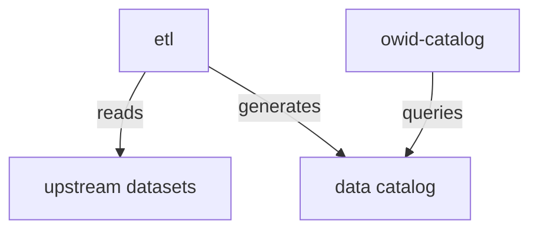

[](https://buildkite.com/our-world-in-data/owid-catalog-unit-tests)
[](https://badge.fury.io/py/owid-catalog)


# owid-catalog

_A Pythonic library for working with OWID data._

The `owid-catalog` library is the foundation of Our World in Data's data management system. It provides:

1. **Data APIs**: Access OWID's published data through unified client interfaces
2. **Data Structures**: Enhanced pandas DataFrames with rich metadata support

## Installation

```bash
pip install owid-catalog
```

## Quick Examples

### Accessing OWID Data

```python
from owid.catalog import fetch, search

# Search for charts (default)
charts = search("population")
tb = charts[0].fetch()

# Fetch data from OWID Chart at ourworldindata.org/grapher/life-expectancy
tb = fetch("life-expectancy")

# Search for tables
tables = search("population", kind="table", namespace="un")
tb = tables[0].fetch()

# Search indicators (using semantic search)
search("renewable energy", kind="indicator")
```

### Working with Data Structures

```python
from owid.catalog import Table
from owid.catalog import processing as pr

# Tables are pandas DataFrames with metadata
tb = Table(df, metadata={"short_name": "population"})

# Metadata propagates through operations
tb_filtered = tb[tb["year"] > 2000]  # Keeps metadata
tb_merged = pr.merge(tb1, tb2, on="country")  # Merges metadata
```

## Documentation

For detailed documentation, see:
- **[API Reference](https://docs.owid.io/projects/etl/libraries/catalog/api/)**: ChartsAPI, IndicatorsAPI, TablesAPI
- **[Data Structures](https://docs.owid.io/projects/etl/libraries/catalog/structures/)**: Dataset, Table, Variable, metadata handling
- **[Full Documentation](https://docs.owid.io/projects/etl/libraries/catalog/intro/)**: Complete library documentation

## Architecture


```mermaid
graph TB
etl -->|reads| snapshot[upstream datasets]
etl -->|generates| s3[data catalog]
catalog[owid-catalog] -->|queries| s3
```

This library is part of OWID's [ETL project](https://github.com/owid/etl), which contains recipes for all datasets we publish.

## Development

You need Python 3.11+, `uv` and `make` installed. Clone the repo, then you can simply run:

```
# run all unit tests and CI checks
make test

# watch for changes, then run all checks
make watch
```

Maintainer notes — how the version is bumped, how a release reaches PyPI, and which checks actually cover this directory — are in [`DEVELOPMENT.md`](DEVELOPMENT.md).

## Changelog

### Unreleased
Merged to `master` but not published yet — see [`DEVELOPMENT.md`](DEVELOPMENT.md) for how a release is cut.
- Render metadata Jinja in a `SandboxedEnvironment`, so a producer-supplied value containing `<<` or `<%` cannot walk `__class__`/`__subclasses__` on whatever runs the ETL
- Fail loudly on a character-exploded `description_key` (a markdown string that was iterated character by character): `Markdown` is now a `str` subclass that raises `TypeError` on iteration, alongside a new `validate_description_key_list()` sanity check
- New `s3_utils.object_exists()` to check for an object without downloading it

### `v1.2.4`
- **Python support**
  - Add Python 3.14, drop Python 3.10 (`requires-python = ">=3.11, <3.15"`)
  - Drop the `typing_extensions` fallbacks for `Self`, `Required` and `NotRequired`
- **`description_key` becomes free-form markdown**
  - `VariableMeta.description_key` is now a markdown string
  - A list of bullet points is still accepted (items may carry per-item Jinja) and is converted to a markdown list after rendering — the grapher only ever sees a string
  - New `description_key_to_string()` in `owid.catalog.core.meta`, reproducing how the grapher rendered those lists before
- **Display metadata**
  - Add `display.timeInterval` (`day`, `week`, `month`, `quarter`, `year`, `decade`)
  - Remove the deprecated `display.yearIsDay`

### `v1.2.3`
- `combine_indicators_processing_level` tolerates unrendered Jinja templates in `processing_level` instead of asserting on an unknown level — when a template is combined with a literal it overstates rather than understates the result, since `processing_level` feeds licensing downstream
- `s3_utils.upload()` accepts `content_type` and `cache_control`
- Catalog JSON-LD (`schema_org`): license and keyword fixes, `citation` dropped
- Dependency bumps for security advisories

### `v1.2.2`
- Add `owners` to `DatasetMeta`
- New `Dataset.update_metadata_from_dict()` and `yaml_metadata.update_metadata_from_dict()`, for callers that already hold parsed metadata rather than a YAML path (used by the Owl runner)
- New `schema_org` module emitting schema.org JSON-LD for catalog datasets and tables, with follow-ups: stable short landing-page URLs, table descriptions filled from existing metadata, an explicit dataset description requirement, and unrendered Jinja templates kept out of the output
- YAML variable checks accept a long-format base name as a match for pivoted `{base}__{dim}_{value}` columns, so a `long_to_wide` override block is no longer flagged as a typo
- Republished to PyPI after the `ty` upgrade, with no functional change of its own

### `v1.2.1`
- Send `User-Agent: owid-catalog/<version> (python <x.y.z>)` on every outbound HTTP call, via a shared `requests.Session` in `owid.catalog.api.utils` (plus `STORAGE_OPTIONS` for the pandas reads that cannot take a session)
- `prune_dict()` keeps explicitly-empty values for keys listed in `KEEP_IF_EMPTY`: `chartTypes: []` is a meaningful "render no chart-type toggles" override, not the same as an absent key

### `v1.2.0`
- **Remove legacy `Source` metadata (origins only)**
  - Removed `Source` class from `owid.catalog.core.meta`
  - Removed `sources` field from `VariableMeta` and `DatasetMeta` (use `origins` instead)
  - Removed `if_source_exists` parameter from `Dataset.update_metadata` (use `if_origins_exist`)
  - Removed `get_unique_sources_from_indicators` helper
  - Removed `sources` aggregation from `combine_indicators_metadata`

### `v1.1.0`
- **Remove processing log feature**
  - Removed `ProcessingLog` and `processing_log` module from `owid.catalog.core`
  - Removed `combine_indicators_processing_logs` helper
  - Removed `update_log` / `amend_log` methods on `Indicator`
  - Removed processing-log tracking from `Table` arithmetic operations (`__add__`, `__sub__`, `__mul__`, etc.)
  - Removed `processing_log` field from `VariableMeta`

### `v1.0.1`
- **ResponseSet ergonomics**
  - Remove deprecated `ResponseSet.results` property (use `.items` instead)
  - Add `.to_dict()` method for serializing results to plain dicts (useful for AI/LLM context windows)
  - Add `all_fields` parameter to `.to_frame()` to temporarily override display mode without mutating instance state

### `v1.0.0`
- **New unified Client API**
  - `owid.catalog.Client` as single entry point with `ChartsAPI`, `IndicatorsAPI`, `TablesAPI`
  - Quick access via `search()` and `fetch()` convenience functions
  - Rich result types: `ChartResult`, `IndicatorResult`, `TableResult` with `ResponseSet` container
- **Charts API**
  - Fetch chart data by slug, URL, or slug with query params
  - Parse chart slugs from grapher/explorer URLs via `parse_chart_slug()`
  - Explorer best-effort fetching with graceful error handling
  - `set_ui_advanced()` / `set_ui_basic()` for display configuration
- **Tables API**
  - Search catalog by table, namespace, version, dataset, and channel
  - Fetch tables directly by catalog path
  - Embedded catalog index with local caching
- **Indicators API**
  - Semantic search via `search.owid.io` vector embeddings
  - Sort by relevance (similarity + popularity blend) or similarity only
  - `fetch()` for single-column indicator or `fetch_table()` for the full table
- **Search & discovery**
  - Fuzzy, exact, contains, and regex matching modes
  - `.latest()` filtering to keep only newest versions
  - Popularity scores (0.0-1.0) from analytics views, results sorted by popularity
  - `refresh_index` parameter to force catalog index reload
- **Data structures integration**
  - All `fetch()` methods return `owid.catalog.Table` with full metadata
  - `CatalogPath` helper for parsing catalog paths
  - Lazy loading with `load_data=False` for deferred data access
- **Library reorganization**
  - Restructured into `owid.catalog.core` (data structures) and `owid.catalog.api` (remote access)
  - `catalog.find()` deprecated in favor of `Client().tables.search()` (backwards compat maintained)
  - Legacy code moved to `owid.catalog.api.legacy`
  - New dependencies: `pydantic` v2.0+
- **Private data support**
  - Private datasets served from separate R2 bucket
  - API can fetch private data from private bucket
- **Performance**
  - Vectorized operations replacing `iterrows()` in TablesAPI
  - Embedded catalog index loading (removed ETLCatalog dependency)
  - Modularized search into helper methods
- **Other**
  - Thumbnail display in `ResponseSet` for chart results
  - JSON output format support
  - Comprehensive exception handling: `ChartNotFoundError`, `LicenseError`
  - API URLs immutable with Pydantic `Field(frozen=True)`

<details>
<summary>See previous versions</summary>

#### `v0.4.5`
- Allow both `table` and `dataset` parameters in `find()` (they can now be used together)
- Migrate from pyright to ty type checker for improved type checking

#### `v0.4.4`
- Enhanced `find()` with better search capabilities:
  - Case-insensitive search by default (use `case=True` for case-sensitive)
  - Regex support enabled by default for `table` and `dataset` parameters
  - New fuzzy search with `fuzzy=True` - typo-tolerant matching sorted by relevance
  - Configurable fuzzy threshold (0-100) to control match strictness
- New dependency: `rapidfuzz` for fuzzy string matching

#### `v0.4.3`
- Fixed minor bugs

#### `v0.4.0`
- **Highlights**
  - Support for Python 3.10-3.13 (was 3.11-3.13)
  - Drop support for Python 3.9 (breaking change)
- **Others**
  - Deprecate Walden.
  - Dependencies: Change `rdata` for `pyreadr`.
  - Support: indicator dimensions.
  - Support: MDIMs.
  - Switched from Poetry to UV package manager.
  - New decorator `@keep_metadata` to propagate metadata in pandas functions.
- Fixes: `Table.apply`, `groupby.apply`, metadata propagation, type hinting, etc.

#### `v0.3.11`
- Add support for Python 3.12 in `pypackage.toml`

#### `v0.3.10`
- Add experimental chart data API in `owid.catalog.charts`

#### `v0.3.9`
- Switch from isort & black & fake8 to ruff

#### `v0.3.8`
- Pin dataclasses-json==0.5.8 to fix error with python3.9

#### `v0.3.7`
- Fix bugs.
- Improve metadata propagation.
- Improve metadata YAML file handling, to have common definitions.
- Remove `DatasetMeta.origins`.

#### `v0.3.6`
- Fixed tons of bugs
- `processing.py` module with pandas-like functions that propagate metadata
- Support for Dynamic YAML files
- Support for R2 alongside S3

#### `v0.3.5`
- Remove `catalog.frames`; use `owid-repack` package instead
- Relax dependency constraints
- Add optional `channel` argument to `DatasetMeta`
- Stop supporting metadata in Parquet format, load JSON sidecar instead
- Fix errors when creating new Table columns

#### `v0.3.4`
- Bump `pyarrow` dependency to enable Python 3.11 support

#### `v0.3.3`
- Add more arguments to `Table.__init__` that are often used in ETL
- Add `Dataset.update_metadata` function for updating metadata from YAML file
- Python 3.11 support via update of `pyarrow` dependency

#### `v0.3.2`
- Fix a bug in `Catalog.__getitem__()`
- Replace `mypy` type checker by `pyright`

#### `v0.3.1`
- Sort imports with `isort`
- Change black line length to 120
- Add `grapher` channel
- Support path-based indexing into catalogs

#### `v0.3.0`
  - Update `OWID_CATALOG_VERSION` to 3
  - Support multiple formats per table
  - Support reading and writing `parquet` files with embedded metadata
  - Optional `repack` argument when adding tables to dataset
  - Underscore `|`
  - Get `version` field from `DatasetMeta` init
  - Resolve collisions of `underscore_table` function
  - Convert `version` to `str` and load json `dimensions`

#### `v0.2.9`
- Allow multiple channels in `catalog.find` function

#### `v0.2.8`
- Update `OWID_CATALOG_VERSION` to 2

#### `v0.2.7`
- Split datasets into channels (`garden`, `meadow`, `open_numbers`, ...) and make garden default one
- Add `.find_latest` method to Catalog

#### `v0.2.6`
- Add flag `is_public` for public/private datasets
- Enforce snake_case for table, dataset and variable short names
- Add fields `published_by` and `published_at` to Source
    - Added a list of supported and unsupported operations on columns
    - Updated `pyarrow`

#### `v0.2.5`
- Fix ability to load remote CSV tables

#### `v0.2.4`
- Update the default catalog URL to use a CDN

#### `v0.2.3`
- Fix methods for finding and loading data from a `LocalCatalog`

#### `v0.2.2`
- Repack frames to compact dtypes on `Table.to_feather()`

#### `v0.2.1`
- Fix key typo used in version check

#### `v0.2.0`
- Copy dataset metadata into tables, to make tables more traceable
- Add API versioning, and a requirement to update if your version of this library is too old

#### `v0.1.1`
- Add support for Python 3.8

#### `v0.1.0`

- Initial release, including searching and fetching data from a remote catalog

</details>
