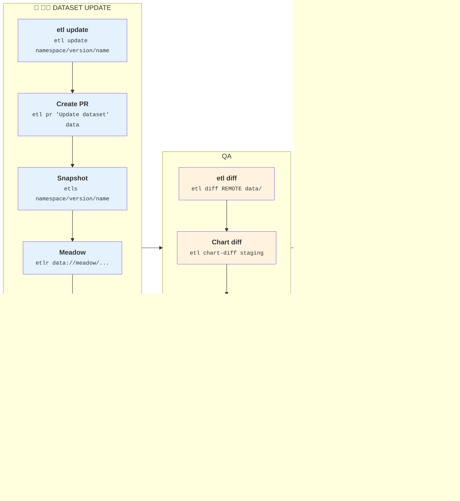

# Dataset Update Workflow

```mermaid
graph LR
    subgraph UPDATE[" 🤖 🧑‍💻 DATASET UPDATE "]
        direction TB
        S1["<b>etl update</b><br/><small><code>etl update namespace/version/name</code></small>"]
        S2["<b>Create PR</b><br/><small><code>etl pr 'Update dataset' data</code></small>"]
        S3["<b>Snapshot</b><br/><small><code>etls namespace/version/name</code></small>"]
        S4["<b>Meadow</b><br/><small><code>etlr data://meadow/...</code></small>"]
        S5["<b>Garden</b><br/><small><code>etlr data://garden/...</code></small>"]
        S6["<b>Grapher</b><br/><small><code>etlr data://grapher/... --grapher</code></small>"]
        S7["<b>Indicator upgrade</b><br/><small><code>etl indicator-upgrade</code></small>"]
        S1 --> S2
        S2 --> S3
        S3 --> S4
        S4 --> S5
        S5 --> S6
        S6 --> S7
    end

    subgraph QA[" QA "]
        direction TB
        Q1["<b>etl diff</b><br/><small><code>etl diff REMOTE data/</code></small>"]
        Q2["<b>Chart diff</b><br/><small><code>etl chart-diff staging</code></small>"]
        Q3["<b>Anomalist</b><br/><small><code>anomalist dataset_uri</code></small>"]
        Q1 --> Q2
        Q2 --> Q3
    end

    subgraph REVIEW[" Review "]
        direction TB
        R1["🤖 Copilot"]
        R2["🧑‍💻 Human"]
        R1 --> R2
    end

    UPDATE --> QA
    QA --> REVIEW
    REVIEW --> Deploy([Deploy])

    style Deploy fill:#c8e6c9
    style S1 fill:#e3f2fd
    style S2 fill:#e3f2fd
    style S3 fill:#e3f2fd
    style S4 fill:#e3f2fd
    style S5 fill:#e3f2fd
    style S6 fill:#e3f2fd
    style S7 fill:#e3f2fd
    style Q1 fill:#fff3e0
    style Q2 fill:#fff3e0
    style Q3 fill:#fff3e0
    style R1 fill:#f3e5f5
    style R2 fill:#f3e5f5
```
