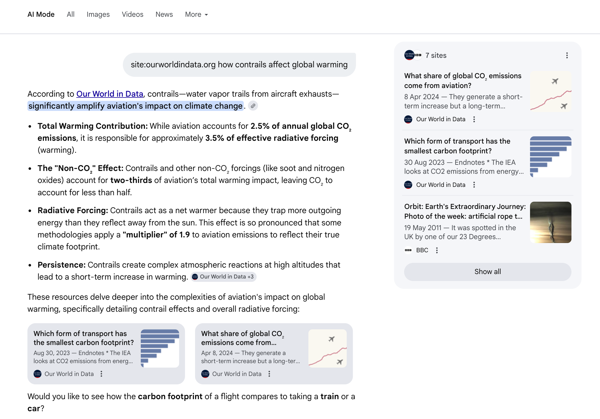

# R&D: LLMs for Search

Exploring AI-powered approaches to improve search functionality

OWID Research & Development

---

# Why Now?

**The opportunity and the challenge**

- **LLMs are changing UX expectations**
  - Google AI mode shows what's possible
  - Simple search bars may not be enough in the AI age

- **Current system is failing users**
  - 21% of queries return zero results
  - Straightforward queries like "public school funding" fail

- **Reputation considerations**
  - Test AI on structured data (our strength)
  - Avoid ChatGPT/MCP pitfalls (hallucinations, unreliability)
  - Users trust us for accurate data, not generative text

---

# Our North Star: Google AI Mode

**What's possible with AI-powered search**

Google's AI mode demonstrates:
- Natural language understanding of queries
- Contextual summaries with source citations
- **<1s latency** even with LLM reasoning
- Better results than traditional keyword search

**This sets our aspiration**

---
layout: section
---

# Problems

---

# Problem 1: Mapping Natural Language Queries

Users express intent in natural language, but keyword search doesn't match anything

- **User query**: "How has life expectancy changed over time?"
- **What they mean**: Time-series data on life expectancy
- **What keyword search sees**: No exact phrase match → **zero results**

**Challenge**: Understanding user intent vs. matching text strings

---

# Problem 2: Zero Search Results

**21% of queries return no results** even when relevant content exists

**Real examples that fail:**
- "public school funding"
- "road traffic deaths age"
- "average hours of work per week"

**Why this happens:**
- **Vocabulary mismatch**: "CO2 emissions" vs "carbon dioxide"
- **Spelling variations**: "labour" vs "labor", "urbanisation" vs "urbanization"
- **Phrasing differences**: "GDP per capita" vs "GDP per person"

**Impact**: Users think content doesn't exist → **immediate frustration** → abandon search

---

# Problem 3: Irrelevant Results

Search returns results that technically match but aren't what the user wants

**Real examples of mismatched results:**
- "population" → returns Mpox disease statistics
- "populism" → returns population data
- "money" → returns military expenditures
- "physical exercise" → returns child labor topics

**The problem**: Keyword matching ignores semantic relationships

**The result**: Low-quality results ranked highly, relevant content buried

---
layout: section
---

# Solutions

---

# Evolution of Search Technologies

| Technology | Adoption Era | Key Innovation |
|-----------|--------------|----------------|
| **Keyword Search** | ~1990s | Traditional information retrieval |
| **Semantic Search** | ~2018 | Transformers & embeddings (BERT) |
| **Hybrid Search** | ~2020 | Combining keyword + semantic |
| **Agentic RAG** | ~2023 | LLM agents with reasoning |
| **Future?** | ~2025+ | Multimodal, reinforcement learning |

---

# Keyword Search (~1990s)

**Traditional information retrieval**: Term frequency, inverse document frequency (TF-IDF)

**Pros:**
- Fast and predictable
- Well understood, easy to debug
- Works well for exact matches

**Cons:**
- No understanding of semantics
- Vocabulary mismatch problems
- Can't handle natural language queries

**Cost/Latency:**
- Free with Algolia (our current provider)
- ~10-50ms latency

---

# Semantic Search (~2018)

**Neural embeddings**: Convert text to vectors in semantic space

**Pros:**
- Understands meaning, not just words
- Handles synonyms and related concepts
- Better for natural language queries
- **Multilingual**: 33% of users have non-English language

**Cons:**
- Can miss exact keyword matches
- Requires model deployment
- More computationally expensive

**Cost/Latency:**
- ~$10-15/month
- ~50-200ms latency

---

# Hybrid Search (~2020)

**Best of both worlds**: Combine keyword + semantic search with reranking

**Pros:**
- Captures both exact matches and semantic meaning
- More robust than either alone
- Can tune keyword vs semantic weight

**Cons:**
- More complex to implement
- Requires careful balancing of signals
- Higher computational cost

**Cost/Latency:**
- ~$20/month (requires switch from Algolia to Typesense)
- ~100-300ms latency

---

# Agentic RAG (~2023)

**LLM-powered retrieval**: Agent reasons about query, retrieves, and generates answers

**Pros:**
- Extremely flexible and powerful
- Can handle complex, multi-step queries
- Natural language interaction

**Cons:**
- Expensive per query
- Slower response times
- Non-deterministic results
- Can fail to return expected JSON format

**Cost/Latency:**
- ~$200/month
- ~1-5s latency

---

# Future Directions

**Context Window Search**: Fit all our data into LLM context window

- Load entire dataset metadata into context
- Use prompt caching to reduce costs
- Search directly within the LLM
- Potentially better understanding of relationships and context
- Challenge: Keeping data fresh and handling updates

---

# Vocabulary: The Foundation

**Bridging user language to our taxonomy**

**Keyword Search**
- Inverted index (A-B-C)
- Exact match required
- Limited synonym support

**Limitations:**
- "public school funding" → no results
- "road traffic deaths age" → no results
- Phrase matching is brittle

**Semantic Search**
- Embeddings/vectors
- Maps "solar power" → "renewable energy"
- Understands related concepts

**Benefits:**
- Handles synonyms naturally
- Works across languages (33% of users non-English)
- Bridges vocabulary gaps

---

# The Trade-off Matrix

**Cost & Latency vs. Context Awareness & Intelligence**

  <strong>Keyword (Algolia)</strong> 
  Free • 10-50ms 
  Low intelligence

  <strong>Semantic Search</strong> 
  $10-15/mo • 50-200ms 
  Moderate intelligence

  <strong>Hybrid Search</strong> 
  $20/mo • 100-300ms 
  ✨ Production Sweet Spot

  <strong>Agentic RAG</strong> 
  $200/mo • 1-5s 
  🎯 Research Prototype

← Lower Cost/Latency — — — — Higher Cost/Latency →

---
layout: section
---

# Pitches

---

# Pitch 1: The 'Zero Result' Safety Net

**Problem**: Users get no results even when relevant content exists

**Solution**: Deploy hybrid search (keyword + semantic)
- Keyword search catches exact matches
- Semantic search catches related concepts
- Reranking combines signals

**Implementation**:
- Switch from Algolia to Typesense
- Matthieu had a prototype in the pipeline

**Benefits**:
- Dramatically reduce zero-result queries
- Better handling of vocabulary mismatches
- Improved user satisfaction

**Cost/Latency**:
- ~$20/month
- ~100-300ms latency

---

# Pitch 2: Query Expansion Guide

**Problem**: Users don't know what terms to search for

**Solution**: Auto-suggest based on controlled vocabulary
- Real-time suggestions as user types
- Powered by vocabulary mappings
- Show popular/related searches

**Implementation**:
- Build vocabulary index from our charts/articles
- Semantically search the vocabulary index

**Benefits**:
- Guide users to successful queries
- Expose available content
- Reduce failed searches

**Cost/Latency**:
- Included in semantic search costs (~$10-15/month)
- ~50-100ms latency

---

# Pitch 3: Suggested Topics

**Problem**: Users may not know what topics are available

**Solution**: Context-aware topic recommendations
- Show related topics based on current query
- Display when search returns zero results
- Showcase our topic searches (which are really good!)
- Show featured metrics

**Implementation**:
- Trivial: Show LLM our 100+ topics and ask for recommendations
- LLM selects most relevant topics for the query

**Benefits**:
- Increase content discovery
- Improve exploration experience
- Connect related datasets
- Turn failed searches into successful explorations

**Cost/Latency**:
- Minimal (mostly existing infrastructure)
- ~50ms latency

---

# Pitch 4: The Production Sweet Spot

**Approach**: Semantic search + query rewriting + reranking via Cloudflare AI Search

**Components**:
1. Query rewriting (expand/normalize)
2. Semantic search (embeddings)
3. Reranking (learned model)

**Pros**:
- Much cheaper than agentic approach
- Predictable latency
- Good quality results

**Cons**:
- Hard to customize (not particularly customizable or good)
- Less flexible than agents
- Cloudflare-specific implementation

**Cost/Latency**: Included in Cloudflare pricing, ~100-200ms

---

# Pitch 5: The 'North Star' Prototype

**Approach**: LLM agent orchestrates the entire search process

**Note**: Using generic LLMs for query rewriting and reranking is very inefficient

**Capabilities**:
- Understand complex queries
- Add chart parameters dynamically
- Follow custom instructions
- Multi-step reasoning

**Pros**:
- Extremely flexible
- Natural language interaction
- Can handle edge cases

**Cons**:
- Expensive (~$200/month with Gemini Flash 2.5 Lite)
- Unreliable (JSON response issues)
- Non-deterministic (inconsistent results)
- High latency (~1-5s)

---
layout: section
---

# Outputs

---

# Outputs

**From this R&D cycle**

**1. Search Comparison Tool**
- Side-by-side qualitative comparison in Wizard
- [/etl/wizard/search-comparison](http://staging-site-ai-search-api/etl/wizard/search-comparison)

**2. API Endpoints (Cloudflare Workers)**

*Suggested topics:*
- `/api/ai-search/topics?q=population`

*Suggested searches:*
- `/api/ai-search/searches?q=population`

**3. Semantic Search with Reranking**
- `/api/ai-search/charts?q=population`

**4. Agentic Search**
- `/api/ai-search/recommend?q=population`

---

# Risks & Guardrails

## ⚠️ Reputational Risks

- **Chatbot hallucinations**
  - Users trust us for accurate data
  - Not generative text

- **Jailbreak vulnerability**
  - LLMs can be manipulated
  - Need robust safeguards

- **User expectations**
  - We're known for data quality
  - Can't afford AI mistakes

## 🛡️ The "Narrow Solution" Strategy

- **Respond with Charts, not Chat**
  - Show actual data visualizations
  - Not generated summaries

- **LLM for Retrieval, not Generation**
  - Use AI to find content
  - Don't create new content

- **Results Trace to Database**
  - Every result links to source
  - Fully auditable

---
layout: section
---

# Challenges

---

# Problematic Queries

Examples of queries that are particularly challenging

*Add specific problematic queries from your testing*

Example categories:
- Ambiguous queries
- Multi-intent queries
- Highly specific technical terms
- Queries requiring multiple datasets
- Queries with implicit context

---
layout: center
---

# Conclusions & Path Forward

---

# Next Steps

## ✅ Immediate Wins

**Can implement now, low risk**

- **Query Expansion Suggestions**
  - Guide users to better searches
  - Build vocabulary index from our content
  - Works on top of existing Algolia
  - Immediate UX improvement

- **Suggested Topics**
  - Show related topics on zero results
  - Leverage our excellent topic pages
  - Turns failures into discoveries
  - Low cost, high impact

## 🔬 Further Exploration

**Worth investigating**

- **Hybrid Search**
  - Could fix 21% zero-result problem
  - Requires migration from Algolia
  - Need to assess implementation complexity

- **Agentic Prototype**
  - Test capabilities and limitations
  - Understand cost/benefit tradeoffs
  - Learn what's possible with LLMs
  - Guide future strategy

---
layout: center
---
# Discussion

**Questions? Feedback? Priorities?**

The 'zero result' problem is solvable today. 
True 'answer' capabilities define the future.

